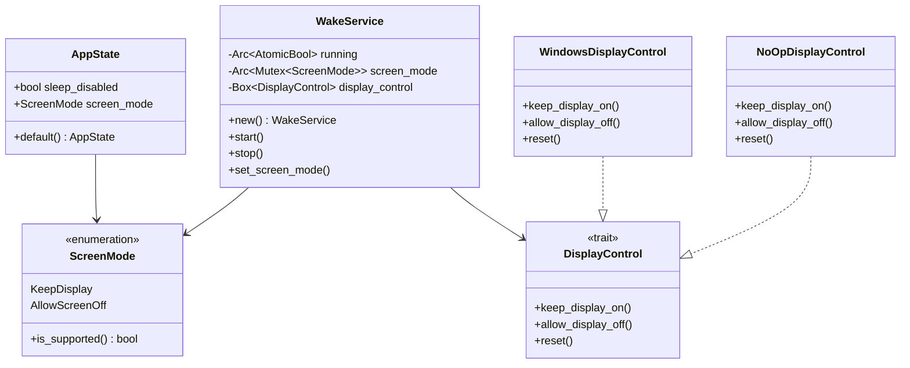

# Appendix B: Data Models and Types

> *Complete reference for all data structures used in Tea.*

---

## Rust Types

### AppState

The persisted application state.

```rust
// src-tauri/src/persistence.rs

#[derive(Debug, Clone, Serialize, Deserialize, PartialEq)]
pub struct AppState {
    pub sleep_disabled: bool,
    pub screen_mode: ScreenMode,
}

impl Default for AppState {
    fn default() -> Self {
        Self {
            sleep_disabled: false,
            screen_mode: ScreenMode::default(),
        }
    }
}
```

| Field | Type | Default | Description |
|-------|------|---------|-------------|
| `sleep_disabled` | `bool` | `false` | Whether sleep prevention is active |
| `screen_mode` | `ScreenMode` | `KeepDisplay` | How to handle the display |

### ScreenMode

Display behavior options.

```rust
// src-tauri/src/core/screen_mode.rs

#[derive(Debug, Clone, Copy, PartialEq, Eq, Serialize, Deserialize, Default)]
pub enum ScreenMode {
    #[default]
    KeepDisplay,
    AllowScreenOff,
}

impl ScreenMode {
    pub fn is_supported(&self) -> bool {
        match self {
            ScreenMode::KeepDisplay => true,
            ScreenMode::AllowScreenOff => cfg!(windows),
        }
    }
}
```

| Variant | Supported | Description |
|---------|-----------|-------------|
| `KeepDisplay` | All platforms | Keep screen on |
| `AllowScreenOff` | Windows only | Allow screen to turn off |

### WakeService

Background service for sleep prevention.

```rust
// src-tauri/src/wake_service.rs

pub struct WakeService {
    running: Arc<AtomicBool>,
    screen_mode: Arc<Mutex<ScreenMode>>,
    display_control: Box<dyn DisplayControl + Send>,
}
```

| Field | Type | Description |
|-------|------|-------------|
| `running` | `Arc<AtomicBool>` | Thread-safe stop flag |
| `screen_mode` | `Arc<Mutex<ScreenMode>>` | Current screen mode |
| `display_control` | `Box<dyn DisplayControl + Send>` | Platform-specific controller |

### DisplayControl Trait

Abstraction for platform-specific display control.

```rust
// src-tauri/src/wake_service.rs

pub trait DisplayControl {
    fn keep_display_on(&self) -> Result<(), Box<dyn std::error::Error>>;
    fn allow_display_off(&self) -> Result<(), Box<dyn std::error::Error>>;
    fn reset(&self) -> Result<(), Box<dyn std::error::Error>>;
}
```

| Method | Purpose |
|--------|---------|
| `keep_display_on()` | Prevent display from sleeping |
| `allow_display_off()` | Allow display to sleep (system stays awake) |
| `reset()` | Return to normal system behavior |

### WindowsDisplayControl

Windows implementation of DisplayControl.

```rust
// src-tauri/src/platform.rs

pub struct WindowsDisplayControl;

impl DisplayControl for WindowsDisplayControl {
    fn keep_display_on(&self) -> Result<(), Box<dyn std::error::Error>> {
        // Uses SetThreadExecutionState with ES_DISPLAY_REQUIRED
    }
    
    fn allow_display_off(&self) -> Result<(), Box<dyn std::error::Error>> {
        // Uses SetThreadExecutionState with ES_SYSTEM_REQUIRED only
    }
    
    fn reset(&self) -> Result<(), Box<dyn std::error::Error>> {
        // Uses SetThreadExecutionState with ES_CONTINUOUS
    }
}
```

---

## Error Types

### AppError

Unified error type for the application.

```rust
// src-tauri/src/error.rs

#[derive(Debug)]
pub enum AppError {
    Io(std::io::Error),
    Json(serde_json::Error),
    Tauri(tauri::Error),
    Generic(String),
}

impl std::fmt::Display for AppError {
    fn fmt(&self, f: &mut std::fmt::Formatter<'_>) -> std::fmt::Result {
        match self {
            AppError::Io(e) => write!(f, "IO error: {}", e),
            AppError::Json(e) => write!(f, "JSON error: {}", e),
            AppError::Tauri(e) => write!(f, "Tauri error: {}", e),
            AppError::Generic(s) => write!(f, "{}", s),
        }
    }
}
```

| Variant | Source | Description |
|---------|--------|-------------|
| `Io` | `std::io::Error` | File system errors |
| `Json` | `serde_json::Error` | Serialization errors |
| `Tauri` | `tauri::Error` | Tauri framework errors |
| `Generic` | `String` | Other errors |

---

## File Formats

### state.json

Persisted application state.

```json
{
  "sleep_disabled": true,
  "screen_mode": "KeepDisplay"
}
```

| Field | JSON Type | Values |
|-------|-----------|--------|
| `sleep_disabled` | `boolean` | `true` / `false` |
| `screen_mode` | `string` | `"KeepDisplay"` / `"AllowScreenOff"` |

### File Locations

| Platform | Path |
|----------|------|
| Windows | `%LOCALAPPDATA%\tea\state.json` |
| macOS | `~/Library/Application Support/tea/state.json` |
| Linux | `~/.config/tea/state.json` |

---

## Configuration Files

### Cargo.toml Structure

```toml
[package]
name = "tea"
version = "2.0.0"
description = "System tray sleep prevention utility"
authors = ["Author Name"]
edition = "2021"

[lib]
name = "tea_lib"
crate-type = ["staticlib", "cdylib", "rlib"]

[dependencies]
tauri = { version = "2", features = ["tray-icon"] }
# ... other dependencies

[profile.release]
opt-level = "z"
lto = true
codegen-units = 1
panic = "abort"
strip = true
```

### tauri.conf.json Structure

```json
{
  "productName": "Tea",
  "version": "2.0.0",
  "identifier": "com.tea.app",
  "build": {
    "devUrl": "http://localhost:1420",
    "frontendDist": "../dist"
  },
  "app": {
    "windows": [],
    "trayIcon": {
      "iconPath": "icons/icon.png",
      "iconAsTemplate": true
    }
  },
  "bundle": {
    "active": true,
    "targets": "all",
    "icon": ["icons/32x32.png", "icons/icon.icns", "icons/icon.ico"]
  }
}
```

### package.json Structure

```json
{
  "name": "tea",
  "version": "2.0.0",
  "type": "module",
  "scripts": {
    "dev": "vite",
    "build": "tsc && vite build",
    "test": "vitest",
    "test:coverage": "vitest run --coverage"
  },
  "dependencies": {
    "@tauri-apps/api": "^2",
    "@tauri-apps/plugin-shell": "^2"
  },
  "devDependencies": {
    "@tauri-apps/cli": "^2",
    "typescript": "^5.2.2",
    "vite": "^7.2.6",
    "vitest": "^4.0.15"
  }
}
```

---

## Icon Specifications

### Required Formats

| Platform | Format | Sizes (px) |
|----------|--------|------------|
| Windows | `.ico` | 16, 24, 32, 48, 64, 256 |
| macOS | `.icns` | 16, 32, 64, 128, 256, 512, 1024 |
| Linux | `.png` | 32, 128, 256 |
| Tray | `.png` | 32 (RGBA) |

### Tray Icon Data

```rust
// Icon loading returns raw RGBA bytes
let icon_data: Vec<u8> = load_icon("enabled_32.png")?;
// 32x32 pixels × 4 channels (RGBA) = 4096 bytes
assert_eq!(icon_data.len(), 4096);
```

| Property | Value |
|----------|-------|
| Format | RGBA8 |
| Channels | 4 (Red, Green, Blue, Alpha) |
| Bit Depth | 8 bits per channel |
| Byte Order | RGBA (not ARGB or BGRA) |

---

## Type Relationships



---

## Constants and Magic Values

### F15 Key Simulation

```rust
// Wake interval in seconds
const WAKE_INTERVAL_SECS: u64 = 60;

// Key used for wake simulation
const WAKE_KEY: enigo::Key = enigo::Key::F15;
```

| Constant | Value | Purpose |
|----------|-------|---------|
| Wake interval | 60 seconds | Time between F15 presses |
| Wake key | F15 | Rarely used, safe to simulate |

### Windows Execution State Flags

```rust
// From windows crate
ES_CONTINUOUS: u32 = 0x80000000;
ES_SYSTEM_REQUIRED: u32 = 0x00000001;
ES_DISPLAY_REQUIRED: u32 = 0x00000002;
```

| Flag | Effect |
|------|--------|
| `ES_CONTINUOUS` | Maintain state until explicitly changed |
| `ES_SYSTEM_REQUIRED` | Prevent system sleep |
| `ES_DISPLAY_REQUIRED` | Prevent display sleep |

### Vite Server

```typescript
// From vite.config.ts
const DEV_PORT: number = 1420;
const HMR_PORT: number = 1421;
```

| Port | Purpose |
|------|---------|
| 1420 | Vite dev server |
| 1421 | Hot Module Replacement WebSocket |
