# Part 0: The Map

> *Before you explore a new city, look at the map. Before you read code, understand the architecture.*

This chapter gives you the complete picture of Tea before we dive into details. By the end, you'll know:

- What Tea does and why it exists
- How all the pieces connect
- The journey of data through the application
- Where to find everything in the codebase

---

## What We're Building

**Tea** is a system tray application that prevents your computer from sleeping. That's it. One job, done well.

### Why Does This Exist?

Your computer wants to sleep. After a few minutes of inactivity, it dims the screen, then sleeps entirely. Usually that's good—it saves power.

But sometimes you need it awake:
- Downloading a large file
- Running a long build
- Presenting slides
- Rendering video

Tea sits in your system tray and says "no" to sleep requests until you tell it to stop.

### How It Works (The Short Version)

1. **On Windows**: Tea calls the Windows API (`SetThreadExecutionState`) to tell the OS "I'm still working, don't sleep"
2. **On All Platforms**: Tea simulates pressing the F15 key every 60 seconds (a key that exists but does nothing visible, yet counts as activity)

That's the core trick. Everything else is infrastructure: menus, persistence, icons, autostart.

---

## The Architecture at a Glance

```mermaid
flowchart TB
    subgraph SystemTray["System Tray (Native OS)"]
        TrayIcon["🫖 Tray Icon"]
        TrayMenu["Menu"]
    end

    subgraph TauriRuntime["Tauri Runtime"]
        EventLoop["Event Loop"]
        StateManager["AppStateManager"]
    end

    subgraph RustBackend["Rust Backend"]
        Main["main.rs<br/>Entry + Tray Setup"]
        Commands["commands.rs<br/>Business Logic"]
        WakeService["wake_service.rs<br/>Background Task"]
        Platform["platform.rs<br/>OS APIs"]
        Persistence["persistence.rs<br/>File I/O"]
        Core["core/<br/>Shared Types"]
    end

    subgraph Storage["Filesystem"]
        StateFile["state.json"]
    end

    TrayMenu -->|"Menu Click"| EventLoop
    EventLoop -->|"on_menu_event"| Main
    Main -->|"Delegates to"| Commands
    Commands -->|"Updates"| StateManager
    Commands -->|"Controls"| WakeService
    Commands -->|"Writes"| Persistence
    WakeService -->|"Calls"| Platform
    Persistence -->|"Reads/Writes"| StateFile
    StateManager -->|"Updates"| TrayIcon
```

### Key Insight: No Visible Window

Unlike typical Tauri apps, Tea has **no window**. The entire UI is the system tray menu. This means:

- The frontend (`src/main.ts`) is minimal—just a stub
- All user interaction flows through native OS tray menus
- Rust handles everything: UI events, business logic, persistence

This is a *system tray-first* application, not a web-app-in-a-window.

---

## The Module Map

Here's every file in the Rust backend and its responsibility:

### File-by-File Summary

| File | Lines | Purpose |
|------|-------|---------|
| `main.rs` | ~200 | Entry point, tray setup, menu event routing |
| `commands.rs` | ~150 | Tauri commands, core business logic |
| `error.rs` | ~80 | Structured error types with recovery hints |
| `wake_service.rs` | ~100 | Background task that prevents sleep |
| `platform.rs` | ~80 | OS-specific display control |
| `persistence.rs` | ~100 | JSON state file read/write |
| `icon.rs` | ~40 | Embedded icon loading |
| `core/mod.rs` | ~5 | Module re-exports |
| `core/screen_mode.rs` | ~50 | `ScreenMode` enum and logic |
| `core/tooltip.rs` | ~30 | Tooltip text generation |

**Total: ~800 lines of Rust**. Small enough to read completely.

---

## The Data Models

Tea has a small, focused data model. Four types do all the work:

### Mental Models

| Type | Analogy | Lives In |
|------|---------|----------|
| `AppState` | A sticky note with your preferences | `persistence.rs` → `state.json` file |
| `ScreenMode` | A two-position switch: "Screen On" or "Screen Can Sleep" | `core/screen_mode.rs` |
| `AppStateManager` | The live control panel in the running app | `commands.rs` → Tauri state |
| `WakeService` | A tireless assistant pressing F15 every minute | `wake_service.rs` → background task |

---

## The Complete Data Flow

Let's trace exactly what happens when you click "Disable Sleep" in the tray menu.

### Step-by-Step Breakdown

1. **User clicks menu item**: The OS captures this and sends it to Tauri
2. **Menu event received**: `main.rs` function `on_menu_event` receives `MenuEvent { id: "toggle" }`
3. **Route to handler**: Match on `id`, call `handle_toggle_sleep()`
4. **Business logic**: `commands.rs::toggle_sleep_impl()` runs
5. **Read current state**: Check `is_awake` AtomicBool (thread-safe boolean)
6. **Flip the state**: If was `false`, set to `true`
7. **Start wake service**: Create `WakeService`, call `start()`
8. **Platform API**: On Windows, call `SetThreadExecutionState`
9. **Background loop**: Spawn async task that presses F15 every 60 seconds
10. **Persist state**: Write `{ "sleep_disabled": true, "screen_mode": "KeepScreenOn" }` to file
11. **Update UI**: Change tray icon, menu text, and tooltip

---

## Platform Differences

Tea runs on Windows, macOS, and Linux—but each platform has quirks:

### The ScreenMode Distinction

On Windows, users can choose:
- **Keep Screen On**: Prevents both sleep AND screen dimming
- **Allow Screen Off**: Prevents sleep but lets screen dim

On macOS/Linux, only "Keep Screen On" is available because F15 simulation always prevents screen dimming.

---

## The Tray Menu Structure

```mermaid
flowchart TB
    subgraph Menu["System Tray Menu"]
        Toggle["Toggle Sleep<br/>'Enable Sleep' / 'Disable Sleep'"]
        Sep1["─────────────"]
        ScreenOn["Keep Screen On ✓"]
        ScreenOff["Allow Screen Off"]
        Sep2["─────────────"]
        Autostart["Start at Login"]
        Sep3["─────────────"]
        Quit["Quit"]
    end

    Toggle --> |"Click"| ToggleHandler["handle_toggle_sleep()"]
    ScreenOn --> |"Click"| ScreenHandler["handle_screen_mode_change()"]
    ScreenOff --> |"Click"| ScreenHandler
    Autostart --> |"Click"| AutostartHandler["handle_toggle_autostart()"]
    Quit --> |"Click"| QuitHandler["handle_quit()"]

    style Sep1 fill:none,stroke:none
    style Sep2 fill:none,stroke:none
    style Sep3 fill:none,stroke:none
```

**Note**: The screen mode items (Keep Screen On, Allow Screen Off) only appear on Windows.

---

## Where State Lives

### Why Two Places?

- **Runtime state** (`AtomicBool`, `Mutex`): Fast, thread-safe access during operation
- **Disk state** (`state.json`): Survives app restarts

They're synchronized: when runtime state changes, we write to disk. On startup, we read from disk to initialize runtime state.

---

## Key Concepts to Remember

Before we proceed to the chapters, internalize these:

1. **Tauri is Rust-first**: The backend is Rust. The frontend is optional. For system tray apps, Rust does everything.

2. **State is explicit**: Tea uses `Arc<AtomicBool>` and `Arc<Mutex<T>>` for thread-safe shared state. No magic globals.

3. **Errors have recovery hints**: Every error in `AppError` includes a human-readable message AND a suggestion for what to try.

4. **Platform code is isolated**: OS-specific code lives in `platform.rs` behind a trait (`DisplayControl`). The rest of the app is platform-agnostic.

5. **Persistence is defensive**: If the state file is corrupt, Tea returns defaults instead of crashing. User data loss is minimized.

---

## What's Next

Now you have the map. You know:
- What Tea does (prevents sleep)
- How it's structured (tray-first, Rust backend)
- Where data flows (menu → commands → services → persistence)
- What the key types are (`AppState`, `ScreenMode`, `AppStateManager`, `WakeService`)

In the chapters ahead, we'll build this understanding piece by piece:

- **Part 1**: Learn enough Rust to read and write this code
- **Part 2**: Understand Tauri's architecture and APIs
- **Part 3**: Build each feature of Tea from scratch
- **Part 4**: Test, build, and ship

Turn to [Chapter 1: How to Use This Book](01-how-to-use-this-book.md) to understand the learning path, or jump to [Chapter 2: Rust Fundamentals](02-rust-fundamentals.md) if you're eager to code.

---

## Quick Reference: File Locations

| What | Where |
|------|-------|
| Entry point | `src-tauri/src/main.rs` |
| Business logic | `src-tauri/src/commands.rs` |
| Error types | `src-tauri/src/error.rs` |
| Background service | `src-tauri/src/wake_service.rs` |
| Platform code | `src-tauri/src/platform.rs` |
| State persistence | `src-tauri/src/persistence.rs` |
| Icon loading | `src-tauri/src/icon.rs` |
| ScreenMode enum | `src-tauri/src/core/screen_mode.rs` |
| Tooltip generation | `src-tauri/src/core/tooltip.rs` |
| Tauri config | `src-tauri/tauri.conf.json` |
| Rust dependencies | `src-tauri/Cargo.toml` |
| State file (runtime) | `%APPDATA%/com.tea.app/state.json` (Windows) |
