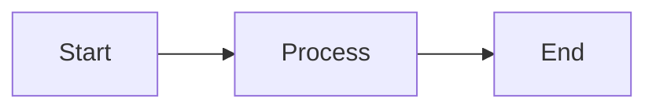

# Chapter 1: How to Use This Book

> *A guide to guides. Meta, but useful.*

---

## The Two Ways to Learn

People learn programming in two ways:

1. **Bottom-up**: Learn syntax, then concepts, then build things
2. **Top-down**: See a working thing, then understand how it works

This book does both. We start with **the map** (top-down: here's what we're building), then teach **foundations** (bottom-up: here's the Rust you need), then **build features** (top-down again: here's how each piece works).

If you're impatient, skip to the chapters that interest you. If you're methodical, read in order.

---

## Prerequisites

### You Need

- **Basic programming experience**: Variables, functions, if/else, loops in any language
- **A computer**: Windows 10+, macOS 10.15+, or Linux
- **Comfort with the terminal**: Running commands, navigating directories
- **A text editor**: VS Code recommended (Tauri has good VS Code support)

### You Don't Need

- Prior Rust experience (we teach it)
- Prior Tauri experience (we teach it)
- Web development skills (Tea's frontend is minimal)
- Deep systems programming knowledge (we explain what's needed)

---

## How Chapters Are Structured

Every chapter follows this pattern:

### 1. The Goal
What you'll understand or build by the end.

### 2. The Concept
Plain-language explanation with analogies.

### 3. The Code
Real code from Tea with annotations.

### 4. The Flow
How this fits into the larger data journey.

### 5. Try It Yourself
Exercises or experiments to solidify understanding.

### 6. Key Takeaways
Bullet points summarizing what you learned.

---

## Conventions

### Code Blocks

Code from the Tea repository looks like this:

```rust
// File: src-tauri/src/core/screen_mode.rs

pub enum ScreenMode {
    KeepScreenOn,
    AllowScreenOff,
}
```

The comment at the top tells you exactly where to find this code.

### Annotations

When we need to explain code inline:

```rust
pub fn should_keep_display_on(&self) -> bool {
    matches!(self, ScreenMode::KeepScreenOn)  // <- Returns true only for KeepScreenOn
}
```

### Analogies

We use real-world analogies to explain concepts. They're marked with *italics*:

> *Ownership is like having the only key to a room. You can give the key away (move), let someone borrow it temporarily (borrow), or make a copy (clone).*

### Diagrams

All diagrams use Mermaid syntax:



These render in GitHub, VS Code (with extensions), and most Markdown viewers.

### Callouts

| Symbol | Meaning |
|--------|---------|
| 💡 | Tip or insight |
| ⚠️ | Common mistake or gotcha |
| 📍 | "You are here" in a data flow |
| 🔑 | Key concept to remember |

---

## The Running Example

Throughout the book, we follow one action:

> **"The user clicks 'Disable Sleep' in the system tray"**

This is our *running example*. Every chapter connects back to it:

- In the Rust chapters: "Here's the type that represents the sleep state"
- In the Tauri chapters: "Here's how the menu event reaches Rust"
- In the feature chapters: "Here's how we update the icon after toggling"

By the end, you'll understand every line of code that executes when that menu item is clicked.

---

## Reading Code vs. Writing Code

This book emphasizes *reading* real code. Why?

1. **Real code is messy**: Production code has edge cases, error handling, and compromises. Tutorials hide this.
2. **Reading builds intuition**: You see patterns before you need to invent them.
3. **The code already works**: Tea is a complete, shipping application. You're learning from success.

We'll also write code—exercises, modifications, and experiments. But reading comes first.

---

## The Tea Codebase

Make sure you have access to the Tea repository. The book references specific files constantly.

### Repository Structure (Relevant Parts)

```
Tea/
├── src-tauri/
│   ├── src/
│   │   ├── main.rs          # Start here
│   │   ├── commands.rs      # Then here
│   │   ├── core/            # The data types
│   │   └── ...              # Services
│   ├── Cargo.toml           # Rust dependencies
│   └── tauri.conf.json      # Tauri configuration
├── src/
│   └── main.ts              # Minimal frontend
└── docs/
    └── chapters/            # This book
```

### Files by Learning Order

If you want to read the code alongside the book:

1. `core/screen_mode.rs` — Simplest type, good Rust intro
2. `core/tooltip.rs` — Simple struct and method
3. `error.rs` — Enums with data
4. `persistence.rs` — File I/O, error handling
5. `icon.rs` — External crate usage
6. `platform.rs` — Traits and conditional compilation
7. `wake_service.rs` — Async code, Arc/Mutex
8. `commands.rs` — Tauri integration, state management
9. `main.rs` — Putting it all together

---

## Suggested Learning Paths

### Path A: Complete Beginner (Never Written Rust)

1. Read Part 0 (The Map) to understand what we're building
2. Work through Part 1 (Rust Foundations) chapter by chapter
3. Do the exercises—they build muscle memory
4. Then proceed to Part 2 (Tauri) and Part 3 (Building Tea)

**Time estimate**: 2–3 weeks at 1 hour/day

### Path B: Know Some Rust, New to Tauri

1. Skim Part 0 for architecture understanding
2. Skim Part 1, stopping at unfamiliar concepts
3. Focus on Part 2 (Tauri Core) and Part 3 (Building Tea)

**Time estimate**: 1 week at 1 hour/day

### Path C: Know Tauri, Want to See Patterns

1. Read Part 0 for the architecture
2. Jump to Part 3 chapters that interest you
3. Use appendices as reference

**Time estimate**: A few hours

### Path D: Reference Mode

Use the [Summary](../SUMMARY.md) to jump to specific topics. Each chapter is designed to be somewhat self-contained.

---

## Setting Up Your Environment

Before Chapter 3 (which covers this in detail), here's the quick version:

### Install Rust

```bash
# Windows: Download from https://rustup.rs
# macOS/Linux:
curl --proto '=https' --tlsv1.2 -sSf https://sh.rustup.rs | sh
```

### Install Node.js

Download from https://nodejs.org (LTS version)

### Install Tauri Prerequisites

See https://tauri.app/start/prerequisites/

### Verify Installation

```bash
rustc --version    # Should show rustc 1.XX.X
cargo --version    # Should show cargo 1.XX.X
node --version     # Should show v20.X.X or similar
npm --version      # Should show 10.X.X or similar
```

### Run Tea

```bash
cd Tea
npm install
cargo tauri dev
```

You should see the tea icon in your system tray.

---

## Getting Help

### If You're Stuck on Rust

- [The Rust Book](https://doc.rust-lang.org/book/) — The official tutorial
- [Rust by Example](https://doc.rust-lang.org/rust-by-example/) — Learn by code
- [Rustlings](https://github.com/rust-lang/rustlings) — Small exercises

### If You're Stuck on Tauri

- [Tauri Documentation](https://tauri.app/develop/) — Official docs
- [Tauri Discord](https://discord.com/invite/tauri) — Community help

### If You Find an Error in This Book

The book lives in `docs/` within the Tea repository. Issues and corrections welcome.

---

## Key Takeaways

- This book teaches by reading real code, then building understanding
- Every chapter connects to the running example: "user clicks Disable Sleep"
- Follow the path that matches your experience level
- Set up your environment before diving into code
- When stuck, use the resources above

---

## Next Steps

- If you're ready to learn Rust: [Chapter 2: Rust Fundamentals](02-rust-fundamentals.md)
- If you want to set up your environment first: [Chapter 3: Setting Up Your Environment](03-setting-up-your-environment.md)
- If you want to review the architecture: [Part 0: The Map](00-part-0-the-map.md)
