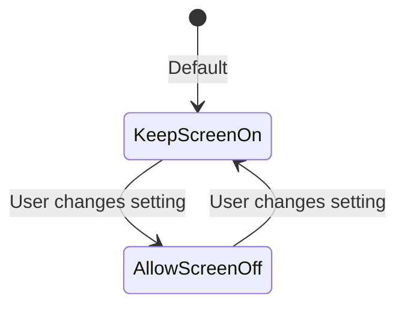
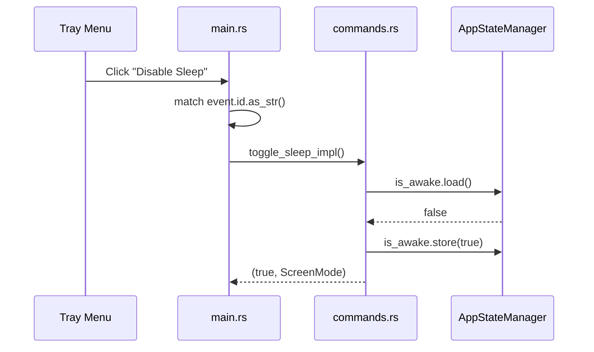

# Chapter 2: Rust Fundamentals for Tauri

> *Learn enough Rust to read Tea's code—and start writing your own.*

---

## The Goal

By the end of this chapter, you'll understand:

- Why Rust exists and what problems it solves
- Variables, types, and mutability
- Functions and return values
- Structs, enums, and methods
- The basics of ownership (deeper dive in Chapter 4)
- How these concepts appear in Tea's actual code

---

## Why Rust?

Rust is a systems programming language. Like C and C++, it gives you low-level control. Unlike them, it prevents entire categories of bugs *at compile time*.

### The Problems Rust Solves

1. **Memory safety without garbage collection**: No null pointer crashes, no use-after-free, no buffer overflows
2. **Concurrency without data races**: The compiler ensures threads don't corrupt shared data
3. **Zero-cost abstractions**: High-level code compiles to efficient machine code

### Why Tauri Uses Rust

Tauri is a framework for building desktop apps. It needs to be:
- **Fast**: Rust has no runtime overhead
- **Small**: Rust binaries are compact
- **Safe**: Desktop apps can't crash or be exploited
- **Cross-platform**: Rust compiles to Windows, macOS, Linux

Tea's entire backend is ~800 lines of Rust. It runs fast, uses minimal memory, and handles errors gracefully.

---

## Variables and Types

### Declaring Variables

```rust
// Immutable by default
let name = "Tea";
let version = 2;

// Mutable with `mut`
let mut counter = 0;
counter = counter + 1;  // This is allowed
```

🔑 **Key insight**: Rust defaults to immutable. This prevents accidental changes and makes code easier to reason about.

### Common Types

```rust
// Integers
let count: i32 = 42;      // Signed 32-bit
let size: usize = 100;    // Platform-sized (for indexing)

// Booleans
let is_active: bool = true;

// Strings
let label: &str = "Enable Sleep";     // String slice (borrowed)
let owned: String = String::from("Enable Sleep");  // Owned string

// Options (might be something or nothing)
let maybe_value: Option<i32> = Some(42);
let nothing: Option<i32> = None;
```

### Types in Tea

From `src-tauri/src/core/screen_mode.rs`:

```rust
// File: src-tauri/src/core/screen_mode.rs

impl ScreenMode {
    pub fn as_str(&self) -> &'static str {
        match self {
            ScreenMode::KeepScreenOn => "KeepScreenOn",
            ScreenMode::AllowScreenOff => "AllowScreenOff",
        }
    }
}
```

Here we see:
- `&self` — A reference to the enum value (borrowed, not moved)
- `&'static str` — A string slice that lives forever (compile-time constant)
- `match` — Rust's pattern matching (we'll cover this soon)

---

## Functions

### Basic Functions

```rust
// Simple function
fn greet() {
    println!("Hello!");
}

// With parameters
fn greet_user(name: &str) {
    println!("Hello, {}!", name);
}

// With return value
fn add(a: i32, b: i32) -> i32 {
    a + b  // No semicolon = return value
}

// Explicit return
fn add_explicit(a: i32, b: i32) -> i32 {
    return a + b;
}
```

🔑 **Key insight**: The last expression without a semicolon is the return value. This is idiomatic Rust.

### Functions in Tea

From `src-tauri/src/core/screen_mode.rs`:

```rust
// File: src-tauri/src/core/screen_mode.rs

impl ScreenMode {
    pub fn should_keep_display_on(&self) -> bool {
        matches!(self, ScreenMode::KeepScreenOn)
    }
}
```

Breaking this down:
- `pub fn` — Public function (accessible from other modules)
- `should_keep_display_on` — Descriptive name (Rust style: snake_case)
- `&self` — Method on `ScreenMode` (borrows the value)
- `-> bool` — Returns a boolean
- `matches!(...)` — Macro that checks if value matches a pattern

---

## Structs

Structs are custom data types that group related values.

### Defining Structs

```rust
struct Person {
    name: String,
    age: u32,
}

// Creating an instance
let user = Person {
    name: String::from("Alice"),
    age: 30,
};
```

### Structs in Tea

From `src-tauri/src/persistence.rs`:

```rust
// File: src-tauri/src/persistence.rs

#[derive(Debug, Serialize, Deserialize)]
pub struct AppState {
    pub sleep_disabled: bool,
    pub screen_mode: ScreenMode,
}
```

Breaking this down:
- `#[derive(...)]` — Automatically implement traits (behaviors)
- `Debug` — Enables printing with `{:?}` format
- `Serialize, Deserialize` — Enables JSON conversion (from `serde` crate)
- `pub` — Struct and fields are public
- `sleep_disabled: bool` — Field named `sleep_disabled` of type `bool`
- `screen_mode: ScreenMode` — Field containing another type we defined

### The Mental Model

*Think of a struct as a form with labeled fields. `AppState` is a form with two fields: a checkbox for "sleep disabled" and a dropdown for "screen mode".*

```mermaid
classDiagram
    class AppState {
        +bool sleep_disabled
        +ScreenMode screen_mode
    }
    note for AppState "Serialized to JSON:\n{\"sleep_disabled\": true,\n\"screen_mode\": \"KeepScreenOn\"}"
```

---

## Enums

Enums define a type that can be one of several variants.

### Basic Enums

```rust
enum Direction {
    North,
    South,
    East,
    West,
}

let heading = Direction::North;
```

### Enums with Data

```rust
enum Message {
    Quit,
    Move { x: i32, y: i32 },
    Write(String),
}

let msg = Message::Move { x: 10, y: 20 };
```

### Enums in Tea

From `src-tauri/src/core/screen_mode.rs`:

```rust
// File: src-tauri/src/core/screen_mode.rs

#[derive(Debug, Clone, Copy, PartialEq, Eq, Serialize, Deserialize, Default)]
pub enum ScreenMode {
    #[default]
    KeepScreenOn,
    AllowScreenOff,
}
```

Breaking this down:
- `#[derive(...)]` — Implement multiple traits automatically
- `Clone, Copy` — Values can be copied instead of moved
- `PartialEq, Eq` — Values can be compared with `==`
- `#[default]` — `KeepScreenOn` is the default variant
- Two variants: `KeepScreenOn` and `AllowScreenOff`

### The Mental Model

*An enum is like a physical switch with labeled positions. `ScreenMode` is a switch that can be in one of two positions.*



---

## Pattern Matching with `match`

Rust's `match` is like a switch statement, but more powerful.

### Basic Matching

```rust
let number = 3;

match number {
    1 => println!("One"),
    2 => println!("Two"),
    3 => println!("Three"),
    _ => println!("Something else"),  // _ matches anything
}
```

### Matching Enums

```rust
enum ScreenMode {
    KeepScreenOn,
    AllowScreenOff,
}

fn describe_mode(mode: ScreenMode) -> &'static str {
    match mode {
        ScreenMode::KeepScreenOn => "Screen stays on",
        ScreenMode::AllowScreenOff => "Screen can sleep",
    }
}
```

### Pattern Matching in Tea

From `src-tauri/src/main.rs` (conceptual, simplified):

```rust
// File: src-tauri/src/main.rs (simplified)

match event.id.as_str() {
    "toggle" => handle_toggle_sleep(&app, &state_manager),
    "screen_on" => handle_screen_mode_change(&app, &state_manager, ScreenMode::KeepScreenOn),
    "screen_off" => handle_screen_mode_change(&app, &state_manager, ScreenMode::AllowScreenOff),
    "toggle_autostart" => handle_toggle_autostart(&app),
    "quit" => app.exit(0),
    _ => {}  // Ignore unknown menu items
}
```

This is how Tea routes menu clicks to handlers. Each menu item has an ID, and `match` directs to the right function.

---

## Methods with `impl`

Methods are functions attached to a type.

### Defining Methods

```rust
struct Rectangle {
    width: u32,
    height: u32,
}

impl Rectangle {
    // Method that borrows self
    fn area(&self) -> u32 {
        self.width * self.height
    }

    // Associated function (no self) - like a constructor
    fn square(size: u32) -> Rectangle {
        Rectangle { width: size, height: size }
    }
}

// Using methods
let rect = Rectangle::square(10);  // Associated function
let area = rect.area();            // Method call
```

### Methods in Tea

From `src-tauri/src/core/tooltip.rs`:

```rust
// File: src-tauri/src/core/tooltip.rs

pub struct TooltipText(String);  // Tuple struct wrapping a String

impl TooltipText {
    pub fn generate(is_awake: bool, screen_mode: ScreenMode) -> Self {
        let text = if !is_awake {
            "Tea - Sleep prevention disabled".to_string()
        } else {
            match screen_mode {
                ScreenMode::KeepScreenOn => "Tea - Screen & System On".to_string(),
                ScreenMode::AllowScreenOff => "Tea - System On, Screen Can Sleep".to_string(),
            }
        };
        TooltipText(text)
    }

    pub fn as_str(&self) -> &str {
        &self.0
    }
}
```

Breaking this down:
- `pub struct TooltipText(String)` — Tuple struct (newtype pattern)
- `fn generate(...) -> Self` — Associated function returning `TooltipText`
- `&self` — Method that borrows the struct
- `self.0` — Access the first (only) field of the tuple struct

### The Mental Model

*`impl` blocks are like adding abilities to a thing. `TooltipText` is a box containing text, and `impl` teaches the box how to generate text (`generate`) and how to show its contents (`as_str`).*

---

## Ownership Basics

This is Rust's signature feature. We'll go deep in Chapter 4, but here are the essentials.

### The Three Rules

1. Each value has exactly one owner
2. When the owner goes out of scope, the value is dropped (freed)
3. You can have either one mutable reference OR any number of immutable references

### Ownership Example

```rust
fn main() {
    let s1 = String::from("hello");  // s1 owns the string
    let s2 = s1;                      // Ownership moves to s2
    // println!("{}", s1);            // ERROR: s1 no longer owns anything
    println!("{}", s2);               // OK: s2 is the owner
}
```

### Borrowing

```rust
fn main() {
    let s1 = String::from("hello");
    let len = calculate_length(&s1);  // Borrow s1
    println!("'{}' has length {}", s1, len);  // s1 still valid
}

fn calculate_length(s: &String) -> usize {
    s.len()  // Use the borrowed reference
}  // s goes out of scope, but doesn't drop the String (it's borrowed)
```

### The Mental Model

*Ownership is like having the only key to a room:*
- *You can give the key away permanently (move)*
- *You can let someone borrow it temporarily (borrow `&`)*
- *You can let someone borrow it and rearrange the furniture (mutable borrow `&mut`)*
- *You can make a copy of the key (clone), but now there are two rooms*

### Ownership in Tea

From `src-tauri/src/commands.rs`:

```rust
// File: src-tauri/src/commands.rs

pub struct AppStateManager {
    pub is_awake: Arc<AtomicBool>,
    pub screen_mode: Arc<Mutex<ScreenMode>>,
}
```

Why `Arc` and `Mutex`?
- `Arc` = "Atomic Reference Counted" — Allows multiple owners across threads
- `Mutex` = "Mutual Exclusion" — Allows safe mutable access from multiple threads

Tea needs thread-safe state because:
- The main thread handles UI events
- The wake service runs on a background thread
- Both need to read/write the same state

We'll explore this in depth in Chapter 4.

---

## Error Handling with `Result`

Rust doesn't have exceptions. Instead, functions that can fail return `Result`.

### The Result Type

```rust
enum Result<T, E> {
    Ok(T),   // Success, contains the value
    Err(E),  // Failure, contains the error
}
```

### Using Result

```rust
use std::fs;

fn read_config() -> Result<String, std::io::Error> {
    fs::read_to_string("config.txt")
}

fn main() {
    match read_config() {
        Ok(contents) => println!("Config: {}", contents),
        Err(e) => println!("Error reading config: {}", e),
    }
}
```

### The `?` Operator

The `?` operator propagates errors automatically:

```rust
fn read_config() -> Result<String, std::io::Error> {
    let contents = fs::read_to_string("config.txt")?;  // Returns Err if fails
    Ok(contents)
}
```

### Error Handling in Tea

From `src-tauri/src/persistence.rs`:

```rust
// File: src-tauri/src/persistence.rs

pub fn read_state() -> AppState {
    read_state_internal().unwrap_or_else(|e| {
        log::warn!("Failed to read state, using defaults: {}", e);
        AppState::default()
    })
}
```

Tea's philosophy: Don't crash. If state is corrupted, log the error and use defaults. The user's experience continues.

---

## Connecting to Tea: The Toggle Flow

Let's trace our running example through the Rust code:



The types we learned:
- `ScreenMode` enum — The user's display preference
- `AppStateManager` struct — Holds the live state
- `match` — Routes the menu event
- `Result` — Functions that might fail

---

## Try It Yourself

### Exercise 1: Read the Types

Open `src-tauri/src/core/screen_mode.rs` and answer:
1. What traits does `ScreenMode` derive?
2. What does `#[default]` mean?
3. What does `should_keep_display_on()` return for each variant?

### Exercise 2: Trace the Data

Open `src-tauri/src/persistence.rs` and find:
1. What fields does `AppState` have?
2. What is the default value for each field?
3. What happens if the state file doesn't exist?

### Exercise 3: Write Some Rust

Create a new file and implement:

```rust
enum Status {
    Active,
    Inactive,
}

impl Status {
    fn as_emoji(&self) -> &'static str {
        // Return "🟢" for Active, "⚫" for Inactive
        todo!()
    }

    fn toggle(&self) -> Status {
        // Return the opposite status
        todo!()
    }
}
```

---

## Key Takeaways

- **Variables** are immutable by default; use `mut` for mutability
- **Structs** group related data; **enums** represent variants
- **`match`** is powerful pattern matching that must be exhaustive
- **`impl`** blocks add methods to types
- **Ownership** ensures memory safety without garbage collection
- **`Result`** handles errors explicitly, no exceptions
- **Tea uses these patterns everywhere**: `ScreenMode` (enum), `AppState` (struct), `AppStateManager` (thread-safe state)

---

## Next Steps

- **Deep dive into ownership**: [Chapter 4: Ownership and Borrowing in Practice](04-ownership-and-borrowing.md)
- **More on structs and enums**: [Chapter 5: Structs, Enums, and Pattern Matching](05-structs-enums-patterns.md)
- **Tea's error handling**: [Chapter 6: Error Handling Done Right](06-error-handling.md)
- **Set up your environment**: [Chapter 3: Setting Up Your Environment](03-setting-up-your-environment.md)
