# Chapter 3: Setting Up Your Environment

> *Before you can build, you must prepare. A craftsman sharpens tools before cutting wood.*

---

## The Goal

By the end of this chapter, you will have:

- Rust and Cargo installed and working
- Node.js and npm installed
- Platform-specific Tauri prerequisites configured
- The Tea application running in development mode
- Verified that everything works

We'll also cover common problems and how to fix them.

---

## Overview: What You Need

Tauri applications require two toolchains:


| Tool | Purpose | Required Version |
|------|---------|------------------|
| Rust | Compiles the backend | Latest stable |
| Node.js | Runs build tools, frontend tooling | LTS (v20+) |
| Platform tools | Native compilation | Varies by OS |

---

## Step 1: Install Rust

Rust is installed via **rustup**, the official Rust toolchain manager.

### Windows

1. Download the installer from [https://rustup.rs](https://rustup.rs)
2. Run `rustup-init.exe`
3. Accept the defaults (press Enter)
4. Restart your terminal

### macOS and Linux

Open a terminal and run:

```bash
curl --proto '=https' --tlsv1.2 -sSf https://sh.rustup.rs | sh
```

Accept the defaults, then restart your terminal or run:

```bash
source $HOME/.cargo/env
```

### Verify Installation

```bash
rustc --version
# Expected: rustc 1.XX.X (XXXXXX 202X-XX-XX)

cargo --version
# Expected: cargo 1.XX.X (XXXXXX 202X-XX-XX)
```

💡 **Tip**: The exact version doesn't matter as long as it's recent (2024 or later). Tea uses Rust Edition 2021.

---

## Step 2: Install Node.js

Node.js runs the frontend build tools (Vite) and the Tauri CLI.

### All Platforms

Download the **LTS version** from [https://nodejs.org](https://nodejs.org)

Or use a version manager:

```bash
# Using nvm (macOS/Linux)
curl -o- https://raw.githubusercontent.com/nvm-sh/nvm/v0.39.0/install.sh | bash
nvm install --lts

# Using fnm (Windows/macOS/Linux)
# Install fnm, then:
fnm install --lts
```

### Verify Installation

```bash
node --version
# Expected: v20.X.X or higher

npm --version
# Expected: 10.X.X or higher
```

---

## Step 3: Install Platform-Specific Tools

This is where platforms diverge. Follow the section for your OS.

### Windows

You need two things:

#### 1. Visual Studio Build Tools

Download from: [https://visualstudio.microsoft.com/visual-cpp-build-tools/](https://visualstudio.microsoft.com/visual-cpp-build-tools/)

During installation, select:
- **"Desktop development with C++"** workload
- This includes MSVC compiler and Windows SDK

⚠️ **Common mistake**: Installing only Visual Studio Code. You need the **Build Tools**, not the editor.

#### 2. WebView2 Runtime

WebView2 is usually pre-installed on Windows 10/11. To verify:

1. Open Settings → Apps → Installed Apps
2. Search for "WebView2"
3. If missing, download from [Microsoft](https://developer.microsoft.com/en-us/microsoft-edge/webview2/)

### macOS

Install Xcode Command Line Tools:

```bash
xcode-select --install
```

A dialog will appear. Click "Install" and wait (it may take several minutes).

Verify:

```bash
xcode-select -p
# Expected: /Library/Developer/CommandLineTools (or similar)
```

### Linux

Linux requires several development libraries. Commands vary by distribution:

#### Ubuntu / Debian

```bash
sudo apt-get update
sudo apt-get install build-essential libwebkit2gtk-4.0-dev libgtk-3-dev libayatana-appindicator3-dev librsvg2-dev xdotool
```

#### Fedora

```bash
sudo dnf install webkit2gtk4.0-devel gtk3-devel libappindicator-gtk3-devel librsvg2-devel xdotool
```

#### Arch / Manjaro

```bash
sudo pacman -S webkit2gtk gtk3 libappindicator-gtk3 librsvg xdotool base-devel
```

💡 **Why xdotool?** Tea uses the `enigo` crate to simulate the F15 key press. On Linux, this requires X11 tools. The `xdotool` package provides the necessary libraries.

---

## Step 4: Clone and Set Up Tea

Now we get the Tea repository and install its dependencies.

### Clone the Repository

```bash
git clone https://github.com/yourusername/tea.git
cd tea
```

Or if you already have it:

```bash
cd /path/to/tea
```

### Install npm Dependencies

```bash
npm install
```

This installs the packages defined in `package.json`:

```json
// File: package.json (excerpt)

{
  "dependencies": {
    "@tauri-apps/api": "^2",
    "@tauri-apps/plugin-shell": "^2"
  },
  "devDependencies": {
    "@tauri-apps/cli": "^2",
    "typescript": "^5.2.2",
    "vite": "^7.2.6",
    "vitest": "^4.0.15"
  }
}
```

Key packages:
- `@tauri-apps/cli` — The Tauri command-line tool
- `@tauri-apps/api` — JavaScript bindings to Tauri
- `vite` — Fast frontend build tool
- `typescript` — Type checking

### Verify Tauri CLI

```bash
npx tauri --version
# Expected: tauri-cli 2.X.X
```

---

## Step 5: Run in Development Mode

This is the moment of truth.

```bash
cargo tauri dev
```

### What Happens

1. **Vite starts** — Frontend dev server on `http://localhost:1420`
2. **Rust compiles** — First build takes 1–5 minutes (subsequent builds are faster)
3. **App launches** — Tea icon appears in your system tray

```mermaid
sequenceDiagram
    participant You
    participant Terminal
    participant Vite
    participant Cargo
    participant Tauri
    participant Tray as System Tray

    You->>Terminal: cargo tauri dev
    Terminal->>Vite: npm run dev
    Vite-->>Terminal: Dev server ready on :1420
    Terminal->>Cargo: Build Rust code
    Cargo-->>Terminal: Compiled (debug mode)
    Terminal->>Tauri: Launch app
    Tauri->>Tray: Add icon
    Tray-->>You: 🫖 Tea icon appears!
```



### First Run is Slow

The first `cargo tauri dev` downloads and compiles all Rust dependencies. This is normal:

```
   Compiling libc v0.2.XXX
   Compiling serde v1.0.XXX
   Compiling tauri v2.X.X
   ... (many more) ...
   Compiling tea v2.0.0
```

Subsequent runs skip unchanged dependencies and complete in seconds.

### Success Looks Like

You should see the Tea icon in your system tray:

- **Windows**: Bottom-right corner, possibly in the overflow menu (^)
- **macOS**: Top-right menu bar
- **Linux**: System tray area (depends on desktop environment)

Click the icon to see the menu:
- Disable Sleep / Enable Sleep
- Keep Screen On (Windows only)
- Allow Screen Off (Windows only)
- Start at Login
- Quit

---

## Step 6: Verify the Development Environment

Let's make sure everything works correctly.

### Test 1: Toggle Sleep Prevention

1. Click the Tea tray icon
2. Click "Disable Sleep"
3. The menu text should change to "Enable Sleep"
4. The tooltip should update

### Test 2: Hot Reload (Frontend)

1. Open `src/main.ts` in your editor
2. Change the console.log message:
   ```typescript
   console.log("Tea application loaded - modified!");
   ```
3. Save the file
4. Check the browser dev tools (if open) or terminal — the change is detected

Note: For a system tray app, frontend hot reload has limited visibility since there's no window.

### Test 3: Rust Rebuild

1. Open `src-tauri/src/core/tooltip.rs`
2. Make a small change to a string
3. Save — Watch the terminal: Rust recompiles automatically
4. The app restarts with your change

### Test 4: Run the Tests

```bash
# Frontend tests
npm run test:run

# Rust tests
cd src-tauri
cargo test
```

---

## Common Problems and Solutions

### Problem: "cargo: command not found"

**Cause**: Rust isn't in your PATH.

**Solution**:
```bash
# Add to PATH (add to your shell config for persistence)
export PATH="$HOME/.cargo/bin:$PATH"

# Or restart your terminal
```

### Problem: "error: linker `link.exe` not found" (Windows)

**Cause**: Visual Studio Build Tools not installed or not configured.

**Solution**:
1. Install Visual Studio Build Tools
2. Select "Desktop development with C++"
3. Restart your terminal

### Problem: "webkit2gtk not found" (Linux)

**Cause**: Missing development libraries.

**Solution**: Install the libraries for your distro (see Step 3 above).

### Problem: First compile takes forever

**Cause**: Normal for first build — downloading and compiling dependencies.

**Solution**: Wait. Subsequent builds are much faster. For reference:
- First build: 2–10 minutes (depending on machine)
- Incremental build: 5–30 seconds

### Problem: "port 1420 already in use"

**Cause**: Another process is using the Vite dev server port.

**Solution**:
```bash
# Find and kill the process
# Windows:
netstat -ano | findstr :1420
taskkill /PID <PID> /F

# macOS/Linux:
lsof -i :1420
kill -9 <PID>
```

### Problem: Tray icon doesn't appear (Linux)

**Cause**: Desktop environment doesn't support AppIndicator or system tray.

**Solution**:
- GNOME: Install the "AppIndicator and KStatusNotifierItem Support" extension
- Some minimal WMs: May require a system tray program like `trayer`

### Problem: "error[E0433]: failed to resolve: use of undeclared crate"

**Cause**: Rust dependencies not downloaded or corrupted.

**Solution**:
```bash
cd src-tauri
cargo clean
cargo build
```

---

## Understanding the Project Structure

Now that you have Tea running, let's orient you to the codebase:

```
Tea/
├── package.json         # npm configuration, scripts
├── tsconfig.json        # TypeScript configuration
├── vite.config.ts       # Vite build configuration
├── vitest.config.ts     # Test configuration
│
├── src/                 # Frontend source
│   ├── main.ts          # Entry point (minimal for tray apps)
│   └── styles.css       # Styles (unused in tray-only app)
│
├── src-tauri/           # Rust backend
│   ├── Cargo.toml       # Rust dependencies
│   ├── tauri.conf.json  # Tauri configuration
│   ├── build.rs         # Build script
│   └── src/             # Rust source files
│       ├── main.rs      # Entry point
│       ├── commands.rs  # Tauri commands
│       └── ...          # Other modules
│
├── tests/               # Test files
└── docs/                # This book
```

### Key Configuration Files

#### `package.json` — npm Scripts

```json
// File: package.json (scripts section)

"scripts": {
  "dev": "vite",              // Start Vite dev server
  "build": "tsc && vite build", // Type-check and build frontend
  "tauri": "tauri",           // Tauri CLI passthrough
  "test": "vitest",           // Run tests in watch mode
  "test:run": "vitest run"    // Run tests once
}
```

#### `src-tauri/Cargo.toml` — Rust Dependencies

```toml
// File: src-tauri/Cargo.toml (excerpt)

[dependencies]
tauri = { version = "2", features = ["tray-icon"] }
tauri-plugin-autostart = "2"
tokio = { version = "1", features = ["time", "rt-multi-thread", "macros"] }
enigo = "0.3.0"
serde = { version = "1.0", features = ["derive"] }
```

Key dependencies:
- `tauri` with `tray-icon` feature — Core framework + system tray support
- `tauri-plugin-autostart` — Start at login functionality
- `tokio` — Async runtime for background tasks
- `enigo` — Cross-platform input simulation (F15 key)
- `serde` — JSON serialization

#### `src-tauri/tauri.conf.json` — Tauri Configuration

```json
// File: src-tauri/tauri.conf.json (excerpt)

{
  "productName": "Tea",
  "version": "2.0.0",
  "identifier": "com.tea.app",
  "build": {
    "beforeDevCommand": "npm run dev",
    "devUrl": "http://localhost:1420",
    "beforeBuildCommand": "npm run build"
  },
  "app": {
    "windows": []  // No windows! Tray-only app
  }
}
```

Notice `"windows": []` — Tea has no visible window. It's purely a system tray application.

---

## Development Workflow

Here's the typical workflow when developing Tea:


### Useful Commands

| Command | Purpose |
|---------|---------|
| `cargo tauri dev` | Start development mode |
| `cargo tauri build` | Build release binary |
| `npm run test:run` | Run frontend tests |
| `cargo test` | Run Rust tests (in `src-tauri/`) |
| `cargo check` | Fast type-check without building |
| `cargo clippy` | Lint Rust code |

---

## Key Takeaways

- **Three toolchains**: Rust, Node.js, and platform-specific tools are all required
- **First build is slow**: Dependencies compile once, then incremental builds are fast
- **`cargo tauri dev`**: The main command for development
- **Tray-only app**: Tea has no window — all interaction is through the system tray
- **Configuration lives in three places**: `package.json`, `Cargo.toml`, `tauri.conf.json`

---

## Try It Yourself

### Exercise 1: Explore the Tray Menu

Click through all the menu items. Notice:
- How does "Disable Sleep" / "Enable Sleep" toggle?
- What happens to the icon when you toggle?
- What's the tooltip text in each state?

### Exercise 2: Read the Logs

Run with verbose logging:

```bash
RUST_LOG=debug cargo tauri dev
```

Click menu items and watch the terminal. You'll see debug output showing what's happening internally.

### Exercise 3: Make a Change

1. Open `src-tauri/src/core/tooltip.rs`
2. Find the tooltip strings
3. Change one (e.g., "Tea - Sleep prevention disabled" → "Tea - Sleeping allowed")
4. Save and watch the app rebuild
5. Verify your change appears in the tooltip

---

## Next Steps

Your environment is ready. You understand the project structure. Now we go deeper:

- **Ownership and borrowing**: [Chapter 4: Ownership and Borrowing in Practice](04-ownership-and-borrowing.md) — Why Tea uses `Arc<AtomicBool>` and `Arc<Mutex<T>>`
- **Error handling**: [Chapter 6: Error Handling Done Right](06-error-handling.md) — How Tea's `AppError` works
- **Tauri architecture**: [Chapter 7: Tauri Architecture Deep Dive](07-tauri-architecture.md) — How Rust and the frontend communicate
