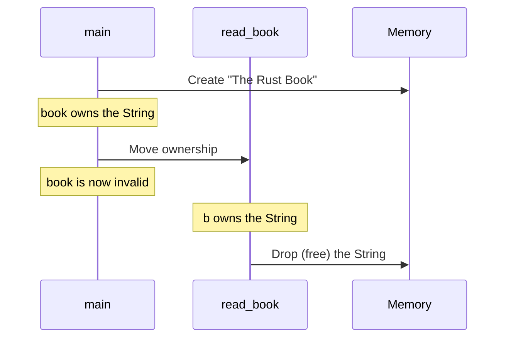
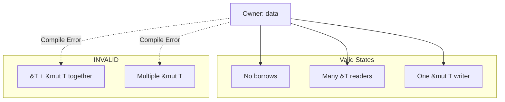
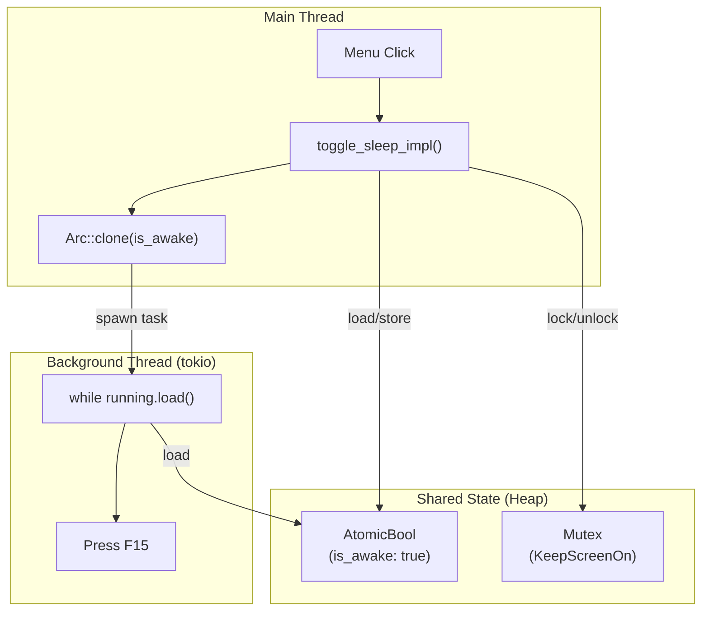
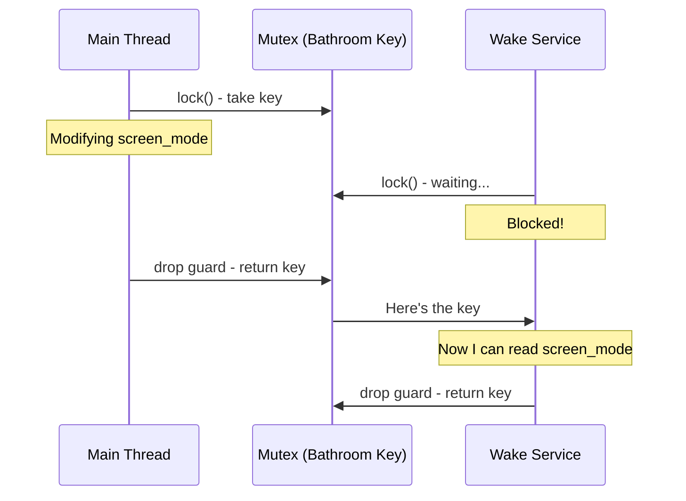

# Chapter 4: Ownership and Borrowing in Practice

> *Every value in Rust has one owner. When the owner goes away, so does the value. This simple rule prevents entire categories of bugs.*

---

## The Goal

By the end of this chapter, you'll understand:

- Why ownership exists (the problem it solves)
- How moves, copies, and clones work
- Borrowing with `&` and `&mut`
- Why Tea uses `Arc<AtomicBool>` and `Arc<Mutex<T>>`
- How to read Tea's thread-safe code with confidence

This is the chapter where Rust "clicks." Let's make it stick with analogies.

---

## The Problem Ownership Solves

In most programming languages, you can do this:

```javascript
// JavaScript - no ownership
let data = { value: 42 };
let alias1 = data;
let alias2 = data;
alias1.value = 100;
console.log(alias2.value); // 100 - spooky action at a distance!
```

Three variables point to the same object. Change one, all see it. This seems convenient until:

1. **Memory leaks**: Who's responsible for cleanup?
2. **Use-after-free**: Someone deletes the data while others still use it
3. **Data races**: Two threads modify simultaneously → corruption

Rust's ownership system makes these bugs *impossible at compile time*.

---

## Ownership: The Library Book Analogy

*Imagine a library with a strict rule: every book has exactly one borrower at a time. When you check out a book, it's yours. When you return it (go out of scope), the library can lend it to someone else or discard it.*

```rust
fn main() {
    let book = String::from("The Rust Book");  // You check out the book
    
    read_book(book);  // You give the book to read_book function
    
    // println!("{}", book);  // ERROR: You don't have the book anymore!
}

fn read_book(b: String) {
    println!("Reading: {}", b);
}  // Book is "returned" (dropped) here
```

The `book` variable **owns** the String. When we pass it to `read_book`, ownership **moves**. The original variable is now empty—using it is a compile error.

### The Mental Model



---

## Move vs. Copy: The Photocopy Analogy

*Some things in the library can't be photocopied (unique manuscripts). Others can (simple forms). Rust has the same distinction.*

### Types That Move (Default)

```rust
let s1 = String::from("hello");
let s2 = s1;  // s1 is MOVED to s2
// println!("{}", s1);  // ERROR: s1 is invalid
```

`String` holds data on the heap. If we just copied the pointer, two variables would "own" the same memory. When both go out of scope, the memory would be freed twice. 💥

### Types That Copy (Simple Values)

```rust
let x = 42;
let y = x;  // x is COPIED to y
println!("{}", x);  // OK: x is still valid
```

Simple types like `i32`, `bool`, `f64` implement the `Copy` trait. They're small and live entirely on the stack—copying is cheap and safe.

### Tea Example: `ScreenMode` is Copy

```rust
// File: src-tauri/src/core/screen_mode.rs

#[derive(Clone, Copy, PartialEq, Eq, Debug)]
pub enum ScreenMode {
    KeepScreenOn,
    AllowScreenOff,
}
```

See `Copy` in the derive list? This enum is just a tag (one byte)—cheap to copy. That's why we can do:

```rust
// File: src-tauri/src/commands.rs

let current_mode = *screen_mode.lock().unwrap();  // Copy the value out
// screen_mode still owns the Mutex, current_mode has a copy of the value
```

### The Rule

| Type | Behavior | Why |
|------|----------|-----|
| `i32`, `bool`, `char`, `f64` | Copy | Small, stack-only |
| `String`, `Vec<T>`, `Box<T>` | Move | Heap data, expensive to copy |
| Custom structs | Move by default | Unless you derive `Copy` |
| `ScreenMode` | Copy | Derived, just a tag |

---

## Clone: The Deliberate Photocopy

*Sometimes you want to copy something that doesn't auto-copy. You have to explicitly ask for a photocopy.*

```rust
let s1 = String::from("hello");
let s2 = s1.clone();  // Explicit deep copy
println!("{} {}", s1, s2);  // Both valid!
```

`clone()` creates a full, independent copy. It's explicit because it might be expensive (copying megabytes of data).

### Tea Example: Cloning Arc

```rust
// File: src-tauri/src/commands.rs

pub fn start_wake_service(is_awake: Arc<AtomicBool>, screen_mode: ScreenMode) {
    let display_controller = platform::get_display_controller();
    let service = WakeService::new(is_awake, display_controller);
    // ...
}
```

Wait, we pass `is_awake` (an `Arc`) without cloning—doesn't it move? We'll see why shortly. First, let's understand borrowing.

---

## Borrowing: The Visitor Pass Analogy

*You're at a conference. You can let someone look at your badge (read), but you don't give it away. That's borrowing.*

### Immutable Borrow: `&T`

```rust
fn main() {
    let book = String::from("The Rust Book");
    
    show_title(&book);  // Lend for reading
    
    println!("I still have: {}", book);  // Still mine!
}

fn show_title(b: &String) {  // Borrow, don't take
    println!("Title: {}", b);
}  // Borrow ends, original owner unaffected
```

`&book` creates a **reference**—a pointer that borrows the value without taking ownership.

### Mutable Borrow: `&mut T`

*You can let someone edit your document, but only one person at a time. Otherwise, chaos.*

```rust
fn main() {
    let mut book = String::from("Draft");
    
    add_chapter(&mut book);  // Lend for editing
    
    println!("{}", book);  // "Draft - Chapter 1"
}

fn add_chapter(b: &mut String) {
    b.push_str(" - Chapter 1");
}
```

`&mut` allows modification. But there's a rule:

### The Borrowing Rules

1. **Many readers OR one writer** — You can have either:
   - Any number of `&T` (immutable references)
   - Exactly one `&mut T` (mutable reference)
   - Never both at the same time

2. **References must be valid** — Can't outlive the data they point to

```rust
// This WON'T compile:
let mut data = vec![1, 2, 3];
let first = &data[0];      // Immutable borrow
data.push(4);              // ERROR: Can't mutate while borrowed
println!("{}", first);     // Borrow used here
```

The compiler catches the bug: `push` might reallocate the vector, invalidating `first`.

### The Mental Model



---

## The Multi-Threaded Problem

So far, so good. But Tea has a challenge:

1. The **main thread** handles tray menu clicks
2. A **background thread** runs the wake service (pressing F15)
3. Both need to read/write the `is_awake` state

Regular references won't work across threads. We need special tools.

### The Hotel Key Card Analogy

*Imagine a hotel room with an electronic lock. Normal keys only work for one person. But the hotel can issue multiple key cards, all accessing the same room. The lock tracks who's inside and prevents conflicts.*

That's what `Arc` and `Mutex` do.

---

## Arc: Shared Ownership Across Threads

**Arc** = **A**tomic **R**eference **C**ounted

*Arc is like a shared key card system. Multiple people can hold cards to the same room. The room only gets cleaned up (memory freed) when the last card is returned.*

```rust
use std::sync::Arc;

let data = Arc::new(String::from("shared"));

let data1 = Arc::clone(&data);  // New key card, same room
let data2 = Arc::clone(&data);  // Another key card

// All three can read the data
// When all three go out of scope, memory is freed
```

### Why "Atomic"?

The reference count is updated **atomically**—thread-safe without locks. Multiple threads can clone/drop `Arc`s simultaneously.

### Tea Example: Sharing `is_awake`

```rust
// File: src-tauri/src/commands.rs

pub struct AppStateManager {
    pub is_awake: Arc<AtomicBool>,
    pub screen_mode: Arc<Mutex<ScreenMode>>,
}
```

`is_awake` is wrapped in `Arc`. This means:
- Multiple places can hold a reference to the same `AtomicBool`
- When passed to the wake service, we clone the `Arc`, not move it

```rust
// Simplified from commands.rs

pub fn start_wake_service(is_awake: Arc<AtomicBool>, screen_mode: ScreenMode) {
    let service = WakeService::new(is_awake, /* ... */);
    
    tokio::spawn(async move {
        service.run(screen_mode).await
    });
}
```

The `Arc<AtomicBool>` is cloned when passed here (Arc implements Clone cheaply—just increment the count). The background task and main thread share the same underlying boolean.

---

## AtomicBool: Lock-Free Thread Safety

*AtomicBool is like a light switch with a "do not disturb" mechanism built in. Anyone can flip it, and everyone instantly sees the current state.*

```rust
use std::sync::atomic::{AtomicBool, Ordering};

let flag = AtomicBool::new(false);

flag.store(true, Ordering::SeqCst);   // Set to true
let value = flag.load(Ordering::SeqCst);  // Read current value
```

`AtomicBool` operations are **atomic**—they complete in one indivisible step. No locks needed.

### Tea Example: The `is_awake` Flag

```rust
// File: src-tauri/src/commands.rs

pub fn toggle_sleep_impl(
    is_awake: &Arc<AtomicBool>,
    screen_mode: &Arc<Mutex<ScreenMode>>,
) -> Result<(bool, ScreenMode), String> {
    let was_awake = is_awake.load(Ordering::SeqCst);  // Read
    let new_awake = !was_awake;                        // Flip
    is_awake.store(new_awake, Ordering::SeqCst);      // Write
    // ...
}
```

And in the wake service:

```rust
// File: src-tauri/src/wake_service.rs

while self.running.load(Ordering::SeqCst) {
    // Press F15...
    tokio::time::sleep(Duration::from_secs(60)).await;
}
```

The main thread sets `is_awake` to `false`; the wake service sees it immediately and exits its loop.

### What's `Ordering::SeqCst`?

Memory ordering controls how operations are observed across threads. `SeqCst` (Sequentially Consistent) is the strictest—all threads see operations in the same order. It's the safest default.

---

## Mutex: One Writer at a Time

*A Mutex is like a bathroom key at a gas station. Only one person can have it. You take it, do your business, then return it so the next person can go.*

**Mutex** = **Mut**ual **Ex**clusion

```rust
use std::sync::Mutex;

let data = Mutex::new(5);

{
    let mut guard = data.lock().unwrap();  // Take the key
    *guard = 10;                            // Modify data
}  // Return the key (guard dropped)

// Another thread can now lock it
```

When you call `.lock()`, you get a **guard**. The guard:
1. Gives you access to the inner value
2. Automatically releases the lock when dropped

### Tea Example: Protecting `screen_mode`

```rust
// File: src-tauri/src/commands.rs

pub fn change_screen_mode_impl(
    is_awake: &Arc<AtomicBool>,
    screen_mode: &Arc<Mutex<ScreenMode>>,
    new_mode: ScreenMode,
) -> Result<ScreenMode, String> {
    // Lock, modify, unlock (via scope)
    {
        let mut mode = screen_mode
            .lock()
            .map_err(|e| format!("Mutex poisoned: {}", e))?;
        *mode = new_mode;
    }  // Lock released here
    
    // ...
}
```

Why `Mutex<ScreenMode>` but `AtomicBool` for `is_awake`?

| Type | Use Case |
|------|----------|
| `AtomicBool` | Simple flag, just true/false, very fast |
| `Mutex<T>` | Any type, more complex operations |

`ScreenMode` is an enum. While it's `Copy`, we might want to add more variants or do more complex updates. `Mutex` is flexible.

### Mutex Poisoning

If a thread panics while holding a lock, the Mutex becomes "poisoned." Tea handles this:

```rust
let mut mode = screen_mode
    .lock()
    .map_err(|e| format!("Mutex poisoned: {}", e))?;
```

The `map_err` converts a poison error into a string error. In practice, this rarely happens.

---

## Putting It Together: The Complete Picture

Let's trace ownership through Tea's toggle flow:



### The Ownership Chain

1. **`AppStateManager`** owns `Arc<AtomicBool>` and `Arc<Mutex<ScreenMode>>`
2. **Tauri** stores `AppStateManager` in managed state
3. **Commands** receive `&Arc<...>` (borrowed) via `State<AppStateManager>`
4. **When spawning wake service**, we `Arc::clone()` to share with background thread
5. **Both threads** can read/write via atomic operations / mutex locks
6. **When app exits**, Arcs drop, reference count reaches zero, memory freed

---

## Common Patterns in Tea

### Pattern 1: Load from AtomicBool

```rust
// Read the current value
let awake = is_awake.load(Ordering::SeqCst);
```

### Pattern 2: Store to AtomicBool

```rust
// Set a new value
is_awake.store(true, Ordering::SeqCst);
```

### Pattern 3: Lock-Modify-Unlock Mutex

```rust
{
    let mut guard = screen_mode.lock().unwrap();
    *guard = new_mode;
}  // Automatic unlock
```

### Pattern 4: Read from Mutex (Copy out)

```rust
let mode = *screen_mode.lock().unwrap();  // Copy the value
// Now `mode` is a copy, lock is released
```

### Pattern 5: Clone Arc for Thread Spawn

```rust
let is_awake_clone = Arc::clone(&is_awake);
tokio::spawn(async move {
    // is_awake_clone moved into this closure
    while is_awake_clone.load(Ordering::SeqCst) { /* ... */ }
});
```

---

## The Bathroom Key Diagram

Let's visualize `Mutex` with our gas station analogy:



---

## Why Not Just Use Globals?

You might wonder: why all this complexity? Can't we just use global variables?

In other languages, you might. But:

1. **Data races**: Two threads writing simultaneously = undefined behavior
2. **Hidden dependencies**: Hard to test, hard to reason about
3. **Initialization order**: When do globals initialize?

Rust's ownership system makes dependencies explicit. `AppStateManager` clearly owns the state, and you can see exactly where it's shared.

---

## Summary Table

| Concept | Analogy | Rust Type | When to Use |
|---------|---------|-----------|-------------|
| Ownership | Library book checkout | Default behavior | Always—it's the foundation |
| Move | Giving away your book | Default for heap types | When you don't need the original |
| Copy | Photocopying a form | `Copy` trait | Small stack values |
| Clone | Deliberate photocopy | `.clone()` | When you need a separate copy |
| Borrow (`&T`) | Visitor pass | `&` reference | Read access, keep ownership |
| Mut borrow (`&mut T`) | Editor access | `&mut` reference | Write access, exclusive |
| Arc | Shared key cards | `Arc<T>` | Multiple owners across threads |
| AtomicBool | Light switch | `AtomicBool` | Thread-safe boolean flag |
| Mutex | Bathroom key | `Mutex<T>` | Thread-safe any-type access |

---

## Try It Yourself

### Exercise 1: Trace the Ownership

Open `src-tauri/src/commands.rs`. For `toggle_sleep_impl`:
1. What parameters are borrowed (`&`)?
2. What parameters are owned?
3. Where does `ScreenMode` get copied?

### Exercise 2: Find the Mutex Lock

In `change_screen_mode_impl`, find:
1. Where the mutex is locked
2. Where it's unlocked (hint: scope braces)
3. What would happen if we forgot the inner braces?

### Exercise 3: Experiment with Ownership

Try this in a Rust playground:

```rust
fn main() {
    let s = String::from("hello");
    takes_ownership(s);
    // Uncomment the next line - what error do you get?
    // println!("{}", s);
}

fn takes_ownership(text: String) {
    println!("{}", text);
}
```

Now modify it to use borrowing so `s` remains valid.

---

## Key Takeaways

- **Ownership** = exactly one owner per value; owner drops → value freed
- **Move** = ownership transfers; original becomes invalid
- **Copy** = cheap clone for simple types; both remain valid
- **Borrowing** = temporary access; many readers OR one writer
- **Arc** = thread-safe shared ownership (reference counting)
- **AtomicBool** = thread-safe boolean without locks
- **Mutex** = thread-safe access to any type (one at a time)
- **Tea uses all of these** to safely share state between UI thread and background service

---

## Next Steps

- **More on structs and enums**: [Chapter 5: Structs, Enums, and Pattern Matching](05-structs-enums-patterns.md)
- **Error handling patterns**: [Chapter 6: Error Handling Done Right](06-error-handling.md)
- **How Tauri uses this**: [Chapter 8: Commands and State Management](08-commands-and-state.md)
