# Chapter 5: Structs, Enums, and Pattern Matching

> *Data structures are containers for meaning. Choose the right container, and your code explains itself.*

---

## The Goal

By the end of this chapter, you'll understand:

- How to define and use structs (with Tea's `AppState`, `TooltipText`)
- Tuple structs and the newtype pattern
- Enums with and without data (Tea's `ScreenMode`, `AppError`)
- Pattern matching with `match`, `if let`, and `matches!`
- Derive macros and what they give you for free

We'll see how Tea's data types express the domain clearly and safely.

---

## Structs: Labeled Containers

*A struct is like a labeled shipping box. Each field has a name, and you know exactly what's inside.*

### Basic Struct

```rust
struct Person {
    name: String,
    age: u32,
    active: bool,
}

let alice = Person {
    name: String::from("Alice"),
    age: 30,
    active: true,
};

println!("{} is {} years old", alice.name, alice.age);
```

Fields are accessed with dot notation. Simple and clear.

### Tea Example: `AppState`

```rust
// File: src-tauri/src/persistence.rs

#[derive(Serialize, Deserialize, Default, Debug, Clone, PartialEq, Eq)]
pub struct AppState {
    /// Whether system wake is currently active
    pub sleep_disabled: bool,
    /// User's screen mode preference
    pub screen_mode: ScreenMode,
}
```

This struct represents the saved state of the application. It has:
- Two fields with clear names
- Documentation comments (`///`)
- Derived traits (we'll cover these shortly)

### The Mental Model

*Think of `AppState` as a form with two checkboxes:*
- ☑️ Sleep disabled?
- 📺 Screen mode: [KeepScreenOn / AllowScreenOff]

When you save the form to a file (JSON), you can reload it later and get the same answers.

```mermaid
flowchart LR
    subgraph AppState["AppState (in memory)"]
        sleep["sleep_disabled: true"]
        mode["screen_mode: KeepScreenOn"]
    end

    subgraph JSON["state.json (on disk)"]
        json["{<br/>  \"sleep_disabled\": true,<br/>  \"screen_mode\": \"KeepScreenOn\"<br/>}"]
    end

    AppState -->|"Serialize"| JSON
    JSON -->|"Deserialize"| AppState
```

---

## Tuple Structs: The Newtype Pattern

*Sometimes you want a box with just one thing inside, but you want to give it a special name.*

### Basic Tuple Struct

```rust
struct Meters(f64);
struct Feet(f64);

let distance_m = Meters(100.0);
let distance_f = Feet(328.0);

// This won't compile - different types!
// let sum = distance_m + distance_f;
```

Both hold `f64`, but they're different types. The compiler prevents mixing them up.

### Tea Example: `TooltipText`

```rust
// File: src-tauri/src/core/tooltip.rs

#[derive(Debug, Clone, PartialEq, Eq)]
pub struct TooltipText(String);
```

This is a **newtype**—a tuple struct wrapping one value. Why not just use `String`?

| Plain `String` | `TooltipText` |
|---------------|---------------|
| Could be anything | Specifically for tooltips |
| No validation | Can enforce rules in constructor |
| Easy to mix up | Type-safe, compiler catches mistakes |

### The Newtype Analogy

*A `String` is like a blank envelope—it can hold any message. A `TooltipText` is like a pre-printed "TOOLTIP" envelope. You can't accidentally put it in the "ERROR MESSAGE" mailbox.*

### Accessing the Inner Value

Tuple structs use numeric indices:

```rust
impl TooltipText {
    pub fn as_str(&self) -> &str {
        &self.0  // Access the first (only) field
    }
}
```

Or implement `AsRef` for ergonomic access:

```rust
impl AsRef<str> for TooltipText {
    fn as_ref(&self) -> &str {
        &self.0
    }
}
```

---

## Enums: Choices with Meaning

*An enum is like a multiple-choice question. You must pick exactly one answer, and each answer can carry different data.*

### Simple Enum (No Data)

```rust
enum Direction {
    North,
    South,
    East,
    West,
}

let heading = Direction::North;
```

### Tea Example: `ScreenMode`

```rust
// File: src-tauri/src/core/screen_mode.rs

#[derive(Serialize, Deserialize, Clone, Copy, PartialEq, Eq, Debug)]
pub enum ScreenMode {
    /// Prevent display from sleeping
    KeepScreenOn,
    /// Allow display to sleep while keeping system awake
    AllowScreenOff,
}
```

Two variants. No data attached. Perfect for a toggle setting.

### The Mental Model

*`ScreenMode` is like a physical toggle switch with two positions:*


---

## Enums with Data: The Power Move

Enums can carry different data per variant. This is Rust's killer feature.

### Example: Message Types

```rust
enum Message {
    Quit,                       // No data
    Move { x: i32, y: i32 },    // Named fields (like struct)
    Write(String),              // Tuple variant (one field)
    ChangeColor(u8, u8, u8),    // Tuple variant (three fields)
}
```

Each variant is a different "shape" of data, but they're all `Message`.

### Tea Example: `AppError`

```rust
// File: src-tauri/src/error.rs

#[derive(Debug)]
pub enum AppError {
    StateIo {
        message: String,
        cause: String,
        recovery_hint: &'static str,
    },
    StateSerialization {
        message: String,
        cause: String,
        recovery_hint: &'static str,
    },
    IconProcessing {
        message: String,
        cause: String,
        recovery_hint: &'static str,
    },
    InputSimulation {
        message: String,
        cause: String,
        recovery_hint: &'static str,
    },
}
```

Every error variant has:
- `message` — What went wrong (human-readable)
- `cause` — Technical details
- `recovery_hint` — What the user can try

### The Error Analogy

*`AppError` is like a medical form where you check which symptom you have, and each symptom has its own set of follow-up questions:*

- ☐ State I/O problem → What file? What error? How to fix?
- ☐ Serialization problem → What data? What error? How to fix?
- ☐ Icon problem → Which icon? What error? How to fix?
- ☐ Input simulation problem → What failed? How to fix?

### Why This Is Powerful

Compare to other languages:

```javascript
// JavaScript - error could be anything
throw new Error("Something went wrong");

// What kind of error? What's the hint? Who knows!
```

```rust
// Rust - error is structured, exhaustive
return Err(AppError::StateIo {
    message: "Failed to write state file".to_string(),
    cause: io_error.to_string(),
    recovery_hint: "Check disk space and permissions.",
});
```

The compiler ensures you handle all error variants.

---

## Pattern Matching: The Swiss Army Knife

`match` is Rust's way of inspecting enums (and other types) and running different code for each case.

### Basic Match

```rust
enum Direction { North, South, East, West }

fn describe(dir: Direction) -> &'static str {
    match dir {
        Direction::North => "Going up",
        Direction::South => "Going down",
        Direction::East => "Going right",
        Direction::West => "Going left",
    }
}
```

**Exhaustiveness**: You must handle every variant. The compiler enforces this.

### Tea Example: Matching `ScreenMode`

```rust
// File: src-tauri/src/core/tooltip.rs

pub fn for_state(is_awake: bool, screen_mode: ScreenMode) -> Self {
    let text = if is_awake {
        match screen_mode {
            ScreenMode::KeepScreenOn => "Tea - Screen & System On",
            ScreenMode::AllowScreenOff => "Tea - System On, Screen Can Sleep",
        }
    } else {
        "Tea - Sleep prevention disabled"
    };
    TooltipText(text.to_string())
}
```

Two states → two branches → two different messages. Clean and explicit.

### Matching Enums with Data

```rust
// File: src-tauri/src/error.rs

impl fmt::Display for AppError {
    fn fmt(&self, f: &mut fmt::Formatter<'_>) -> fmt::Result {
        match self {
            AppError::StateIo { message, cause, recovery_hint } => {
                write!(f, "State I/O error: {} (cause: {}, hint: {})",
                       message, cause, recovery_hint)
            }
            AppError::StateSerialization { message, cause, recovery_hint } => {
                write!(f, "Serialization error: {} (cause: {}, hint: {})",
                       message, cause, recovery_hint)
            }
            // ... other variants
        }
    }
}
```

Pattern matching **destructures** the enum, binding the inner fields to variables.

### The Analogy

*Pattern matching is like a mail sorting machine. Letters come in, the machine reads the address (the variant), extracts the contents (the data), and routes to the right bin (the code block).*

```mermaid
flowchart TD
    Error["AppError arrives"]
    Error --> Check{"Which variant?"}
    Check -->|StateIo| IO["Extract message, cause, hint<br/>→ Format as I/O error"]
    Check -->|StateSerialization| Serial["Extract message, cause, hint<br/>→ Format as serialization error"]
    Check -->|IconProcessing| Icon["Extract message, cause, hint<br/>→ Format as icon error"]
    Check -->|InputSimulation| Input["Extract message, cause, hint<br/>→ Format as input error"]
```



---

## `if let`: Simple Pattern Matching

When you only care about one variant, `if let` is cleaner than `match`:

```rust
let value: Option<i32> = Some(42);

// Full match
match value {
    Some(n) => println!("Got {}", n),
    None => {}  // Do nothing for None
}

// Cleaner with if let
if let Some(n) = value {
    println!("Got {}", n);
}
```

### Tea Example: Optional Handling

```rust
// Hypothetical example - if we had optional config
if let Some(config) = load_optional_config() {
    apply_config(config);
}
// If None, just skip - no else needed
```

---

## `matches!`: Boolean Pattern Test

Sometimes you just want to know "is this variant X?" without extracting data:

```rust
// File: src-tauri/src/core/screen_mode.rs

impl ScreenMode {
    pub fn should_keep_display_on(self) -> bool {
        matches!(self, ScreenMode::KeepScreenOn)
    }
}
```

`matches!` returns `true` if the pattern matches, `false` otherwise. Perfect for boolean checks.

### Equivalent Without `matches!`

```rust
pub fn should_keep_display_on(self) -> bool {
    match self {
        ScreenMode::KeepScreenOn => true,
        ScreenMode::AllowScreenOff => false,
    }
}
```

`matches!` is shorter and more readable for simple cases.

---

## Derive Macros: Free Functionality

The `#[derive(...)]` attribute asks the compiler to auto-implement traits. Let's decode what Tea uses:

### `Debug`

```rust
#[derive(Debug)]
struct Point { x: i32, y: i32 }

let p = Point { x: 1, y: 2 };
println!("{:?}", p);  // Point { x: 1, y: 2 }
```

**What it gives you**: Printable debug output with `{:?}` format.

**Analogy**: *Like a "describe yourself" function that every type gets.*

### `Clone`

```rust
#[derive(Clone)]
struct Data { value: String }

let a = Data { value: String::from("hello") };
let b = a.clone();  // Deep copy
```

**What it gives you**: The `.clone()` method for deep copying.

**Analogy**: *A photocopier for your data.*

### `Copy`

```rust
#[derive(Clone, Copy)]
struct Point { x: i32, y: i32 }

let a = Point { x: 1, y: 2 };
let b = a;  // Copy, not move!
println!("{:?}", a);  // Still valid
```

**What it gives you**: Implicit copy on assignment instead of move.

**Requirement**: All fields must also be `Copy`. Can't derive for types with heap data.

**Analogy**: *Types that fit on a sticky note can be copied instantly.*

### `PartialEq` and `Eq`

```rust
#[derive(PartialEq, Eq)]
struct Point { x: i32, y: i32 }

let a = Point { x: 1, y: 2 };
let b = Point { x: 1, y: 2 };
assert!(a == b);  // Now we can compare!
```

**What it gives you**: The `==` and `!=` operators.

**`Eq` vs `PartialEq`**: `Eq` means "every value equals itself" (reflexive). Floats don't have this (`NaN != NaN`), so they only implement `PartialEq`.

### `Default`

```rust
#[derive(Default)]
struct Config {
    verbose: bool,      // Default: false
    count: i32,         // Default: 0
}

let config = Config::default();
```

**What it gives you**: A `default()` constructor with zero/empty/false values.

**Tea Example**:

```rust
// File: src-tauri/src/core/screen_mode.rs

impl Default for ScreenMode {
    fn default() -> Self {
        ScreenMode::AllowScreenOff
    }
}
```

Tea explicitly implements `Default` to choose `AllowScreenOff` as the default.

### `Serialize` and `Deserialize` (from serde)

```rust
#[derive(Serialize, Deserialize)]
struct AppState {
    sleep_disabled: bool,
    screen_mode: ScreenMode,
}
```

**What it gives you**: Conversion to/from JSON (and other formats).

**Analogy**: *A universal translator that speaks JSON, YAML, TOML, and more.*

---

## Tea's Type Summary

Let's see all of Tea's main types in one place:


---

## Choosing the Right Type

| Situation | Use |
|-----------|-----|
| Group related named fields | Regular struct |
| Wrap one type for type safety | Tuple struct (newtype) |
| Finite set of options (no data) | Simple enum |
| Finite set of options (with varying data) | Enum with data |
| Configuration that needs defaults | Struct + `#[derive(Default)]` |
| Data that needs JSON serialization | Struct/Enum + `Serialize, Deserialize` |
| Error with context | Enum with structured variants |

---

## Defensive Design: Defaults Over Crashes

Tea makes a deliberate choice with defaults:

```rust
// File: src-tauri/src/persistence.rs

pub fn read_state() -> AppState {
    read_state_internal().unwrap_or_else(|e| {
        log::warn!("Failed to read state, using defaults: {}", e);
        AppState::default()
    })
}
```

If the state file is corrupted, missing, or unreadable:
1. Log a warning (for debugging)
2. Return default state (app continues working)
3. User doesn't see a crash

**The Analogy**: *It's like a GPS that says "I'll use last known location" when it loses signal, instead of shutting down entirely.*

---

## Try It Yourself

### Exercise 1: Create a Status Enum

Define an enum for a download status:
- `Pending` (no data)
- `InProgress { bytes_downloaded: u64, total_bytes: u64 }`
- `Complete { file_path: String }`
- `Failed { error: String }`

Write a `match` that prints a human-readable message for each.

### Exercise 2: Add a Trait

Look at `TooltipText`. It derives `Clone, PartialEq, Eq, Debug`. Why doesn't it derive `Copy`?

### Exercise 3: Trace the Patterns

In `src-tauri/src/error.rs`, find:
1. The `match` in `Display` implementation
2. What fields each variant destructures
3. How the error message is formatted

---

## Key Takeaways

- **Structs** group named fields; tuple structs wrap single values
- **Newtype pattern** (tuple struct) adds type safety without runtime cost
- **Enums** represent "one of these options," optionally with different data shapes
- **Pattern matching** is exhaustive—compiler ensures you handle all cases
- **`if let`** simplifies single-variant checks
- **`matches!`** provides boolean pattern tests
- **Derive macros** give you `Debug`, `Clone`, `Copy`, `Default`, `Serialize`, etc. for free
- **Tea's types** are small, focused, and self-documenting

---

## Next Steps

- **Error handling in depth**: [Chapter 6: Error Handling Done Right](06-error-handling.md)
- **Tauri architecture**: [Chapter 7: Tauri Architecture Deep Dive](07-tauri-architecture.md)
- **Using state in commands**: [Chapter 8: Commands and State Management](08-commands-and-state.md)
