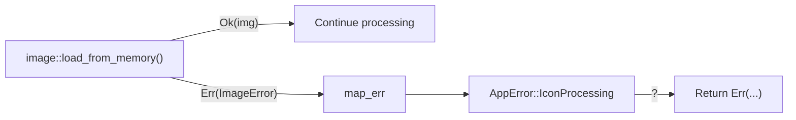
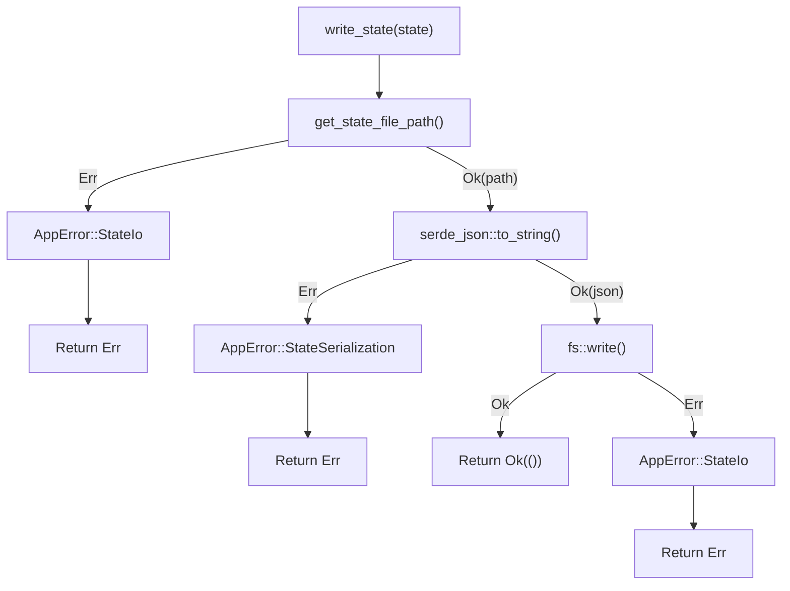

# Chapter 6: Error Handling Done Right

> *A program that crashes is honest. A program that silently corrupts data is dangerous. A program that tells you exactly what went wrong and how to fix it is professional.*

---

## The Goal

By the end of this chapter, you'll understand:

- Why Rust uses `Result` instead of exceptions
- How the `?` operator simplifies error propagation
- How to create custom error types (Tea's `AppError`)
- Implementing `Display` and `Error` traits
- Defensive design: when to return defaults vs. when to fail
- Logging errors with the `log` crate

Tea's error handling is thoughtful. Let's see why.

---

## The Problem with Exceptions

In many languages, errors "throw" up through the call stack:

```javascript
// JavaScript
function readConfig() {
    throw new Error("File not found");  // Surprise!
}

function init() {
    readConfig();  // This might explode
}

init();  // 💥 Unhandled exception
```

Problems with this approach:

1. **Invisible**: You can't tell which functions might throw by looking at them
2. **Easy to forget**: Missing a `try/catch` = crash
3. **Unclear type**: What kind of error? Who knows!

### The Burned Toast Analogy

*Exceptions are like a smoke alarm. They go off suddenly, everyone panics, and you're not sure if it's burnt toast or a real fire.*

---

## Rust's Answer: `Result<T, E>`

Rust makes errors **explicit**. Every function that can fail returns a `Result`:

```rust
enum Result<T, E> {
    Ok(T),    // Success: here's your value
    Err(E),   // Failure: here's why
}
```

```rust
use std::fs;

fn read_config() -> Result<String, std::io::Error> {
    fs::read_to_string("config.txt")
}

fn main() {
    match read_config() {
        Ok(contents) => println!("Config: {}", contents),
        Err(e) => println!("Failed to read config: {}", e),
    }
}
```

### The Package Delivery Analogy

*`Result` is like a delivery notification. Either you get "Delivered: here's your package" (Ok) or "Failed delivery: reason and what to do next" (Err). No surprises at 3am.*

---

## The `?` Operator: Elegant Propagation

Manually matching every `Result` is tedious. The `?` operator handles the common case:

```rust
fn read_and_parse() -> Result<Config, std::io::Error> {
    let contents = fs::read_to_string("config.txt")?;  // Return Err if fails
    // If we get here, contents is the String (not Result<String, ...>)
    let config = parse(contents)?;
    Ok(config)
}
```

`?` does three things:
1. If `Ok(value)` → unwrap and continue
2. If `Err(e)` → return `Err(e)` immediately
3. Convert error types if needed (via `From` trait)

### The Analogy

*`?` is like a quality inspector on an assembly line. "Good part? Pass it along. Defective? Stop the line and report the problem."*

### Tea Example: Error Propagation

```rust
// File: src-tauri/src/persistence.rs

pub fn write_state(state: &AppState) -> Result<()> {
    let path = get_state_file_path()?;  // ? propagates path errors
    
    let json = serde_json::to_string_pretty(state).map_err(|e| AppError::StateSerialization {
        message: "Failed to serialize application state".to_string(),
        cause: e.to_string(),
        recovery_hint: "This is a bug. Please report it with your state configuration.",
    })?;  // ? propagates serialization errors

    fs::write(&path, json).map_err(|e| AppError::StateIo {
        message: format!("Failed to write state to {}", path.display()),
        cause: e.to_string(),
        recovery_hint: "Ensure you have write permissions and sufficient disk space.",
    })?;  // ? propagates write errors

    Ok(())
}
```

Each `?` is a potential exit point. If anything fails, the function returns that error. Clean and linear.

---

## Custom Error Types: Tea's `AppError`

Standard library errors are generic. Tea defines its own error type with **context**:

```rust
// File: src-tauri/src/error.rs

#[derive(Debug)]
pub enum AppError {
    StateIo {
        message: String,
        cause: String,
        recovery_hint: &'static str,
    },
    StateSerialization {
        message: String,
        cause: String,
        recovery_hint: &'static str,
    },
    IconProcessing {
        message: String,
        cause: String,
        recovery_hint: &'static str,
    },
    InputSimulation {
        message: String,
        cause: String,
        recovery_hint: &'static str,
    },
}
```

Each error variant carries **three pieces of information**:

| Field | Purpose | Example |
|-------|---------|---------|
| `message` | What went wrong (human-readable) | "Failed to write state to C:\Users\...\state.json" |
| `cause` | Technical details | "Permission denied (os error 5)" |
| `recovery_hint` | What the user can try | "Ensure you have write permissions and sufficient disk space." |

### The Doctor's Report Analogy

*`AppError` is like a doctor's report with three sections:*
1. *Diagnosis: "You have a sprained ankle"* (message)
2. *Clinical notes: "Grade 2 lateral ligament tear"* (cause)
3. *Treatment plan: "Rest, ice, elevate for 2 weeks"* (recovery_hint)

### Type Alias for Convenience

```rust
// File: src-tauri/src/error.rs

pub type Result<T> = std::result::Result<T, AppError>;
```

Now you can write `Result<()>` instead of `std::result::Result<(), AppError>`.

---

## Implementing `Display` and `Error`

To print errors nicely, implement `Display`:

```rust
// File: src-tauri/src/error.rs

impl fmt::Display for AppError {
    fn fmt(&self, f: &mut fmt::Formatter<'_>) -> fmt::Result {
        match self {
            AppError::StateIo { message, cause, recovery_hint } => {
                write!(f, "State I/O error: {} (cause: {}, hint: {})",
                       message, cause, recovery_hint)
            }
            AppError::StateSerialization { message, cause, recovery_hint } => {
                write!(f, "Serialization error: {} (cause: {}, hint: {})",
                       message, cause, recovery_hint)
            }
            // ... other variants
        }
    }
}
```

And implement `Error` (which requires `Display` + `Debug`):

```rust
impl std::error::Error for AppError {}
```

Now `AppError` works with:
- `println!("{}", error)` — Uses `Display`
- `println!("{:?}", error)` — Uses `Debug`
- The `?` operator in functions returning `Box<dyn Error>`

---

## Creating Errors: The `map_err` Pattern

When calling functions that return different error types, use `map_err` to convert:

```rust
// File: src-tauri/src/icon.rs

pub fn get_icon_rgba(is_awake: bool) -> Result<Vec<u8>> {
    let icon_data = if is_awake { ICON_BLOCK } else { ICON_ALLOW };

    let img = image::load_from_memory(icon_data)
        .map_err(|e| AppError::IconProcessing {
            message: format!(
                "Failed to load {} icon from embedded data",
                if is_awake { "awake" } else { "sleep" }
            ),
            cause: e.to_string(),
            recovery_hint: "This is a bug. Icon data may be corrupted.",
        })?;

    Ok(img.into_rgba8().into_raw())
}
```

`map_err` transforms `image::ImageError` → `AppError::IconProcessing`.

### The Flow



---

## Defensive Design: Defaults Over Crashes

Sometimes failing gracefully is better than crashing. Tea's `read_state` demonstrates this:

```rust
// File: src-tauri/src/persistence.rs

pub fn read_state() -> AppState {  // Returns AppState, not Result!
    let path = match get_state_file_path() {
        Ok(p) => p,
        Err(e) => {
            log::error!("Failed to get state file path, using defaults: {}", e);
            return AppState::default();
        }
    };
    
    match fs::read_to_string(&path) {
        Ok(content) => {
            match serde_json::from_str(&content) {
                Ok(state) => state,
                Err(e) => {
                    log::warn!("State file corrupted, using defaults: {}", e);
                    AppState::default()
                }
            }
        }
        Err(e) => {
            if e.kind() != std::io::ErrorKind::NotFound {
                log::warn!("Failed to read state file, using defaults: {}", e);
            }
            AppState::default()
        }
    }
}
```

### Why Not Return `Result`?

Think about when `read_state` is called—at app startup. If it fails:

| Approach | User Experience |
|----------|-----------------|
| Return `Result`, crash on error | App won't start. User frustrated. |
| Return defaults, log warning | App starts with fresh settings. User unaware of minor issue. |

For **state loading**, defaults are acceptable. For **state saving**, errors matter (user loses changes).

### The Analogy

*`read_state` is like a hotel concierge. If they can't find your reservation:*
- *Bad: "Sorry, no room for you. Go away."*
- *Good: "Let me set you up in a standard room while we sort this out."*

### When to Use Each Approach

| Situation | Approach |
|-----------|----------|
| User's work would be lost | Return `Result`, handle error visibly |
| App can continue with defaults | Return default, log warning |
| Security/safety critical | Return `Result`, fail closed |
| Nice-to-have feature | Return default or skip |

---

## Logging: Making Errors Visible

Tea uses the `log` crate to record errors without crashing:

```rust
// File: src-tauri/src/persistence.rs

log::warn!("State file corrupted, using defaults: {}", e);
log::error!("Failed to get state file path, using defaults: {}", e);
```

### Log Levels

| Level | When to Use |
|-------|-------------|
| `error!` | Something is definitely wrong |
| `warn!` | Something might be wrong, or unexpected |
| `info!` | Normal operation milestones |
| `debug!` | Detailed info for debugging |
| `trace!` | Very detailed, step-by-step |

### Enabling Logs in Development

```bash
RUST_LOG=debug cargo tauri dev
```

You'll see Tea's internal operations:

```
[INFO  tea] Toggle sleep: false -> true
[DEBUG tea] Writing state to C:\Users\...\state.json
[TRACE tea] Simulating F15 key press
```

### The Analogy

*Logging is like a ship's log. You don't stop sailing when you note "rough seas at 14:00," but the record helps explain why you arrived late.*

---

## Error Handling Patterns in Tea

Let's see the patterns used throughout the codebase:

### Pattern 1: Propagate with Context

```rust
fs::create_dir_all(&path).map_err(|e| AppError::StateIo {
    message: format!("Failed to create directory at {}", path.display()),
    cause: e.to_string(),
    recovery_hint: "Ensure you have write permissions.",
})?;
```

*Add context, then propagate with `?`.*

### Pattern 2: Handle or Default

```rust
let mode = *screen_mode
    .lock()
    .map_err(|e| format!("Mutex poisoned: {}", e))?;
```

*Convert error to string for simpler propagation.*

### Pattern 3: Log and Continue

```rust
if let Err(e) = enigo.key(Key::F15, Direction::Click) {
    log::error!("F15 key press failed (continuing): {}", e);
}
```

*Log the error but keep running.*

### Pattern 4: Explicit Early Return

```rust
let path = match get_state_file_path() {
    Ok(p) => p,
    Err(e) => {
        log::error!("...: {}", e);
        return AppState::default();
    }
};
```

*Handle error explicitly, return fallback.*

---

## The Error Flow Diagram

Here's how errors flow through Tea's write operation:



Each step has a clear failure path. The caller sees exactly what went wrong.

---

## Testing Error Cases

Good error handling includes testing the error paths:

```rust
// File: src-tauri/src/icon.rs (tests)

#[test]
fn test_get_icon_for_awake_state() {
    let result = get_icon_rgba(true);
    assert!(result.is_ok());  // Verify success case
    let data = result.unwrap();
    assert_eq!(data.len(), 32 * 32 * 4);  // Verify data is correct
}
```

For error cases, you might write:

```rust
#[test]
fn test_handles_corrupted_state() {
    // Arrange: write invalid JSON
    fs::write("test_state.json", "not valid json").unwrap();
    
    // Act: try to read
    let state = read_state_from_path("test_state.json");
    
    // Assert: returns default, doesn't crash
    assert_eq!(state, AppState::default());
}
```

---

## The No-Panic Philosophy

Tea follows a "no panic" philosophy:

```rust
// File: src-tauri/src/error.rs (comment)

/// All fallible operations return this type. No `unwrap()`, `expect()`, or
/// silent failures are permitted.
```

### Why Avoid `unwrap()` and `expect()`?

```rust
let value = some_result.unwrap();  // Panics if Err!
```

Panics crash the program. In a desktop app:
- User loses unsaved work
- No chance to save state
- Poor user experience

### When `unwrap()` Is Acceptable

| Situation | Acceptable? |
|-----------|-------------|
| Tests | ✅ Yes — test failure is fine |
| Provably impossible error | ✅ Yes — with comment explaining why |
| Prototype/scratch code | ⚠️ Temporarily |
| Production app logic | ❌ No — handle errors properly |

---

## Summary: Error Handling Comparison

| Approach | Pros | Cons | Tea Uses? |
|----------|------|------|-----------|
| `unwrap()` | Short | Crashes on error | ❌ No |
| `expect("msg")` | Short + message | Still crashes | ❌ No |
| `match` | Explicit | Verbose | ✅ Yes |
| `?` operator | Clean | Requires compatible types | ✅ Yes |
| `map_err` + `?` | Clean + contextual | Slightly verbose | ✅ Yes |
| Return default | Graceful | Hides problems | ✅ For reads |
| Log + continue | Resilient | May mask issues | ✅ For non-critical |

---

## Try It Yourself

### Exercise 1: Trace the Error Path

In `src-tauri/src/persistence.rs`, trace what happens if:
1. The config directory doesn't exist and can't be created
2. The state file exists but contains invalid JSON
3. The disk is full when writing

### Exercise 2: Add a New Error Variant

Imagine Tea needs to handle network errors. How would you add:
```rust
NetworkError {
    message: String,
    cause: String,
    recovery_hint: &'static str,
}
```

Don't forget to update the `Display` implementation!

### Exercise 3: Convert `unwrap` to Proper Handling

This code uses `unwrap`:
```rust
let contents = fs::read_to_string("file.txt").unwrap();
```

Rewrite it to:
1. Return a `Result` with a custom error
2. Include a meaningful message and recovery hint

---

## Key Takeaways

- **`Result<T, E>`** makes errors explicit in the type signature
- **`?` operator** propagates errors cleanly
- **Custom error types** carry context: message, cause, recovery hint
- **`map_err`** converts external errors to your error type
- **Defensive design**: sometimes defaults beat crashes
- **Logging** makes invisible errors visible for debugging
- **No panics in production**: handle errors, don't crash

---

## Next Steps

We've covered Rust fundamentals. Now we enter **Part 2: Tauri Core Concepts**:

- **Tauri's architecture**: [Chapter 7: Tauri Architecture Deep Dive](07-tauri-architecture.md)
- **Commands and state**: [Chapter 8: Commands and State Management](08-commands-and-state.md)
- **The plugin system**: [Chapter 9: The Plugin System](09-plugin-system.md)
