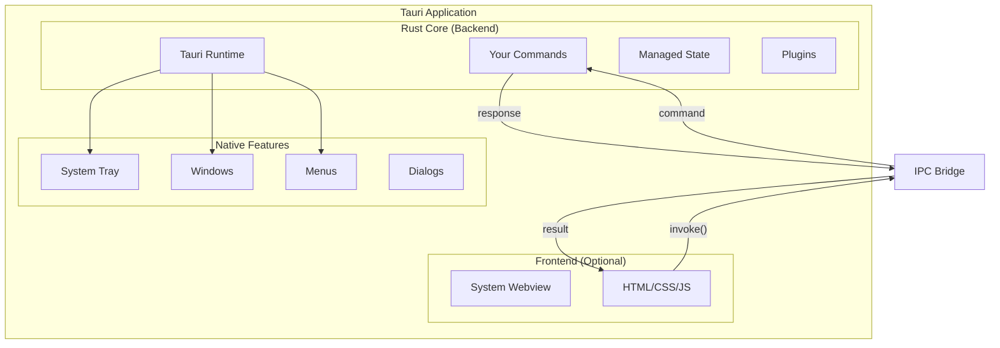
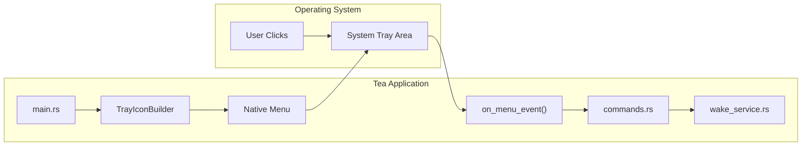
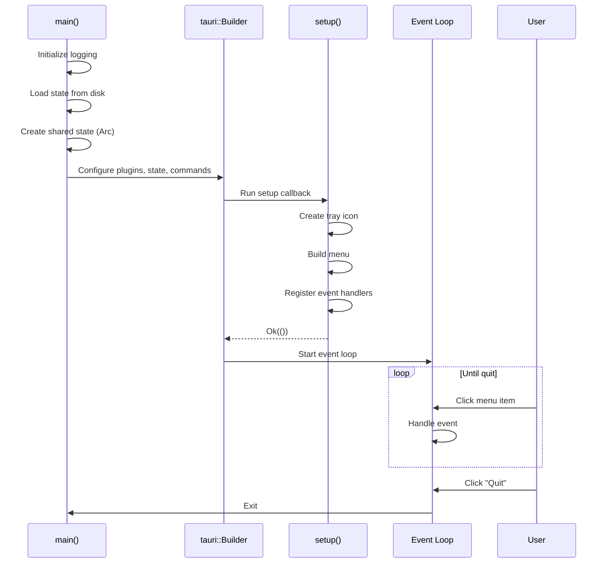
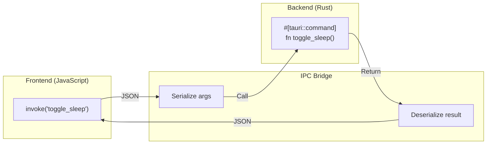
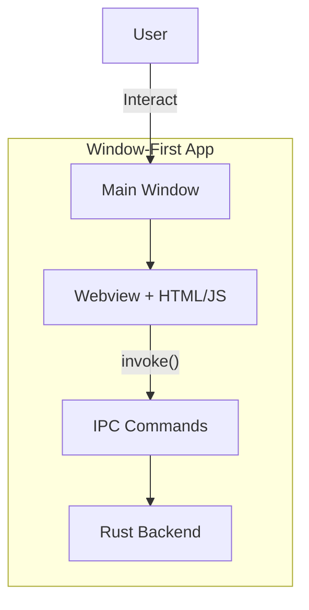
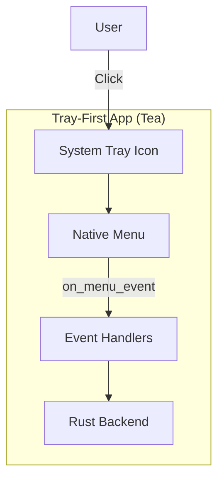
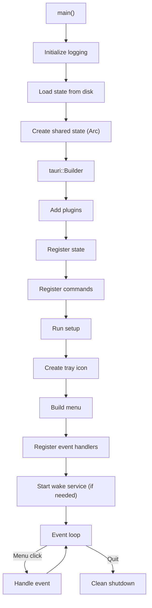

# Chapter 7: Tauri Architecture Deep Dive

> *Tauri is not Electron. It's smaller, faster, and Rust-first. Understanding its architecture unlocks its power.*

---

## The Goal

By the end of this chapter, you'll understand:

- What Tauri is and how it differs from Electron
- The Rust core + webview architecture
- How Tea works as a tray-first application (no webview!)
- The app lifecycle: setup, run, exit
- How IPC (inter-process communication) works
- Tauri's security model and capabilities

This is where we transition from "learning Rust" to "building desktop apps."

---

## What Is Tauri?

Tauri is a framework for building desktop applications using web technologies (HTML, CSS, JavaScript) for the UI, with Rust for the backend.

### The Elevator Pitch

*"Build desktop apps with web skills, but get native performance and tiny binaries."*

### Tauri vs. Electron

| Aspect | Electron | Tauri |
|--------|----------|-------|
| Bundle size | 100+ MB | 3-10 MB |
| Memory usage | 100+ MB | 20-50 MB |
| Backend language | JavaScript (Node.js) | Rust |
| Browser engine | Bundled Chromium | System webview |
| Security model | Node.js in renderer (risky) | Strict IPC boundary |
| Startup time | Slow | Fast |

### The Analogy

*Electron is like shipping a whole car with your pizza. Tauri ships just the pizza box—your OS already has the car (webview).*

---

## The Architecture



### The Three Layers

1. **Rust Core**: Your backend code—commands, state, business logic
2. **System Webview**: The OS-provided browser engine (optional for UI)
3. **Native Features**: System tray, windows, menus, dialogs

### Key Insight: Webview Is Optional

Tea has **no webview**. It's a system tray application:

```json
// File: src-tauri/tauri.conf.json

{
  "app": {
    "windows": []  // Empty! No windows.
  }
}
```

The entire UI is the native system tray menu. This is valid Tauri.

---

## Tea's Tray-First Architecture

Most Tauri tutorials show webview apps. Tea is different:



### Why No Webview?

For a sleep prevention utility, a webview would be overkill:

| Webview App | Tray-Only App (Tea) |
|-------------|---------------------|
| Window management | Just an icon |
| HTML rendering | Native menu |
| Complex state sync | Direct Rust calls |
| Higher resource usage | Minimal footprint |

### The Analogy

*A webview app is a full restaurant. Tea is a coffee cart—you don't need a kitchen, seating, and waiters to serve espresso.*

---

## The App Lifecycle

Let's trace Tea's startup sequence:

```rust
// File: src-tauri/src/main.rs

#[tokio::main]
async fn main() {
    // 1. Initialize logging
    env_logger::Builder::from_env(...).init();

    // 2. Load persisted state
    let state = read_state();

    // 3. Create shared state
    let is_awake = Arc::new(AtomicBool::new(state.sleep_disabled));
    let screen_mode = Arc::new(Mutex::new(state.screen_mode));

    // 4. Build and run Tauri app
    tauri::Builder::default()
        .plugin(...)           // Add plugins
        .manage(...)           // Register state
        .invoke_handler(...)   // Register commands
        .setup(...)            // Configure tray
        .run(...);             // Start event loop
}
```

### The Lifecycle Diagram



---

## The Builder Pattern

Tauri uses the builder pattern for configuration:

```rust
// File: src-tauri/src/main.rs

tauri::Builder::default()
    // Step 1: Add plugins
    .plugin(tauri_plugin_autostart::init(
        MacosLauncher::LaunchAgent,
        None,
    ))
    
    // Step 2: Register managed state
    .manage(AppStateManager {
        is_awake: is_awake.clone(),
        screen_mode: screen_mode.clone(),
    })
    
    // Step 3: Register commands
    .invoke_handler(tauri::generate_handler![
        commands::toggle_sleep,
        commands::change_screen_mode,
        commands::get_state,
    ])
    
    // Step 4: Setup callback (runs once at startup)
    .setup(move |app| {
        setup_tray(app, initial_state, is_awake, screen_mode)
    })
    
    // Step 5: Run the app
    .run(tauri::generate_context!())
```

### The Analogy

*The builder is like assembling a car:*
1. *Add accessories (plugins)*
2. *Load cargo (state)*
3. *Install controls (commands)*
4. *Final inspection (setup)*
5. *Start the engine (run)*

---

## Managed State: `app.manage()`

State you register with `.manage()` becomes available to all commands:

```rust
// Registration
.manage(AppStateManager {
    is_awake: Arc::new(AtomicBool::new(false)),
    screen_mode: Arc::new(Mutex::new(ScreenMode::default())),
})

// Usage in a command
#[tauri::command]
pub fn toggle_sleep(state: State<AppStateManager>) -> Result<(bool, ScreenMode), String> {
    // Access via state.is_awake, state.screen_mode
}
```

`State<T>` is injected by Tauri—you don't create it manually.

### Why Managed State?

- **Thread-safe**: Tauri ensures safe access across threads
- **Centralized**: All commands share the same state instance
- **Automatic**: No global variables or manual passing

---

## The Setup Hook

`setup()` runs once after the builder is configured but before the event loop starts:

```rust
// File: src-tauri/src/main.rs

.setup(move |app| {
    setup_tray(app, initial_state, is_awake_clone, screen_mode_clone)
})
```

This is where Tea creates the tray icon:

```rust
fn setup_tray(
    app: &mut tauri::App,
    state: AppState,
    is_awake: Arc<AtomicBool>,
    screen_mode: Arc<Mutex<ScreenMode>>,
) -> Result<(), Box<dyn std::error::Error>> {
    let handle = app.handle();

    // Build menu items...
    let toggle_sleep_item = MenuItemBuilder::with_id(...)
        .build(handle)?;

    // Build the tray icon...
    let tray = TrayIconBuilder::new()
        .icon(Image::new(...))
        .menu(&tray_menu)
        .tooltip(tooltip.as_str())
        .build(handle)?;

    // Register event handler...
    tray.on_menu_event(move |app, event| {
        // Handle clicks
    });

    Ok(())
}
```

### Setup Responsibilities

| Task | Code |
|------|------|
| Create tray icon | `TrayIconBuilder::new().build()` |
| Build menu | `MenuBuilder::new().item(...).build()` |
| Set initial state | Icon, tooltip based on loaded state |
| Register handlers | `tray.on_menu_event(...)` |
| Start services | `start_wake_service()` if needed |

---

## The Event Loop

After setup, Tauri runs an event loop that:

1. Listens for OS events (clicks, keypresses, window events)
2. Dispatches to your handlers
3. Runs until the app exits

For Tea, the relevant events are menu clicks:

```rust
// File: src-tauri/src/main.rs

tray.on_menu_event(move |app, event| {
    if *event.id() == toggle_sleep_id {
        handle_toggle_sleep(...);
    } else if *event.id() == screen_on_id {
        handle_screen_mode_change(ScreenMode::KeepScreenOn, ...);
    } else if *event.id() == quit_id {
        handle_quit(app, is_awake.clone());
    }
});
```

### The Analogy

*The event loop is like a receptionist. They sit at the desk, waiting for visitors (events). When someone arrives, they route them to the right person (handler).*

---

## IPC: Frontend ↔ Backend Communication

Even though Tea doesn't use a webview, understanding IPC is essential for Tauri apps that do.

### The IPC Model



### Frontend Side (JavaScript)

```javascript
import { invoke } from '@tauri-apps/api/core';

// Call a Rust command
const [isAwake, screenMode] = await invoke('toggle_sleep');
console.log(`Now awake: ${isAwake}`);
```

### Backend Side (Rust)

```rust
// File: src-tauri/src/commands.rs

#[tauri::command]
pub fn toggle_sleep(state: State<AppStateManager>) -> Result<(bool, ScreenMode), String> {
    toggle_sleep_impl(&state.is_awake, &state.screen_mode)
}
```

### The Analogy

*IPC is like calling a help desk. You describe your problem (arguments), they look up the answer (command runs), and they tell you the solution (return value). You never see their computer—you just get the answer.*

### Tea's Hybrid Approach

Tea has commands registered but rarely uses them from JavaScript:

```rust
.invoke_handler(tauri::generate_handler![
    commands::toggle_sleep,
    commands::change_screen_mode,
    commands::get_state,
])
```

Instead, menu events call Rust directly:

```rust
// Menu click → Rust handler (no JavaScript involved)
tray.on_menu_event(move |app, event| {
    handle_toggle_sleep(...);  // Direct Rust call
});
```

The commands exist for potential future use (settings window, etc.).

---

## The Configuration File

`tauri.conf.json` defines your app's identity and capabilities:

```json
// File: src-tauri/tauri.conf.json

{
  "$schema": "https://schema.tauri.app/config/2",
  "productName": "Tea",
  "version": "2.0.0",
  "identifier": "com.tea.app",
  
  "build": {
    "beforeDevCommand": "npm run dev",
    "devUrl": "http://localhost:1420",
    "beforeBuildCommand": "npm run build",
    "frontendDist": "../dist"
  },
  
  "app": {
    "withGlobalTauri": true,
    "windows": [],  // No windows!
    "security": {
      "csp": null
    }
  },
  
  "bundle": {
    "active": true,
    "targets": ["deb", "rpm", "dmg", "nsis"],
    "icon": [...]
  }
}
```

### Key Settings

| Setting | Purpose | Tea's Value |
|---------|---------|-------------|
| `productName` | Display name | "Tea" |
| `identifier` | Unique app ID | "com.tea.app" |
| `windows` | Window definitions | `[]` (none!) |
| `bundle.targets` | Installer formats | deb, rpm, dmg, nsis |

---

## Security: Capabilities

Tauri 2.0 uses a capability system to restrict what your app can do:

```json
// File: src-tauri/capabilities/default.json

{
  "permissions": [
    "core:default",
    "autostart:allow-enable",
    "autostart:allow-disable",
    "autostart:allow-is-enabled"
  ]
}
```

### Why Capabilities?

- **Principle of least privilege**: Only request what you need
- **Explicit permissions**: Reviewers can audit what the app does
- **Defense in depth**: Even if frontend is compromised, backend limits damage

### The Analogy

*Capabilities are like security badges. You can only open doors (APIs) that your badge (capability) allows. Tea's badge only opens the "autostart control" door.*

---

## Tray-First vs. Window-First

Let's compare architectures:

### Window-First (Typical Tauri App)



**Use cases**: Settings apps, editors, dashboards

### Tray-First (Tea)



**Use cases**: System utilities, background services, quick-access tools

### When to Use Each

| Choose Tray-First When... | Choose Window-First When... |
|---------------------------|------------------------------|
| Simple interaction (toggle, select) | Complex forms/settings |
| Background operation | Rich visual display |
| Minimal resource usage | Need webview rendering |
| No persistent UI needed | Multi-page interface |

---

## The Runtime Flow Summary



---

## Try It Yourself

### Exercise 1: Trace the Startup

Read `src-tauri/src/main.rs` and answer:
1. What happens before `tauri::Builder::default()`?
2. What's the order of builder methods?
3. What does `setup_tray` return if it fails?

### Exercise 2: Find the Event Routing

In `setup_tray`, find:
1. Where menu item IDs are defined
2. Where `on_menu_event` is registered
3. How events are routed to handlers

### Exercise 3: Modify the Config

Open `tauri.conf.json` and find:
1. Where the app name is set
2. What bundle targets are configured
3. Why `windows` is an empty array

---

## Key Takeaways

- **Tauri = Rust backend + optional webview frontend**
- **Tea is tray-first**: No window, no webview, just native tray
- **Builder pattern**: Configure plugins, state, commands, then run
- **Managed state**: `app.manage()` makes state available to commands
- **Setup hook**: One-time initialization before event loop
- **Event loop**: Listens for OS events, dispatches to handlers
- **IPC**: JSON bridge between frontend (JS) and backend (Rust)
- **Capabilities**: Security permissions for app features

---

## Next Steps

Now that you understand Tauri's architecture:

- **Commands and state in depth**: [Chapter 8: Commands and State Management](08-commands-and-state.md)
- **Using plugins**: [Chapter 9: The Plugin System](09-plugin-system.md)
- **Configuration details**: [Chapter 10: Configuration and Capabilities](10-configuration-capabilities.md)
