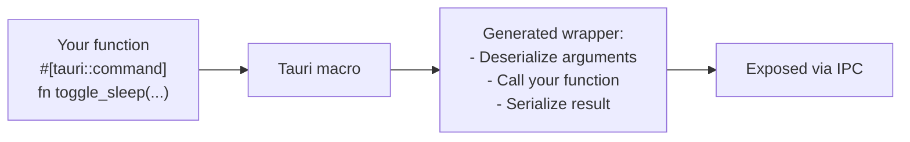
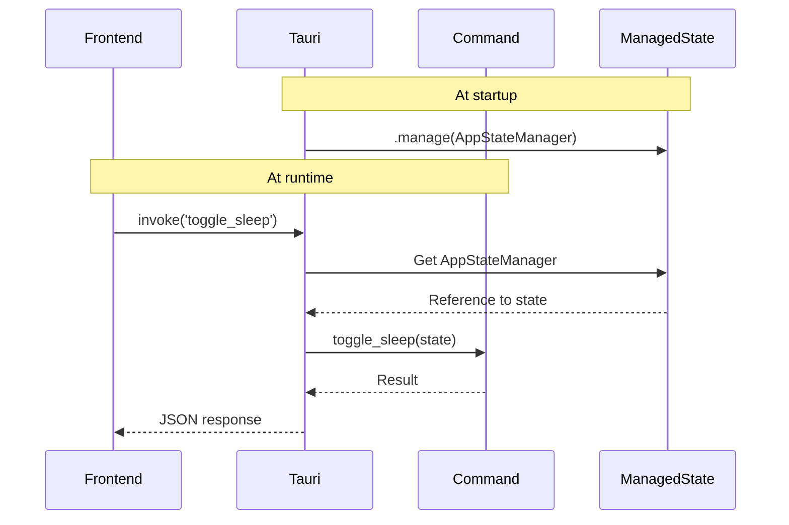
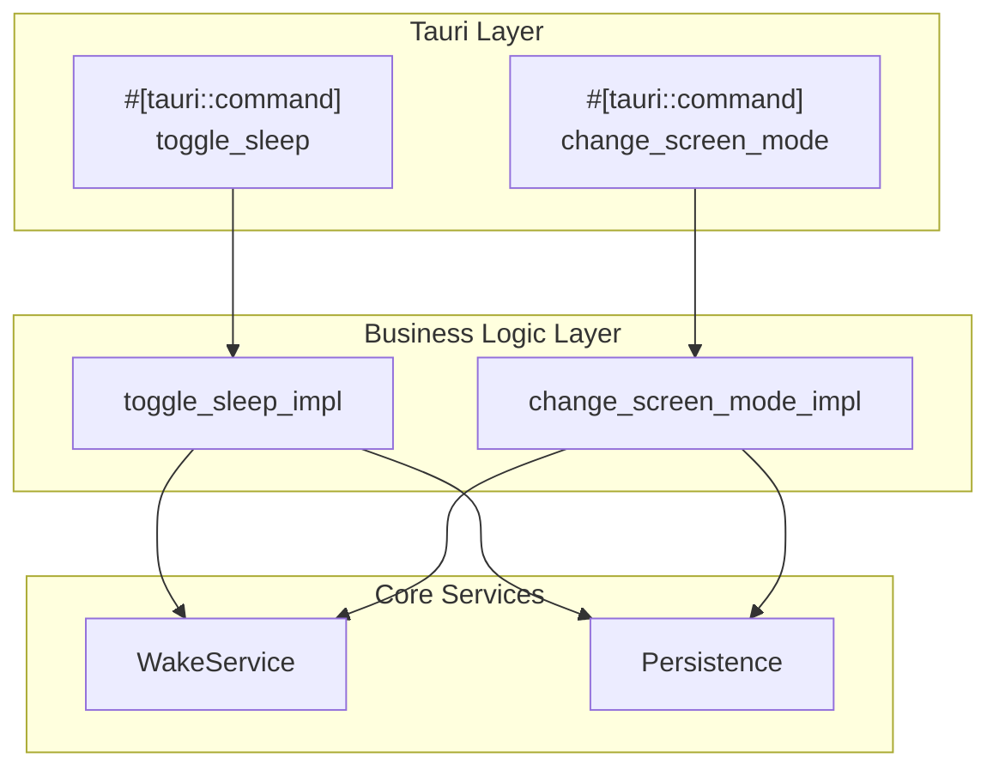
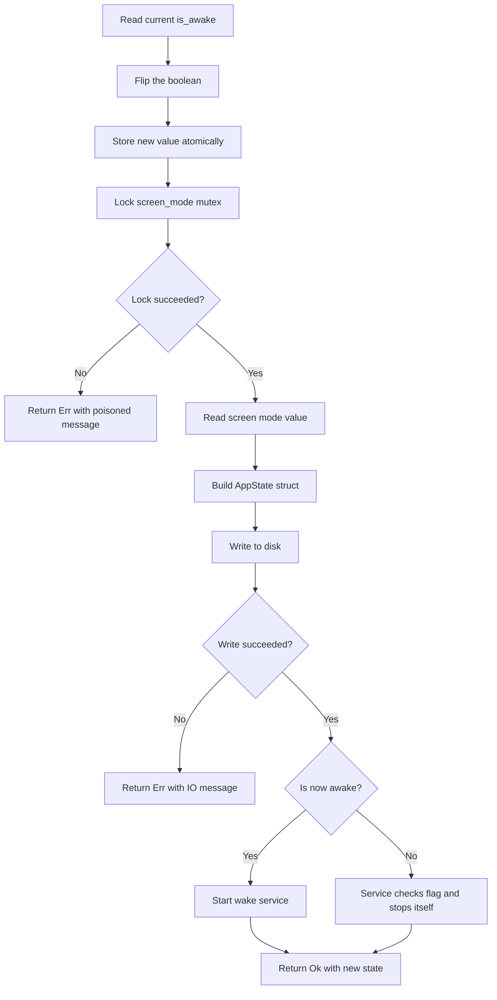
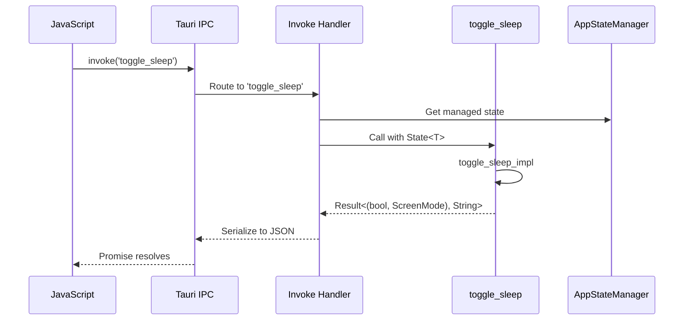

# Chapter 8: Commands and State Management

> *"A waiter takes your order, walks to the kitchen, and brings back your food. They don't cook it themselves—they orchestrate between you (the customer) and the chef (the business logic). Tauri commands work the same way."*

In Chapter 7, you learned how Tauri orchestrates your application's lifecycle. Now we'll explore the **command system**—the mechanism that lets your frontend talk to your Rust backend. Even in Tea, which has no webview, understanding commands is essential because the same patterns apply to tray menu handlers.

---

## What Are Tauri Commands?

A **Tauri command** is a Rust function that can be called from your frontend (JavaScript/TypeScript) or from other parts of your Rust code. Think of commands as the **public API** of your backend.

### The Restaurant Analogy

Imagine a restaurant:

| Restaurant | Tauri App |
|------------|-----------|
| Customer | Frontend (webview) |
| Waiter | IPC system |
| Order slip | Command arguments |
| Kitchen | Rust backend |
| Chef | Business logic functions |
| Plated dish | Return value |

The waiter doesn't cook—they take orders, relay them to the kitchen, and bring back results. Tauri commands are your waiters.

---

## The `#[tauri::command]` Attribute

In Rust, **attributes** are metadata attached to code. The `#[tauri::command]` attribute marks a function as callable from the frontend:

```rust
// src-tauri/src/commands.rs
#[tauri::command]
pub fn toggle_sleep(state: State<AppStateManager>) -> Result<(bool, ScreenMode), String> {
    toggle_sleep_impl(&state.is_awake, &state.screen_mode)
}
```

Let's break this down:

### What the Attribute Does

When you write `#[tauri::command]`, Tauri's **procedural macro** generates additional code:



The macro handles:
1. **Argument deserialization** — Converts JSON from the frontend into Rust types
2. **Result serialization** — Converts your return value back to JSON
3. **IPC registration** — Makes the function callable via `invoke()`

### Function Signature Rules

Commands have specific requirements:

| Requirement | Explanation | Example |
|-------------|-------------|---------|
| Must be `pub` | Needs to be visible to Tauri | `pub fn my_command()` |
| Arguments must be `Deserialize` | Frontend sends JSON | `name: String` |
| Return must be `Serialize` | Frontend receives JSON | `-> String` |
| Or return nothing | For side-effect-only commands | `-> ()` |
| Can return `Result<T, E>` | For fallible operations | `-> Result<T, String>` |

---

## State Injection: The Magic of `State<T>`

Here's where Tauri shines. Look at this command signature:

```rust
#[tauri::command]
pub fn toggle_sleep(state: State<AppStateManager>) -> Result<(bool, ScreenMode), String> {
```

Where does `state` come from? The frontend doesn't pass it. The answer: **dependency injection**.

### The Hotel Front Desk Analogy

Imagine checking into a hotel:

1. You walk up to the front desk
2. You give your name (your "argument")
3. The receptionist looks up your room key in their system
4. They hand you the key along with any info you requested

You didn't bring the key—the hotel **injected** it based on context. Similarly:

1. Frontend calls `invoke('toggle_sleep')`
2. Tauri sees the `State<AppStateManager>` parameter
3. Tauri looks up `AppStateManager` in its managed state
4. Tauri injects it into your function automatically

### How State Gets Registered

In [main.rs](../src-tauri/src/main.rs), state is registered with `.manage()`:

```rust
// src-tauri/src/main.rs
.manage(AppStateManager {
    is_awake: is_awake.clone(),
    screen_mode: screen_mode.clone(),
})
```

This tells Tauri: "Store this `AppStateManager` so commands can access it."

### The State Flow



### Accessing State Values

`State<T>` gives you a reference to the managed data. Tea's commands access fields through it:

```rust
pub fn toggle_sleep(state: State<AppStateManager>) -> Result<(bool, ScreenMode), String> {
    // Access is_awake through the state reference
    toggle_sleep_impl(&state.is_awake, &state.screen_mode)
}
```

`State<T>` implements `Deref`, so you can use `.field` syntax directly.

---

## Tea's Command Architecture

Tea has three commands. Let's examine each one:

### 1. `toggle_sleep` — The Main Toggle

```rust
// src-tauri/src/commands.rs
#[tauri::command]
pub fn toggle_sleep(state: State<AppStateManager>) -> Result<(bool, ScreenMode), String> {
    toggle_sleep_impl(&state.is_awake, &state.screen_mode)
}
```

**Purpose**: Toggle sleep prevention on/off.

**Returns**: A tuple `(bool, ScreenMode)`:
- `bool` — New awake state (`true` = preventing sleep)
- `ScreenMode` — Current screen mode setting

### 2. `change_screen_mode` — Mode Switching

```rust
#[tauri::command]
pub fn change_screen_mode(
    state: State<AppStateManager>,
    new_mode: ScreenMode,
) -> Result<ScreenMode, String> {
    change_screen_mode_impl(&state.is_awake, &state.screen_mode, new_mode)
}
```

**Purpose**: Change between screen modes (keep screen on vs. allow screen off).

**Arguments**:
- `state` — Injected automatically
- `new_mode` — Passed from frontend as JSON

**Note**: `ScreenMode` must implement `Deserialize` for this to work:

```rust
// src-tauri/src/core/screen_mode.rs
#[derive(Debug, Clone, Copy, PartialEq, Eq, Serialize, Deserialize, Default)]
pub enum ScreenMode {
    KeepScreenOn,
    #[default]
    AllowScreenOff,
}
```

### 3. `get_state` — Reading Current State

```rust
#[tauri::command]
pub fn get_state(state: State<AppStateManager>) -> Result<(bool, ScreenMode), String> {
    let awake = state.is_awake.load(Ordering::SeqCst);
    let mode = *state
        .screen_mode
        .lock()
        .map_err(|e| format!("Mutex poisoned during get_state: {}", e))?;

    Ok((awake, mode))
}
```

**Purpose**: Let the frontend query current state.

**Pattern**: Reads from both `AtomicBool` and `Mutex<ScreenMode>`.

---

## The `_impl` Pattern: Separating Concerns

Notice how Tea has both `toggle_sleep` and `toggle_sleep_impl`? This is a deliberate design pattern:



### Why Separate?

The **Library vs. Bookstore Analogy**:

- **Library** (impl functions): Core knowledge, reusable, no dependencies on who's asking
- **Bookstore** (commands): Public-facing interface, handles customers (frontend), knows about Tauri

Benefits:

| Benefit | Explanation |
|---------|-------------|
| **Testability** | `_impl` functions can be unit tested without Tauri |
| **Reusability** | Menu handlers can call `_impl` directly |
| **Clarity** | Commands stay thin; logic stays in one place |

### Tea's Menu Handlers Use `_impl` Directly

In [main.rs](../src-tauri/src/main.rs), the tray menu handlers call `_impl` functions:

```rust
"toggle" => {
    if let Err(e) = toggle_sleep_impl(&is_awake, &screen_mode) {
        log::error!("Failed to toggle sleep: {}", e);
    }
    // ... update tray
}
```

The tray doesn't go through Tauri commands—it calls the business logic directly. This works because the `_impl` functions don't depend on `State<T>`.

---

## Anatomy of `toggle_sleep_impl`

Let's walk through the complete business logic:

```rust
// src-tauri/src/commands.rs
pub fn toggle_sleep_impl(
    is_awake: &Arc<AtomicBool>,
    screen_mode: &Arc<Mutex<ScreenMode>>,
) -> Result<(bool, ScreenMode), String> {
    // 1. Read current state
    let was_awake = is_awake.load(Ordering::SeqCst);
    
    // 2. Compute new state
    let new_awake = !was_awake;
    
    // 3. Update atomic flag
    is_awake.store(new_awake, Ordering::SeqCst);

    log::info!("Toggle sleep: {} -> {}", was_awake, new_awake);

    // 4. Read screen mode (needs lock)
    let current_mode = *screen_mode
        .lock()
        .map_err(|e| format!("Mutex poisoned during toggle_sleep: {}", e))?;

    // 5. Persist to disk
    let new_state = AppState {
        sleep_disabled: new_awake,
        screen_mode: current_mode,
    };
    write_state(&new_state).map_err(|e| format!("Failed to persist state: {}", e))?;

    // 6. Start service if activating
    if new_awake {
        start_wake_service(is_awake.clone(), current_mode);
    }

    Ok((new_awake, current_mode))
}
```

### The Flow Diagram



### Error Handling Pattern

Notice how errors are converted to strings:

```rust
.map_err(|e| format!("Mutex poisoned during toggle_sleep: {}", e))?
```

This is the **frontier pattern**—at the boundary with the frontend, we flatten errors to strings. The frontend can display these messages to users.

---

## Registering Commands

Commands must be registered with Tauri's builder:

```rust
// src-tauri/src/main.rs
tauri::Builder::default()
    .invoke_handler(tauri::generate_handler![
        toggle_sleep,
        change_screen_mode,
        get_state
    ])
```

### What `generate_handler!` Does

This macro creates a dispatcher that:
1. Receives incoming IPC calls with command names
2. Routes to the correct function
3. Handles serialization/deserialization

Think of it as a **switchboard operator**—calls come in, they get routed to the right extension.

---

## Calling Commands from Frontend

Even though Tea doesn't use a webview, here's how commands work from JavaScript:

```typescript
// In a typical Tauri frontend
import { invoke } from '@tauri-apps/api/core';

// Call toggle_sleep
const [isAwake, screenMode] = await invoke<[boolean, string]>('toggle_sleep');

// Call change_screen_mode with an argument
const newMode = await invoke<string>('change_screen_mode', { 
    newMode: 'KeepScreenOn' 
});

// Call get_state
const [awake, mode] = await invoke<[boolean, string]>('get_state');
```

### The Journey of a Command Call



---

## Error Handling in Commands

Commands can return `Result<T, E>` where `E` is any type that can be serialized:

### Option 1: String Errors (Tea's Approach)

```rust
#[tauri::command]
pub fn toggle_sleep(state: State<AppStateManager>) -> Result<(bool, ScreenMode), String> {
    toggle_sleep_impl(&state.is_awake, &state.screen_mode)
}
```

**Pros**: Simple, human-readable messages
**Cons**: No structured error information

### Option 2: Custom Error Types

```rust
#[derive(Debug, Serialize)]
pub struct CommandError {
    code: String,
    message: String,
}

#[tauri::command]
pub fn my_command() -> Result<Data, CommandError> {
    // ...
}
```

**Pros**: Structured errors for programmatic handling
**Cons**: More complex

### Option 3: Using `thiserror` with Serialize

```rust
#[derive(Debug, thiserror::Error, Serialize)]
pub enum MyError {
    #[error("Not found: {0}")]
    NotFound(String),
    #[error("Permission denied")]
    PermissionDenied,
}
```

**Pros**: Best of both worlds
**Cons**: Requires careful serialization setup

---

## Testing Commands

Tea includes tests for its state manager:

```rust
// src-tauri/src/commands.rs
#[cfg(test)]
mod tests {
    use super::*;

    #[test]
    fn test_app_state_manager_creation() {
        let manager = AppStateManager {
            is_awake: Arc::new(AtomicBool::new(false)),
            screen_mode: Arc::new(Mutex::new(ScreenMode::default())),
        };

        assert!(!manager.is_awake.load(Ordering::SeqCst));
        assert_eq!(
            *manager.screen_mode.lock().unwrap(),
            ScreenMode::AllowScreenOff
        );
    }
}
```

### Testing the `_impl` Functions

Because `_impl` functions don't depend on Tauri, they're easy to test:

```rust
#[test]
fn test_toggle_sleep_impl() {
    let is_awake = Arc::new(AtomicBool::new(false));
    let screen_mode = Arc::new(Mutex::new(ScreenMode::default()));
    
    // Toggle on
    let result = toggle_sleep_impl(&is_awake, &screen_mode);
    assert!(result.is_ok());
    let (awake, _mode) = result.unwrap();
    assert!(awake);
    
    // Toggle off
    let result = toggle_sleep_impl(&is_awake, &screen_mode);
    assert!(result.is_ok());
    let (awake, _mode) = result.unwrap();
    assert!(!awake);
}
```

---

## Best Practices Summary

### 1. Keep Commands Thin

Commands should be **orchestrators**, not **implementors**:

```rust
// Good: Thin command, delegates to impl
#[tauri::command]
pub fn toggle_sleep(state: State<AppStateManager>) -> Result<(bool, ScreenMode), String> {
    toggle_sleep_impl(&state.is_awake, &state.screen_mode)
}

// Bad: Fat command with all logic inline
#[tauri::command]
pub fn toggle_sleep(state: State<AppStateManager>) -> Result<(bool, ScreenMode), String> {
    let was_awake = state.is_awake.load(Ordering::SeqCst);
    // ... 50 lines of logic ...
}
```

### 2. Use Descriptive Error Messages

```rust
// Good: Tells user what happened and context
.map_err(|e| format!("Failed to persist state after toggling sleep: {}", e))?

// Bad: Generic, unhelpful
.map_err(|e| e.to_string())?
```

### 3. Document Command Contracts

```rust
/// Toggle system sleep prevention
///
/// ## Returns
/// - `Ok((true, mode))` — Sleep prevention enabled
/// - `Ok((false, mode))` — Sleep prevention disabled
/// - `Err(msg)` — Operation failed
#[tauri::command]
pub fn toggle_sleep(state: State<AppStateManager>) -> Result<(bool, ScreenMode), String>
```

### 4. Validate Input Early

```rust
#[tauri::command]
pub fn set_interval(seconds: u64) -> Result<(), String> {
    if seconds < 10 {
        return Err("Interval must be at least 10 seconds".into());
    }
    if seconds > 3600 {
        return Err("Interval cannot exceed 1 hour".into());
    }
    // ... proceed with valid input
}
```

---

## Key Takeaways

1. **Commands are your API** — The `#[tauri::command]` macro creates frontend-callable functions
2. **State injection is automatic** — Use `State<T>` to access managed application state
3. **Separate concerns** — Use `_impl` functions for testable, reusable business logic
4. **Commands stay thin** — Orchestrate, don't implement
5. **Error handling at boundaries** — Convert errors to user-friendly strings at the command level
6. **Register everything** — Commands need `generate_handler![]` to be callable

---

## What's Next?

In **Chapter 9**, we'll explore Tauri's **plugin system**. You'll learn how Tea uses `tauri-plugin-autostart` to launch at system startup, and how plugins extend Tauri's capabilities without modifying core code.

---

## Exercises

1. **Read the code**: Open [commands.rs](../src-tauri/src/commands.rs) and trace through `change_screen_mode_impl`. What happens to the wake service when the mode changes?

2. **Add a command**: Write a new command `get_version` that returns the app version from `Cargo.toml`. Hint: Use `env!("CARGO_PKG_VERSION")`.

3. **Test the impl**: Write a test for `change_screen_mode_impl` that verifies the screen mode actually changes.

4. **Error paths**: What happens if `toggle_sleep_impl` is called while the mutex is poisoned? Trace the error path through to the return value.
