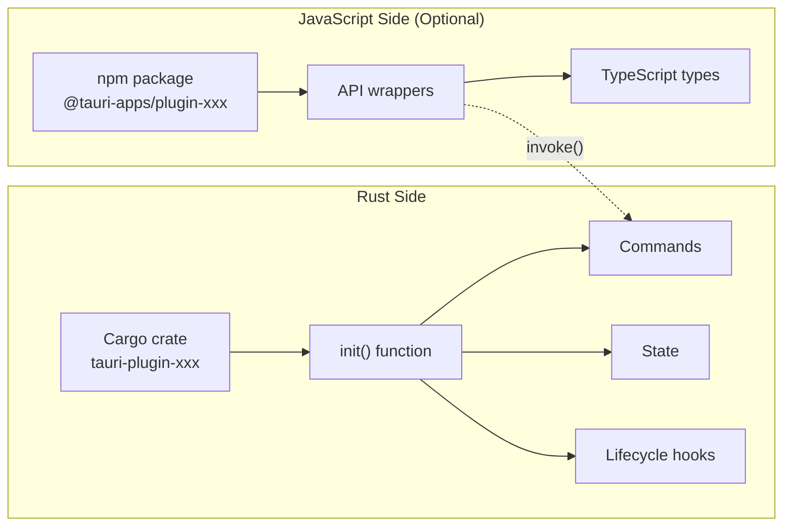
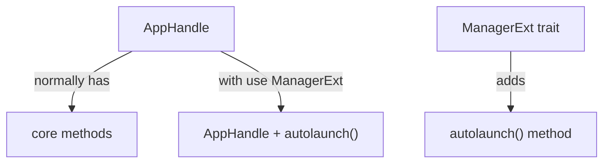
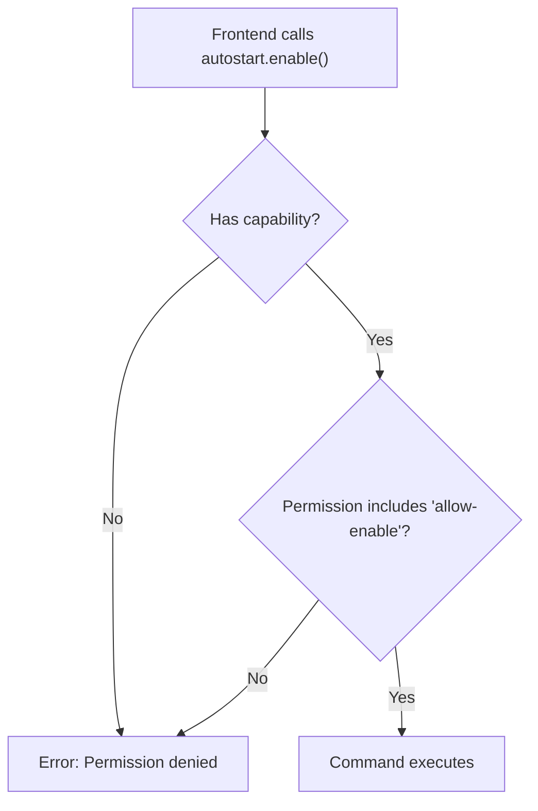
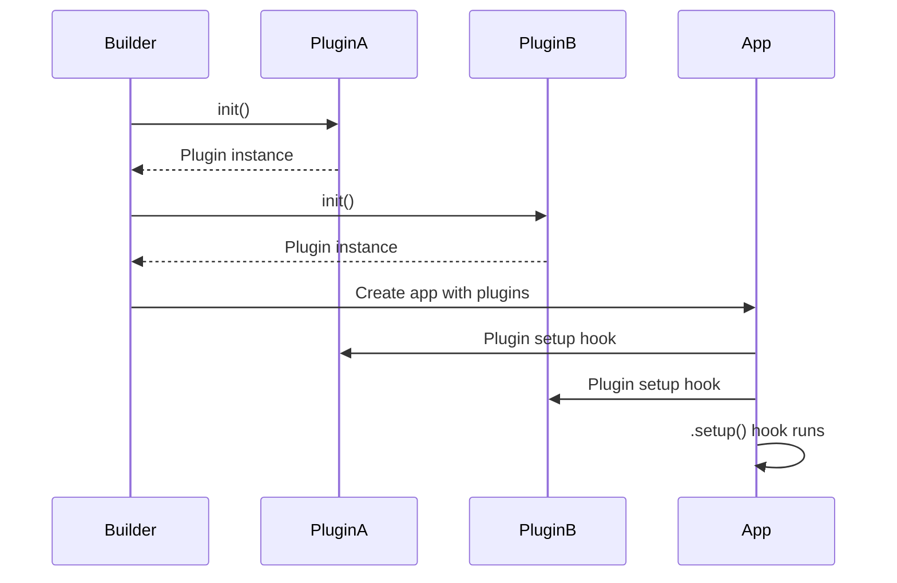

# Chapter 9: The Plugin System

> *"Building a house from scratch is admirable, but why manufacture your own doorknobs? Tauri plugins are pre-built components you can simply install—someone else has already solved that problem."*

In Chapter 8, you learned how commands let your frontend talk to Rust. Now we'll explore **plugins**—the extension mechanism that lets you add powerful features without writing them yourself. Tea uses exactly one plugin, but understanding the system unlocks a world of capabilities.

---

## What Are Tauri Plugins?

A **Tauri plugin** is a packaged piece of functionality that extends your app. Plugins can:

- Add new commands (callable from frontend)
- Hook into the app lifecycle
- Provide platform-specific implementations
- Expose JavaScript APIs

### The Appliance Analogy

Think of your app as a kitchen:

| Kitchen | Tauri App |
|---------|-----------|
| Built-in cabinets | Core Tauri features |
| Appliances (fridge, oven) | Plugins |
| Electrical outlets | Plugin mounting points |
| Appliance manuals | Plugin documentation |

You don't build a refrigerator—you buy one, plug it in, and it works. Plugins work the same way.

---

## The Plugin Ecosystem

Tauri has three categories of plugins:

### 1. Official Plugins (by Tauri team)

Maintained by the Tauri project itself. High quality, well-documented, guaranteed compatible.

| Plugin | Purpose |
|--------|---------|
| `tauri-plugin-autostart` | Launch at system startup |
| `tauri-plugin-shell` | Run shell commands |
| `tauri-plugin-fs` | File system access |
| `tauri-plugin-dialog` | Native file/folder dialogs |
| `tauri-plugin-notification` | System notifications |
| `tauri-plugin-clipboard-manager` | Clipboard access |
| `tauri-plugin-process` | Process management |
| `tauri-plugin-http` | HTTP requests |
| `tauri-plugin-os` | OS information |
| `tauri-plugin-global-shortcut` | System-wide hotkeys |

### 2. Community Plugins

Created by the community. Quality varies—check stars, maintenance status, and documentation.

### 3. Custom Plugins

Plugins you write yourself for app-specific needs.

---

## Anatomy of a Plugin

Every Tauri plugin has two potential parts:



### Rust Side (Required)

The core implementation. Contains:
- An `init()` function that returns a plugin
- Any commands the plugin exposes
- State management
- Lifecycle hooks (setup, on_event, etc.)

### JavaScript Side (Optional)

A convenience wrapper that:
- Provides typed function calls instead of raw `invoke()`
- Includes TypeScript definitions
- Handles serialization details

---

## Tea's Plugin: `tauri-plugin-autostart`

Tea uses exactly one plugin: **autostart**. Let's trace its entire journey through the codebase.

### Step 1: Add the Dependency

In [Cargo.toml](../src-tauri/Cargo.toml):

```toml
[dependencies]
tauri = { version = "2", features = ["tray-icon"] }
tauri-plugin-autostart = "2"
```

This downloads the plugin from crates.io.

### Step 2: Initialize the Plugin

In [main.rs](../src-tauri/src/main.rs):

```rust
use tauri_plugin_autostart::{MacosLauncher, ManagerExt};

// In the Builder chain:
tauri::Builder::default()
    .plugin(tauri_plugin_autostart::init(
        MacosLauncher::LaunchAgent,
        None,
    ))
```

Let's break down this call:

| Component | Purpose |
|-----------|---------|
| `init()` | Creates the plugin instance |
| `MacosLauncher::LaunchAgent` | On macOS, use LaunchAgent (vs AppleScript) |
| `None` | No custom arguments to pass at launch |

### Step 3: Grant Permissions

In [capabilities/default.json](../src-tauri/capabilities/default.json):

```json
{
  "identifier": "default",
  "description": "Capability for the main window",
  "windows": ["main"],
  "permissions": [
    "core:default",
    "autostart:allow-enable",
    "autostart:allow-disable",
    "autostart:allow-is-enabled"
  ]
}
```

Without these permissions, the plugin commands would be blocked.

### Step 4: Use the Plugin

In [main.rs](../src-tauri/src/main.rs), the setup hook accesses the plugin:

```rust
// Get the autostart manager via extension trait
let autostart_manager = handle.autolaunch();

// Check if autostart is currently enabled
let is_autostart = autostart_manager.is_enabled().unwrap_or_else(|e| {
    log::warn!("Failed to check autostart status: {}", e);
    false
});
```

### The Extension Trait Pattern

Notice `handle.autolaunch()`. Where does this method come from? The `ManagerExt` trait!

```rust
use tauri_plugin_autostart::ManagerExt;
```

This is Rust's **extension trait** pattern:



The plugin injects its API into the existing `AppHandle` type.

---

## Platform-Specific Behavior

The autostart plugin handles platform differences internally:

```rust
// Comments from main.rs
// Uses tauri-plugin-autostart which provides platform-specific autostart:
// - Windows: Creates registry entry in HKCU\Software\Microsoft\Windows\CurrentVersion\Run
// - macOS: Creates LaunchAgent plist in ~/Library/LaunchAgents
// - Linux: Creates .desktop file in ~/.config/autostart
```

### The Universal Remote Analogy

A universal TV remote works with any TV brand. You press "power," and internally it sends the right signal for your specific TV. Similarly:

| Your Code | Plugin Translates To |
|-----------|---------------------|
| `manager.enable()` | Windows: Registry write |
| `manager.enable()` | macOS: LaunchAgent plist |
| `manager.enable()` | Linux: .desktop file |

You don't care about the implementation—you just call `enable()`.

---

## The Capabilities System

Tauri 2 introduced **capabilities**—a security model that requires explicit permission for sensitive operations.

### Why Capabilities Exist

Think of capabilities as **security badges**:

| Without Capabilities | With Capabilities |
|---------------------|-------------------|
| Any code can do anything | Code needs explicit permission |
| Security holes possible | Principle of least privilege |
| All-or-nothing access | Fine-grained control |

### Tea's Capability File

```json
{
  "$schema": "../gen/schemas/desktop-schema.json",
  "identifier": "default",
  "description": "Capability for the main window",
  "windows": ["main"],
  "permissions": [
    "core:default",
    "autostart:allow-enable",
    "autostart:allow-disable",
    "autostart:allow-is-enabled"
  ]
}
```

Let's decode each part:

| Field | Purpose |
|-------|---------|
| `$schema` | Enables autocomplete in editors |
| `identifier` | Unique name for this capability |
| `description` | Human-readable explanation |
| `windows` | Which windows get these permissions |
| `permissions` | List of allowed operations |

### Permission Format

Permissions follow the pattern: `plugin:allow-command` or `plugin:deny-command`.

```
autostart:allow-enable
    │          │
    │          └── Permission to call enable()
    └── Plugin name
```

### The Building Pass Analogy

Imagine a corporate building:

- **Capability** = Your employee badge
- **Permissions** = Rooms your badge can access
- **Windows** = Which entrances accept your badge



---

## Initializing Plugins in the Builder

The order matters! Plugins are initialized in the order you add them:

```rust
tauri::Builder::default()
    .plugin(plugin_a::init())  // Initializes first
    .plugin(plugin_b::init())  // Initializes second
    .manage(state)             // After plugins
    .invoke_handler(...)       // After state
    .setup(|app| {             // After everything
        // Can use plugins here
    })
```

### Plugin Initialization Flow



---

## Using the Autostart Manager

Tea's menu needs to show the current autostart state and toggle it. Here's how:

### Checking Status

```rust
let autostart_manager = handle.autolaunch();
let is_autostart = autostart_manager.is_enabled().unwrap_or_else(|e| {
    log::warn!("Failed to check autostart status: {}", e);
    false  // Defensive default
});
```

Pattern: Use `unwrap_or_else` to provide a safe fallback if checking fails.

### Updating After App Updates

Tea has a clever trick—it re-registers autostart if already enabled:

```rust
if is_autostart {
    // Update autostart path if already enabled
    // (ensures correct path after app updates)
    if autostart_manager.disable().is_ok() {
        if let Err(e) = autostart_manager.enable() {
            log::error!("Failed to update autostart path: {}", e);
        }
    }
}
```

**Why?** When you update an app, the executable path might change. This disable-then-enable dance ensures the system points to the new location.

### Menu Item State

The menu item shows a checkmark when autostart is enabled:

```rust
let autostart_text = if is_autostart {
    "\u{2713} Start at Login"  // ✓ Start at Login
} else {
    "Start at Login"
};
```

---

## The Toggle Handler

When the user clicks the autostart menu item, Tea handles it in the menu event handler:

```rust
"toggle_autostart" => {
    let manager = app.autolaunch();
    let currently_enabled = manager.is_enabled().unwrap_or(false);
    
    if currently_enabled {
        if let Err(e) = manager.disable() {
            log::error!("Failed to disable autostart: {}", e);
        }
    } else {
        if let Err(e) = manager.enable() {
            log::error!("Failed to enable autostart: {}", e);
        }
    }
    
    // Update menu to reflect new state
    // ...
}
```

The pattern:
1. Get current state
2. Toggle to opposite
3. Update UI to match

---

## Plugin Configuration Options

The autostart plugin accepts configuration during `init()`:

```rust
tauri_plugin_autostart::init(
    MacosLauncher::LaunchAgent,  // macOS launch mechanism
    None,                        // No extra arguments
)
```

### macOS Launcher Options

| Option | Description |
|--------|-------------|
| `MacosLauncher::LaunchAgent` | System LaunchAgent (recommended) |
| `MacosLauncher::AppleScript` | AppleScript-based (legacy) |

LaunchAgent is more reliable and the modern approach.

### Extra Arguments

The second parameter lets you pass arguments to your app at launch:

```rust
// Pass custom arguments at startup
tauri_plugin_autostart::init(
    MacosLauncher::LaunchAgent,
    Some(vec!["--minimized", "--silent"]),
)
```

Tea uses `None` because it doesn't need startup arguments.

---

## When to Use Plugins vs. Custom Code

### Use a Plugin When:

| Scenario | Why Plugin |
|----------|-----------|
| Common functionality | Already solved well |
| Platform-specific code | Plugin handles differences |
| Security-sensitive | Official plugins are audited |
| Maintenance burden | Someone else updates it |

### Write Custom Code When:

| Scenario | Why Custom |
|----------|-----------|
| Unique business logic | No plugin exists |
| Tight control needed | Plugin is too opinionated |
| Learning purpose | Understanding internals |
| Plugin is unmaintained | Better to own the code |

---

## Installing Additional Plugins

If Tea needed more plugins, here's the process:

### 1. Add Cargo Dependency

```toml
# Cargo.toml
[dependencies]
tauri-plugin-notification = "2"
```

### 2. Add npm Package (Optional)

```bash
npm install @tauri-apps/plugin-notification
```

### 3. Initialize in Builder

```rust
tauri::Builder::default()
    .plugin(tauri_plugin_autostart::init(...))
    .plugin(tauri_plugin_notification::init())  // Add new plugin
```

### 4. Add Permissions

```json
{
  "permissions": [
    "core:default",
    "autostart:allow-enable",
    "autostart:allow-disable",
    "autostart:allow-is-enabled",
    "notification:default"
  ]
}
```

### 5. Use in Code

```rust
// Rust
use tauri_plugin_notification::NotificationExt;
app.notification().show(Notification::new("title").body("body"))?;

// Or JavaScript
import { sendNotification } from '@tauri-apps/plugin-notification';
await sendNotification({ title: 'Hello', body: 'World' });
```

---

## Debugging Plugin Issues

### Common Problems and Solutions

| Problem | Likely Cause | Solution |
|---------|--------------|----------|
| "Permission denied" | Missing capability | Add to `permissions` array |
| "Plugin not found" | Not initialized | Add `.plugin()` to builder |
| Method doesn't exist | Missing extension trait | Add `use PluginExt;` |
| Works on one OS only | Platform limitation | Check plugin docs |

### Checking Plugin Status

Add logging to verify plugin initialization:

```rust
.setup(|app| {
    log::info!("Checking autostart plugin...");
    let manager = app.autolaunch();
    match manager.is_enabled() {
        Ok(enabled) => log::info!("Autostart enabled: {}", enabled),
        Err(e) => log::error!("Autostart check failed: {}", e),
    }
    Ok(())
})
```

---

## Key Takeaways

1. **Plugins extend Tauri** — Add capabilities without writing from scratch
2. **Two-part structure** — Rust crate (required) + npm package (optional)
3. **Capabilities control access** — Permissions must be explicitly granted
4. **Extension traits add methods** — `use ManagerExt` adds `.autolaunch()` to handles
5. **Platform differences hidden** — One API, multiple implementations
6. **Order matters** — Plugins initialize in the order you add them

---

## What's Next?

In **Chapter 10**, we'll dive deep into Tauri's **configuration files**—`tauri.conf.json` and the capabilities system. You'll learn how these JSON files control everything from your app's name to its security permissions.

---

## Exercises

1. **Trace the capability** — Open [default.json](../src-tauri/capabilities/default.json). Remove `autostart:allow-enable` and try to enable autostart. What error do you get?

2. **Add a plugin** — Install `tauri-plugin-os` and use it to log the operating system name at startup. Don't forget permissions!

3. **Read the source** — Find the `tauri-plugin-autostart` crate on GitHub. How does it implement autostart on Windows vs macOS?

4. **Extension trait exploration** — What other methods does `ManagerExt` add? Hint: Check the plugin's documentation.
