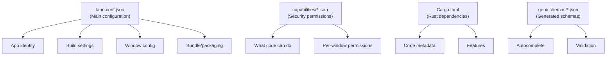
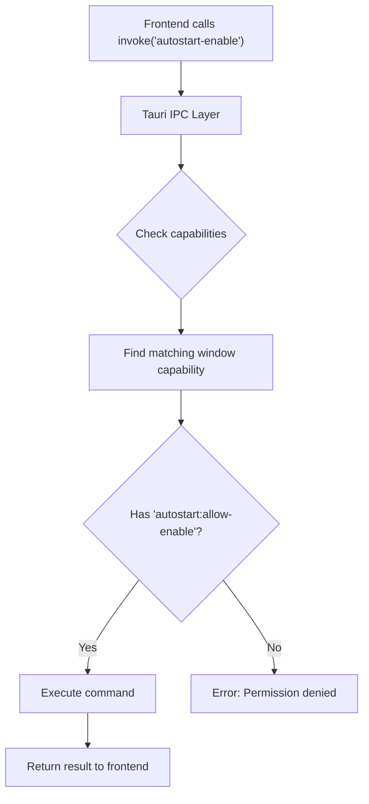

# Chapter 10: Configuration and Capabilities

> *"A blueprint tells builders what to construct. Tauri's configuration files are your app's blueprint—they define its name, its icons, what it's allowed to do, and how it gets packaged."*

In Chapter 9, you learned how plugins extend Tauri and how capabilities control access. Now we'll dive deep into Tauri's configuration system—the JSON files that define every aspect of your application.

---

## The Configuration Landscape

Tauri uses several configuration files:



| File | Purpose | Who Writes It |
|------|---------|---------------|
| `tauri.conf.json` | Main app configuration | You |
| `capabilities/*.json` | Security permissions | You |
| `Cargo.toml` | Rust dependencies | You |
| `gen/schemas/*.json` | Schema validation | Tauri (generated) |

---

## `tauri.conf.json` Deep Dive

This is your app's master configuration file. Let's examine Tea's configuration section by section.

### The Schema Declaration

```json
{
  "$schema": "https://schema.tauri.app/config/2"
}
```

This line enables **autocomplete** and **validation** in your editor. When you type, your editor knows what options are valid.

### App Identity

```json
{
  "productName": "Tea",
  "version": "2.0.0",
  "identifier": "com.tea.app"
}
```

| Field | Purpose | Where It Appears |
|-------|---------|-----------------|
| `productName` | Human-readable name | Window titles, installers |
| `version` | Semantic version | About dialogs, updates |
| `identifier` | Reverse-domain ID | macOS bundles, Windows registry |

**The Identifier Pattern**: `com.tea.app` follows reverse domain notation:
- `com` — Commercial
- `tea` — Your organization/project
- `app` — The specific application

This ensures global uniqueness. Apple and Microsoft use these for app identification.

### Build Settings

```json
{
  "build": {
    "beforeDevCommand": "npm run dev",
    "devUrl": "http://localhost:1420",
    "beforeBuildCommand": "npm run build",
    "frontendDist": "../dist"
  }
}
```

| Field | When Used | What It Does |
|-------|-----------|--------------|
| `beforeDevCommand` | `cargo tauri dev` | Starts your frontend dev server |
| `devUrl` | Development | Where to load webview content |
| `beforeBuildCommand` | `cargo tauri build` | Builds your frontend for production |
| `frontendDist` | Production | Path to built frontend assets |

### The Dev Server Analogy

Think of a restaurant with two modes:

| Restaurant | Tauri |
|------------|-------|
| Kitchen testing (chefs taste dishes) | `cargo tauri dev` |
| Customer service (plated meals) | `cargo tauri build` |
| Test ingredients (raw) | `devUrl` (hot-reloading) |
| Final presentation | `frontendDist` (optimized) |

In dev mode, you get hot-reloading—change code, see results instantly. In production, everything is optimized and bundled.

---

## App Configuration

```json
{
  "app": {
    "withGlobalTauri": true,
    "windows": [],
    "security": {
      "csp": null
    }
  }
}
```

### `withGlobalTauri`

When `true`, the Tauri API is available globally as `window.__TAURI__`. This is useful for:
- Debugging in browser console
- Simple apps without build steps
- Legacy compatibility

### `windows: []`

Tea has **no windows**! This empty array is intentional—Tea is a tray-only application. A typical app would have:

```json
{
  "windows": [
    {
      "title": "My App",
      "width": 800,
      "height": 600,
      "resizable": true,
      "fullscreen": false
    }
  ]
}
```

### Security: CSP

```json
{
  "security": {
    "csp": null
  }
}
```

**CSP** (Content Security Policy) controls what resources your webview can load. Setting it to `null` disables CSP entirely.

**Why null for Tea?** Tea has no webview showing user content, so CSP restrictions aren't needed. For apps with webviews, you'd want:

```json
{
  "csp": "default-src 'self'; script-src 'self'"
}
```

This would:
- Allow content from your own domain (`'self'`)
- Block external scripts (XSS protection)

---

## Bundle Configuration

The `bundle` section controls how your app is packaged for distribution:

```json
{
  "bundle": {
    "active": true,
    "targets": ["deb", "rpm", "dmg", "nsis"],
    "icon": [
      "icons/icon-block-32x32.png",
      "icons/icon-block-128x128.png",
      "icons/icon-block-128x128@2x.png",
      "icons/icon-block-icon.icns",
      "icons/icon-block-icon.ico"
    ],
    "resources": ["icons/icon-allow-32x32.png", "icons/icon-block-32x32.png"]
  }
}
```

### `active`

When `true`, Tauri creates installers during `cargo tauri build`. Set to `false` to skip packaging (faster builds during development).

### `targets`

Which installer formats to create:

| Target | Platform | Result |
|--------|----------|--------|
| `nsis` | Windows | `.exe` installer |
| `msi` | Windows | Windows Installer package |
| `dmg` | macOS | Disk image |
| `app` | macOS | Application bundle |
| `deb` | Linux | Debian package |
| `rpm` | Linux | Red Hat package |
| `appimage` | Linux | Portable executable |

Tea targets `deb`, `rpm`, `dmg`, and `nsis`—covering the major platforms.

### `icon`

Icons for different contexts:

| File | Usage |
|------|-------|
| `32x32.png` | Small taskbar/tray icons |
| `128x128.png` | Medium app icons |
| `128x128@2x.png` | High-DPI displays |
| `.icns` | macOS app bundle |
| `.ico` | Windows executable |

**Important**: Tauri requires icons in specific sizes. Missing sizes may cause build failures.

### `resources`

Additional files to bundle with your app:

```json
{
  "resources": ["icons/icon-allow-32x32.png", "icons/icon-block-32x32.png"]
}
```

Tea bundles both tray icons (allow/block states) so they're available at runtime.

---

## The Capabilities System (Deep Dive)

Chapter 9 introduced capabilities. Now let's explore them fully.

### Capability Files Location

```
src-tauri/
├── capabilities/
│   └── default.json    <- Your capability definitions
├── gen/
│   └── schemas/
│       ├── capabilities.json     <- Generated from your files
│       ├── desktop-schema.json   <- Schema for validation
│       └── acl-manifests.json    <- Plugin ACL definitions
```

### Tea's Capability File

```json
{
  "$schema": "../gen/schemas/desktop-schema.json",
  "identifier": "default",
  "description": "Capability for the main window",
  "windows": ["main"],
  "permissions": [
    "core:default",
    "autostart:allow-enable",
    "autostart:allow-disable",
    "autostart:allow-is-enabled"
  ]
}
```

### Understanding Each Field

#### `$schema`

Points to the generated schema file. This enables:
- Autocomplete in VS Code/other editors
- Real-time validation
- Documentation on hover

#### `identifier`

A unique name for this capability set. You can have multiple capability files:

```
capabilities/
├── default.json      <- Basic permissions for main window
├── admin.json        <- Extended permissions for admin window
└── restricted.json   <- Minimal permissions for preview window
```

#### `windows`

Which windows receive these permissions. Tea has `["main"]` even though it has no visible window—the capability still applies to the app context.

#### `permissions`

The actual permissions granted. Let's break down the format:

```
core:default
  │     │
  │     └── Permission name (or "default" for standard set)
  └── Plugin/scope name
```

### Permission Naming Convention

| Format | Meaning |
|--------|---------|
| `plugin:default` | All default permissions for plugin |
| `plugin:allow-command` | Allow calling specific command |
| `plugin:deny-command` | Explicitly deny command |
| `core:default` | Tauri's built-in defaults |

### The Security Model Visualized



### Why This Matters

The **principle of least privilege**: Code should only have permissions it actually needs.

| Bad Approach | Good Approach |
|--------------|---------------|
| Grant all permissions | Grant only needed ones |
| One giant capability | Multiple focused capabilities |
| "It works, ship it" | Security review before shipping |

### The Office Building Analogy

Capabilities are like office building access:

| Office | Tauri |
|--------|-------|
| Building | Your application |
| Floors/areas | Windows/contexts |
| Key card | Capability file |
| Doors that open | Permissions |
| Security desk | Tauri's ACL check |

Your key card doesn't open every door—just the ones you need for your job.

---

## Generated Schemas

Tauri generates schema files in `src-tauri/gen/schemas/`:

### `capabilities.json`

A compiled version of all your capability files:

```json
{
  "default": {
    "identifier": "default",
    "description": "Capability for the main window",
    "local": true,
    "windows": ["main"],
    "permissions": [
      "core:default",
      "autostart:allow-enable",
      "autostart:allow-disable",
      "autostart:allow-is-enabled"
    ]
  }
}
```

This is **generated**—don't edit it directly.

### `desktop-schema.json`

The JSON Schema that defines valid capability structures. Your editor uses this for validation.

### `acl-manifests.json`

Lists all available permissions from Tauri core and installed plugins. Useful for:
- Discovering what permissions exist
- Understanding permission scopes

---

## Common Configuration Patterns

### Pattern 1: Tray-Only App (Tea)

```json
{
  "app": {
    "windows": []
  }
}
```

No windows defined. The app lives entirely in the system tray.

### Pattern 2: Single Window App

```json
{
  "app": {
    "windows": [
      {
        "title": "My App",
        "width": 1024,
        "height": 768,
        "resizable": true,
        "center": true
      }
    ]
  }
}
```

### Pattern 3: Multi-Window App

```json
{
  "app": {
    "windows": [
      {
        "label": "main",
        "title": "Dashboard"
      },
      {
        "label": "settings",
        "title": "Settings",
        "width": 400,
        "height": 300
      }
    ]
  }
}
```

### Pattern 4: Frameless Window

```json
{
  "app": {
    "windows": [
      {
        "decorations": false,
        "transparent": true,
        "alwaysOnTop": true
      }
    ]
  }
}
```

---

## Configuration Validation

Tauri validates your configuration at build time. Common errors:

### Missing Required Fields

```
Error: `identifier` is required
```

**Fix**: Add the required field.

### Invalid Icon Paths

```
Error: Icon file not found: icons/missing.png
```

**Fix**: Ensure all icon paths exist.

### Schema Violation

```
Error: "targets" must be an array
```

**Fix**: Check the schema for correct types.

### Debugging Configuration

1. **Check schema**: Hover over fields in VS Code for documentation
2. **Validate JSON**: Use `jq . tauri.conf.json` or online validators
3. **Read build output**: Tauri tells you exactly what's wrong

---

## Environment-Specific Configuration

Sometimes you need different configurations for development vs production.

### Using Environment Variables

Tauri supports environment variable substitution:

```json
{
  "identifier": "${APP_IDENTIFIER}"
}
```

Set `APP_IDENTIFIER=com.dev.test` for development.

### Multiple Config Files

You can specify a custom config file:

```bash
cargo tauri build --config ./production.conf.json
```

This merges with `tauri.conf.json`, overriding specified values.

---

## Tea's Configuration Choices Explained

Let's understand why Tea's configuration looks the way it does:

### No Windows

```json
"windows": []
```

Tea is a utility app. Users interact via system tray menu, not a window. This keeps the footprint tiny.

### Global Tauri

```json
"withGlobalTauri": true
```

Even though Tea has no webview, this is set to `true` as a Tauri 2 default.

### CSP Disabled

```json
"csp": null
```

No webview = no need for content security policy.

### Multi-Platform Targets

```json
"targets": ["deb", "rpm", "dmg", "nsis"]
```

Tea aims to run on Windows, macOS, and Linux. Each target produces the native installer format.

### Bundled Resources

```json
"resources": ["icons/icon-allow-32x32.png", "icons/icon-block-32x32.png"]
```

The tray icon changes based on state (sleeping vs awake). Both icons must be bundled so they're available at runtime.

---

## Key Takeaways

1. **`tauri.conf.json` is the master config** — App identity, build settings, windows, bundling
2. **Capabilities control security** — Explicit permissions per window
3. **Schemas enable tooling** — Autocomplete and validation from generated files
4. **Bundle config = distribution** — Icons, installers, resources
5. **Empty windows array = tray-only** — No window doesn't mean no app
6. **Generated files are read-only** — Edit source files, not `gen/` output

---

## What's Next?

In **Chapter 11**, we'll build the system tray—the heart of Tea's user interface. You'll learn how to create tray icons, build menus, and handle menu events.

---

## Exercises

1. **Explore the schema**: Open `tauri.conf.json` in VS Code. Hover over different fields. What documentation appears?

2. **Add a window**: Temporarily add a window configuration to Tea. What happens when you run `cargo tauri dev`?

3. **Capability experiment**: Create a second capability file `capabilities/restricted.json` with no autostart permissions. What would you use this for?

4. **Find all permissions**: Open `gen/schemas/acl-manifests.json`. How many different permissions are available from `core`?
