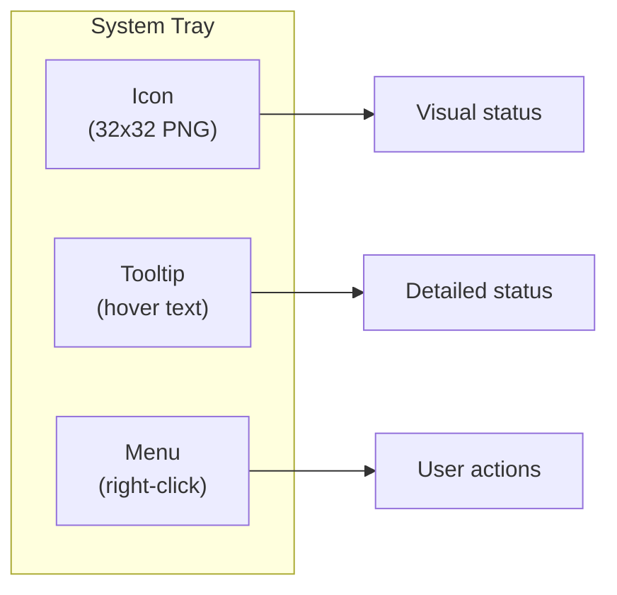
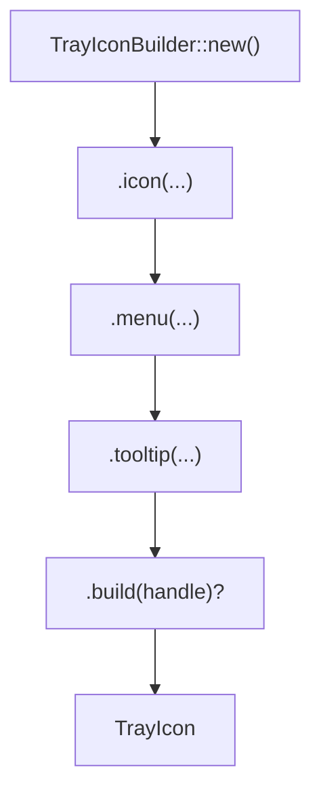
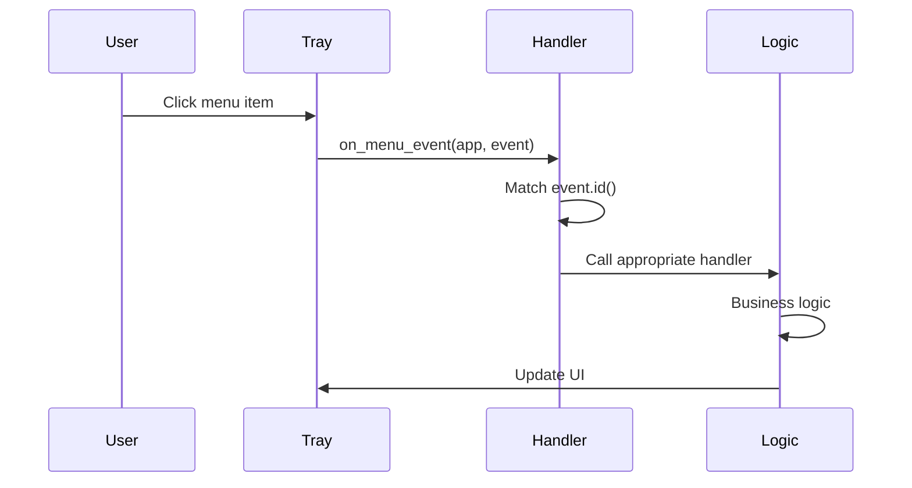
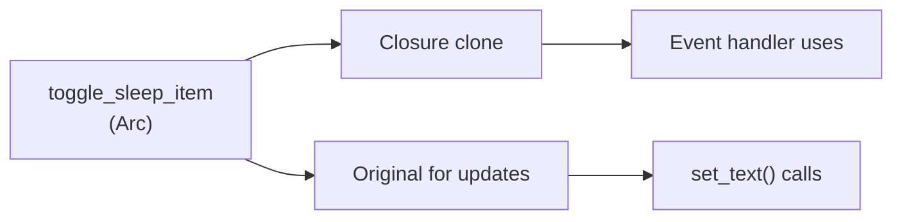

# Chapter 11: Building the System Tray

> *"A system tray icon is like a doorbell camera. It sits quietly in the corner, shows you status at a glance, and gives you quick access to controls without opening the front door."*

In Chapter 10, you learned how Tauri's configuration files define your app. Now we'll build the **system tray**—Tea's entire user interface. This is where everything comes together.

---

## What Is a System Tray?

The **system tray** (also called notification area, menu bar, or status area) is that row of small icons near your clock:

| Platform | Location | Name |
|----------|----------|------|
| Windows | Bottom-right taskbar | System Tray / Notification Area |
| macOS | Top-right menu bar | Menu Bar / Status Menu |
| Linux | Varies by DE | System Tray / App Indicator |

### Why Tray-Only?

Tea deliberately has no window:

| Window App | Tray App |
|------------|----------|
| Takes screen space | Invisible until needed |
| Requires focus switching | One-click access |
| Complex UI | Simple menu |
| Large footprint | Minimal footprint |

For a utility that prevents sleep, a tray icon is perfect—always accessible, never in the way.

---

## The Tray Architecture

Tea's tray consists of three parts:



Each part serves a purpose:

| Component | What User Sees | What It Conveys |
|-----------|---------------|-----------------|
| Icon | Small colored image | Current state (sleeping vs awake) |
| Tooltip | Text on hover | Detailed status message |
| Menu | List of options | Available actions |

---

## Building the Tray with `TrayIconBuilder`

Tauri provides `TrayIconBuilder` for creating system tray icons. Let's trace Tea's implementation.

### The Builder Pattern

```rust
// src-tauri/src/main.rs
let tray = TrayIconBuilder::new()
    .icon(Image::new(icon_data.as_slice(), 32, 32))
    .menu(&tray_menu)
    .tooltip(tooltip.as_str())
    .build(handle)?;
```

This follows the **builder pattern** (from Chapter 7):



### Breaking Down Each Call

#### `.icon()`

Sets the tray icon image:

```rust
let icon_data = icon::get_icon_rgba(state.sleep_disabled)?;
let tray = TrayIconBuilder::new()
    .icon(Image::new(icon_data.as_slice(), 32, 32))
```

The icon changes based on state:
- `state.sleep_disabled == true` → Block icon (preventing sleep)
- `state.sleep_disabled == false` → Allow icon (allowing sleep)

#### `.menu()`

Attaches a context menu:

```rust
.menu(&tray_menu)
```

The menu appears when users right-click (Windows/Linux) or click (macOS) the icon.

#### `.tooltip()`

Sets hover text:

```rust
.tooltip(tooltip.as_str())
```

Users see this when hovering over the tray icon—a quick status check without opening the menu.

#### `.build()`

Finalizes and creates the tray icon:

```rust
.build(handle)?
```

The `handle` is the Tauri `AppHandle`—the tray needs it to integrate with the event system.

---

## Creating Menus with `MenuBuilder`

Tea's menu is built using Tauri's menu system. Let's walk through it piece by piece.

### Menu Item IDs

Every menu item needs a unique identifier:

```rust
// Menu item IDs
let toggle_sleep_id = MenuId::new("toggle_sleep");
let toggle_autostart_id = MenuId::new("toggle_autostart");
let screen_on_id = MenuId::new("screen_on");
let screen_off_id = MenuId::new("screen_off");
let quit_id = MenuId::new("quit");
```

These IDs are how you identify which item was clicked in event handlers.

### Creating Menu Items

Each item uses `MenuItemBuilder`:

```rust
let toggle_sleep_text = if state.sleep_disabled {
    "Enable Sleep"
} else {
    "Disable Sleep"
};
let toggle_sleep_item =
    MenuItemBuilder::with_id(toggle_sleep_id.clone(), toggle_sleep_text).build(handle)?;
```

Pattern breakdown:

| Part | Purpose |
|------|---------|
| `MenuItemBuilder::with_id()` | Create builder with ID and text |
| `.clone()` | IDs are used multiple times |
| `.build(handle)?` | Finalize the menu item |

### Dynamic Text Based on State

Notice how the text changes:

```rust
let toggle_sleep_text = if state.sleep_disabled {
    "Enable Sleep"   // Currently blocking sleep, offer to enable
} else {
    "Disable Sleep"  // Currently allowing sleep, offer to disable
};
```

The text tells users what will happen when clicked, not the current state.

### Adding Checkmarks

Tea shows checkmarks (✓) for enabled options:

```rust
let autostart_text = if is_autostart {
    "\u{2713} Start at Login"  // ✓ Start at Login
} else {
    "Start at Login"
};
```

`\u{2713}` is the Unicode checkmark character. This visual indicator shows what's currently active.

---

## Building the Menu Structure

Tea builds its menu conditionally based on platform:

```rust
// Build tray menu - conditionally include screen mode items (Windows only)
let mut menu_builder = MenuBuilder::new(handle).item(&toggle_sleep_item);

// Add screen mode section only if items exist (Windows)
if screen_on_item.is_some() || screen_off_item.is_some() {
    menu_builder = menu_builder.separator();
    
    if let Some(ref item) = screen_on_item {
        menu_builder = menu_builder.item(item);
    }
    if let Some(ref item) = screen_off_item {
        menu_builder = menu_builder.item(item);
    }
}

let tray_menu = menu_builder
    .separator()
    .item(&toggle_autostart_item)
    .separator()
    .item(&quit_item)
    .build()?;
```

### Menu Structure Visualized

**On Windows:**
```
┌────────────────────────┐
│ Disable Sleep          │
├────────────────────────┤
│ ✓ Keep Screen On       │
│   Allow Screen Off     │
├────────────────────────┤
│   Start at Login       │
├────────────────────────┤
│ Quit                   │
└────────────────────────┘
```

**On macOS/Linux:**
```
┌────────────────────────┐
│ Disable Sleep          │
├────────────────────────┤
│   Start at Login       │
├────────────────────────┤
│ Quit                   │
└────────────────────────┘
```

The screen mode options only appear on Windows where they actually do something.

### The Restaurant Menu Analogy

Think of building menus like creating a restaurant menu:

| Restaurant | Tauri |
|------------|-------|
| Menu sections | Separators |
| Individual dishes | Menu items |
| Daily specials | Platform-specific items |
| Prices/descriptions | Checkmarks/text |

You wouldn't list seafood at a steakhouse—similarly, Tea doesn't show screen mode options where they don't work.

---

## Handling Menu Events

When users click menu items, your code needs to respond. Tea uses `on_menu_event`:

```rust
tray.on_menu_event(move |app, event| {
    if *event.id() == toggle_sleep_id {
        handle_toggle_sleep(
            is_awake.clone(),
            screen_mode.clone(),
            &toggle_sleep_item_clone,
            &tray_handle,
        );
    } else if *event.id() == screen_on_id && screen_on_item_clone.is_some() {
        handle_screen_mode_change(/* ... */);
    } else if *event.id() == screen_off_id && screen_off_item_clone.is_some() {
        handle_screen_mode_change(/* ... */);
    } else if *event.id() == toggle_autostart_id {
        handle_toggle_autostart(app, &toggle_autostart_item);
    } else if *event.id() == quit_id {
        handle_quit(app, is_awake.clone());
    }
});
```

### Event Handler Pattern



### The Switchboard Operator Analogy

The event handler is like an old telephone switchboard:

| Switchboard | Event Handler |
|-------------|---------------|
| Incoming call | Menu click event |
| "Who are you calling?" | `event.id()` check |
| Connect to extension | Call specific handler |
| Call completes | Handler finishes |

---

## Updating the Tray Dynamically

Tea's tray isn't static—it changes based on state. Let's examine the update handlers.

### Updating Menu Item Text

After toggling sleep:

```rust
fn handle_toggle_sleep(/* ... */) {
    // Business logic
    let (new_awake, current_mode) = match commands::toggle_sleep_impl(&is_awake, &screen_mode) {
        Ok(result) => result,
        Err(e) => {
            log::error!("Toggle sleep failed: {}", e);
            return;
        }
    };

    // Update menu text
    let menu_text = if new_awake {
        "Enable Sleep"    // Now blocking, offer to enable
    } else {
        "Disable Sleep"   // Now allowing, offer to disable
    };
    let _ = toggle_item.set_text(menu_text);
    
    // ... icon and tooltip updates
}
```

The `set_text()` method updates what the user sees without rebuilding the entire menu.

### Updating the Icon

```rust
if let Ok(icon_data) = icon::get_icon_rgba(new_awake) {
    let _ = tray.set_icon(Some(Image::new(icon_data.as_slice(), 32, 32)));
}
```

Different icons for different states provide instant visual feedback.

### Updating the Tooltip

```rust
let tooltip = TooltipText::for_state(new_awake, current_mode);
let _ = tray.set_tooltip(Some(tooltip.as_str()));
```

The tooltip changes to reflect the new state.

---

## Thread Safety with Arc

Menu items are shared between the main thread and the event handler closure. Tea uses `Arc` to make this safe:

```rust
// Wrap menu items for event handler
let toggle_sleep_item = Arc::new(toggle_sleep_item);
let toggle_sleep_item_clone = toggle_sleep_item.clone();
let toggle_autostart_item = Arc::new(toggle_autostart_item);
```

### Why Arc?

The `on_menu_event` closure captures variables by value. Without `Arc`:
1. The closure would take ownership
2. You couldn't use the item elsewhere
3. Updates would be impossible

With `Arc`:
1. Multiple references can exist
2. The closure has its clone
3. You can still update via the original



---

## Platform-Specific Menu Items

Tea shows screen mode options only on Windows:

```rust
let screen_on_item = if ScreenMode::KeepScreenOn.is_supported() {
    let screen_on_text = if state.screen_mode == ScreenMode::KeepScreenOn {
        "\u{2713} Keep Screen On"
    } else {
        "Keep Screen On"
    };
    Some(MenuItemBuilder::with_id(screen_on_id.clone(), screen_on_text).build(handle)?)
} else {
    None
};
```

### How `is_supported()` Works

From [screen_mode.rs](../src-tauri/src/core/screen_mode.rs):

```rust
impl ScreenMode {
    pub fn is_supported(&self) -> bool {
        cfg!(windows)
    }
}
```

On Windows: `cfg!(windows)` is `true` → items created
On other platforms: `cfg!(windows)` is `false` → `None`

### Conditional Menu Building

```rust
if screen_on_item.is_some() || screen_off_item.is_some() {
    menu_builder = menu_builder.separator();
    
    if let Some(ref item) = screen_on_item {
        menu_builder = menu_builder.item(item);
    }
    // ...
}
```

The separator and items are only added when the items exist.

---

## The Complete Event Handlers

Let's examine each handler in detail:

### `handle_toggle_sleep`

```rust
fn handle_toggle_sleep(
    is_awake: Arc<AtomicBool>,
    screen_mode: Arc<Mutex<ScreenMode>>,
    toggle_item: &Arc<tauri::menu::MenuItem<tauri::Wry>>,
    tray: &tauri::tray::TrayIcon<tauri::Wry>,
) {
    // 1. Delegate to business logic
    let (new_awake, current_mode) = match commands::toggle_sleep_impl(&is_awake, &screen_mode) {
        Ok(result) => result,
        Err(e) => {
            log::error!("Toggle sleep failed: {}", e);
            return;
        }
    };

    // 2. Update menu text
    let menu_text = if new_awake {
        "Enable Sleep"
    } else {
        "Disable Sleep"
    };
    let _ = toggle_item.set_text(menu_text);

    // 3. Update icon and tooltip
    if let Ok(icon_data) = icon::get_icon_rgba(new_awake) {
        let tooltip = TooltipText::for_state(new_awake, current_mode);
        let _ = tray.set_icon(Some(Image::new(icon_data.as_slice(), 32, 32)));
        let _ = tray.set_tooltip(Some(tooltip.as_str()));
    }
}
```

Pattern:
1. Call business logic (in `commands.rs`)
2. Update UI based on result
3. Handle errors gracefully

### `handle_screen_mode_change`

```rust
fn handle_screen_mode_change(
    new_mode: ScreenMode,
    is_awake: Arc<AtomicBool>,
    screen_mode: Arc<Mutex<ScreenMode>>,
    screen_on_item: &Option<Arc<tauri::menu::MenuItem<tauri::Wry>>>,
    screen_off_item: &Option<Arc<tauri::menu::MenuItem<tauri::Wry>>>,
    tray: &tauri::tray::TrayIcon<tauri::Wry>,
) {
    // 1. Business logic
    if let Err(e) = commands::change_screen_mode_impl(&is_awake, &screen_mode, new_mode) {
        log::error!("Change screen mode failed: {}", e);
        return;
    }

    // 2. Update checkmarks
    if let Some(ref item) = screen_on_item {
        let _ = item.set_text(if new_mode == ScreenMode::KeepScreenOn {
            "\u{2713} Keep Screen On"
        } else {
            "Keep Screen On"
        });
    }
    
    if let Some(ref item) = screen_off_item {
        let _ = item.set_text(if new_mode == ScreenMode::AllowScreenOff {
            "\u{2713} Allow Screen Off"
        } else {
            "Allow Screen Off"
        });
    }

    // 3. Update tooltip if awake
    let awake = is_awake.load(Ordering::SeqCst);
    if awake {
        let tooltip = TooltipText::for_state(true, new_mode);
        let _ = tray.set_tooltip(Some(tooltip.as_str()));
    }
}
```

The checkmark pattern: exactly one item has ✓, the others don't.

### `handle_toggle_autostart`

```rust
fn handle_toggle_autostart(
    app: &tauri::AppHandle,
    toggle_item: &Arc<tauri::menu::MenuItem<tauri::Wry>>,
) {
    let autostart_manager = app.autolaunch();
    let is_enabled = autostart_manager.is_enabled().unwrap_or_else(|e| {
        log::warn!("Failed to check autostart status during toggle: {}", e);
        false
    });

    log::info!("Toggling autostart: {} -> {}", is_enabled, !is_enabled);

    if is_enabled {
        let _ = autostart_manager.disable();
        let _ = toggle_item.set_text("Start at Login");
    } else {
        let _ = autostart_manager.enable();
        let _ = toggle_item.set_text("✓ Start at Login");
    }
}
```

Uses the autostart plugin directly—no `_impl` function needed here since it's already abstracted.

### `handle_quit`

```rust
fn handle_quit(app: &tauri::AppHandle, is_awake: Arc<AtomicBool>) {
    log::info!("Quit requested");
    is_awake.store(false, Ordering::SeqCst);  // Stop wake service
    app.exit(0);
}
```

Clean shutdown:
1. Signal wake service to stop
2. Exit the application

---

## Managing the Tray Handle

Tea stores the tray icon for later access:

```rust
app.manage(tray);
```

This lets other parts of the app access the tray if needed.

---

## Tooltips with `TooltipText`

Tea uses a newtype for tooltips:

```rust
// From core/tooltip.rs
pub struct TooltipText(String);

impl TooltipText {
    pub fn for_state(is_awake: bool, screen_mode: ScreenMode) -> Self {
        let status = if is_awake {
            match screen_mode {
                ScreenMode::KeepScreenOn => "Keeping screen on",
                ScreenMode::AllowScreenOff => "Preventing sleep (screen may turn off)",
            }
        } else {
            "Sleep allowed"
        };
        Self(format!("Tea - {}", status))
    }
    
    pub fn as_str(&self) -> &str {
        &self.0
    }
}
```

The tooltip gives detailed status:
- "Tea - Keeping screen on"
- "Tea - Preventing sleep (screen may turn off)"
- "Tea - Sleep allowed"

---

## Error Handling in UI Code

Notice the pattern `let _ = ...`:

```rust
let _ = toggle_item.set_text(menu_text);
let _ = tray.set_icon(Some(Image::new(...)));
```

The `let _ =` explicitly ignores the Result. Why?

1. **UI updates should be best-effort** — A failed tooltip update shouldn't crash the app
2. **Logging happens elsewhere** — The underlying functions may log errors
3. **User experience matters** — Partial UI updates are better than crashes

---

## Key Takeaways

1. **TrayIconBuilder creates the tray** — Icon, menu, and tooltip in one builder chain
2. **MenuBuilder creates menus** — Items with IDs, separators, conditional sections
3. **Event handlers respond to clicks** — Match on `event.id()` to route actions
4. **Arc enables shared access** — Menu items wrapped in Arc for thread-safe updates
5. **Dynamic updates via set methods** — `set_text()`, `set_icon()`, `set_tooltip()`
6. **Platform awareness** — Show/hide items based on `cfg!()` checks

---

## What's Next?

In **Chapter 12**, we'll dive deeper into menus and icons—loading icons from files, creating dynamic menus, and handling more complex menu scenarios.

---

## Exercises

1. **Add a menu item**: Add a "Show Status" item that logs the current state to the console.

2. **Change the icon**: Try loading a different icon for the tray. What happens if the file doesn't exist?

3. **Keyboard shortcut**: Research Tauri's `global-shortcut` plugin. Could you add a hotkey to toggle sleep?

4. **Tooltip experiment**: Modify `TooltipText::for_state` to include the current time. What happens when you hover?
