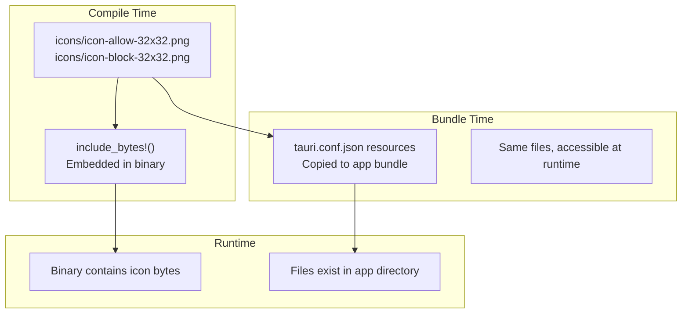
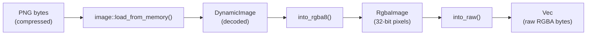

# Chapter 12: Icons and Resources

> *"A traffic light doesn't need labels—red means stop, green means go. Tea's icons work the same way: one glance tells you the state."*

In Chapter 11, you built the system tray with menus and events. Now we'll explore how Tea loads, processes, and displays icons—the visual heartbeat of your tray application.

---

## Why Icons Matter

For a tray-only app like Tea, the icon is your **primary user interface**:

| Traditional App | Tray App |
|-----------------|----------|
| Large window | Tiny icon |
| Text labels | Visual state |
| Obvious affordances | Glanceable status |

Users don't read your tray icon—they **recognize** it. The icon must communicate state instantly.

### Tea's Two States

| State | Icon | Meaning |
|-------|------|---------|
| Blocking sleep | 🟢 Green/active | "I'm keeping you awake" |
| Allowing sleep | ⚪ Gray/inactive | "Sleep is allowed" |

One bit of information, two distinct visuals.

---

## Embedded vs. Bundled Resources

Tea uses **two different strategies** for icons:



### Embedded Resources (`include_bytes!`)

```rust
// src-tauri/src/icon.rs
static ICON_ALLOW: &[u8] = include_bytes!("../icons/icon-allow-32x32.png");
static ICON_BLOCK: &[u8] = include_bytes!("../icons/icon-block-32x32.png");
```

**What happens**: At compile time, Rust reads the file and embeds its raw bytes directly into the binary.

**Advantages**:
- No external files to lose
- Faster loading (already in memory)
- Simpler deployment

**Disadvantages**:
- Increases binary size
- Can't change without recompiling

### Bundled Resources (`tauri.conf.json`)

```json
{
  "bundle": {
    "resources": ["icons/icon-allow-32x32.png", "icons/icon-block-32x32.png"]
  }
}
```

**What happens**: Tauri copies these files into the application bundle during build.

**Advantages**:
- Can be updated separately
- Accessible via filesystem paths
- Good for user-customizable resources

**Disadvantages**:
- Files can be deleted/corrupted
- Slightly slower to load

### The Suitcase Analogy

Think of deploying your app like packing for a trip:

| Packing Style | Resource Type |
|---------------|---------------|
| Clothes sewn into jacket lining | `include_bytes!` (embedded) |
| Clothes in your suitcase | Bundle resources (separate) |

Embedded resources can't be lost but add weight. Bundled resources are separate but could get lost baggage.

**Tea's choice**: Embed the tray icons (critical for function) but also bundle them (for potential future use).

---

## The `icon.rs` Module

Tea's icon handling is remarkably simple—and that's intentional.

### The Complete Module

```rust
// src-tauri/src/icon.rs
use crate::error::{AppError, Result};

/// Embedded icon for "sleep allowed" state (gray)
static ICON_ALLOW: &[u8] = include_bytes!("../icons/icon-allow-32x32.png");

/// Embedded icon for "sleep blocked" state (green)
static ICON_BLOCK: &[u8] = include_bytes!("../icons/icon-block-32x32.png");

/// Convert embedded icon data to RGBA format
pub fn get_icon_rgba(is_awake: bool) -> Result<Vec<u8>> {
    let icon_data = if is_awake { ICON_BLOCK } else { ICON_ALLOW };

    let img = image::load_from_memory(icon_data).map_err(|e| AppError::IconProcessing {
        message: format!(
            "Failed to load {} icon from embedded data",
            if is_awake { "awake" } else { "sleep" }
        ),
        cause: e.to_string(),
        recovery_hint: "This is a bug. Icon data may be corrupted.",
    })?;

    let rgba = img.into_rgba8();
    Ok(rgba.into_raw())
}
```

### Breaking It Down

#### Static Byte Arrays

```rust
static ICON_ALLOW: &[u8] = include_bytes!("../icons/icon-allow-32x32.png");
```

| Part | Meaning |
|------|---------|
| `static` | Lives for entire program lifetime |
| `ICON_ALLOW` | Constant name (SCREAMING_CASE for statics) |
| `&[u8]` | Reference to byte slice |
| `include_bytes!()` | Macro that embeds file at compile time |

The path `"../icons/icon-allow-32x32.png"` is relative to the source file (`icon.rs`).

#### The `get_icon_rgba` Function

```rust
pub fn get_icon_rgba(is_awake: bool) -> Result<Vec<u8>>
```

**Input**: A boolean indicating current state
**Output**: RGBA pixel data (or error)

This function is the **only public interface** for icon loading.

#### State-Based Selection

```rust
let icon_data = if is_awake { ICON_BLOCK } else { ICON_ALLOW };
```

Simple branching: awake → block icon, not awake → allow icon.

#### Image Processing

```rust
let img = image::load_from_memory(icon_data).map_err(|e| AppError::IconProcessing {
    message: format!("Failed to load {} icon", if is_awake { "awake" } else { "sleep" }),
    cause: e.to_string(),
    recovery_hint: "This is a bug. Icon data may be corrupted.",
})?;
```

The `image` crate parses the PNG bytes into a structured image.

#### RGBA Conversion

```rust
let rgba = img.into_rgba8();
Ok(rgba.into_raw())
```

Tauri's tray icon API expects raw RGBA bytes:
- `into_rgba8()` — Convert to 8-bit RGBA format
- `into_raw()` — Extract the raw pixel bytes

---

## The `image` Crate

Tea uses the [`image`](https://crates.io/crates/image) crate for image processing.

### Cargo.toml Configuration

```toml
[dependencies]
image = { version = "0.24", default-features = false, features = ["png"] }
```

| Setting | Purpose |
|---------|---------|
| `default-features = false` | Don't include unnecessary codecs |
| `features = ["png"]` | Only enable PNG support |

This keeps the binary small—Tea only needs PNG.

### What `image` Does



Each 32x32 pixel produces 4 bytes (R, G, B, A), so the output is 32 × 32 × 4 = **4,096 bytes**.

---

## Platform Icon Requirements

Different platforms have different icon needs:

### Tray Icon Sizes

| Platform | Recommended Size | Notes |
|----------|------------------|-------|
| Windows | 16×16, 32×32 | 32×32 for high DPI |
| macOS | 22×22, 44×44 | Template images preferred |
| Linux | 22×22, 24×24, 32×32 | Varies by desktop environment |

Tea uses 32×32 as a reasonable compromise.

### Application Icons (for installers)

Tea provides multiple sizes in the `icons/` directory:

```
icons/
├── icon-block-32x32.png       # Small
├── icon-block-128x128.png     # Medium
├── icon-block-128x128@2x.png  # Medium high-DPI
├── icon-block-icon.icns       # macOS bundle
├── icon-block-icon.ico        # Windows executable
├── icon-block-Square*.png     # Windows Store tiles
└── icon-block-StoreLogo.png   # Windows Store logo
```

### The @2x Convention

```
icon-block-128x128.png      # 128×128 pixels
icon-block-128x128@2x.png   # 256×256 pixels (for Retina/high-DPI)
```

The `@2x` suffix tells macOS to use this icon on Retina displays, showing at "logical" 128×128 but with double the pixels.

---

## Icon Configuration in `tauri.conf.json`

### Bundle Icons

```json
{
  "bundle": {
    "icon": [
      "icons/icon-block-32x32.png",
      "icons/icon-block-128x128.png",
      "icons/icon-block-128x128@2x.png",
      "icons/icon-block-icon.icns",
      "icons/icon-block-icon.ico"
    ]
  }
}
```

These icons are used for:
- Windows: Executable icon (`.ico`)
- macOS: Application bundle (`.icns`)
- Linux: Desktop entries (`.png`)

### Bundle Resources

```json
{
  "bundle": {
    "resources": ["icons/icon-allow-32x32.png", "icons/icon-block-32x32.png"]
  }
}
```

These files are copied into the app bundle, accessible at runtime via Tauri's resource resolver.

---

## Using Icons in the Tray

From Chapter 11, recall how icons are set:

### Initial Icon

```rust
// src-tauri/src/main.rs
let icon_data = icon::get_icon_rgba(state.sleep_disabled)?;
let tray = TrayIconBuilder::new()
    .icon(Image::new(icon_data.as_slice(), 32, 32))
    // ...
```

### Dynamic Icon Updates

```rust
// In handle_toggle_sleep
if let Ok(icon_data) = icon::get_icon_rgba(new_awake) {
    let _ = tray.set_icon(Some(Image::new(icon_data.as_slice(), 32, 32)));
}
```

### The `Image::new` Call

```rust
Image::new(icon_data.as_slice(), 32, 32)
```

| Parameter | Meaning |
|-----------|---------|
| `icon_data.as_slice()` | Raw RGBA bytes |
| `32` | Width in pixels |
| `32` | Height in pixels |

Tauri's `Image` wraps raw pixel data with dimensions.

---

## Error Handling in Icon Loading

Tea handles icon errors gracefully:

### Structured Error

```rust
AppError::IconProcessing {
    message: format!("Failed to load {} icon", if is_awake { "awake" } else { "sleep" }),
    cause: e.to_string(),
    recovery_hint: "This is a bug. Icon data may be corrupted.",
}
```

This error should **never happen** in production—the icons are embedded at compile time. If it does, something is very wrong.

### Graceful Degradation in UI

```rust
if let Ok(icon_data) = icon::get_icon_rgba(new_awake) {
    let _ = tray.set_icon(Some(Image::new(icon_data.as_slice(), 32, 32)));
}
```

If icon loading fails:
- The error is logged (by the `?` in the original call)
- The UI continues with the previous icon
- The app doesn't crash

---

## Testing Icons

Tea includes tests for icon loading:

```rust
// src-tauri/src/icon.rs
#[cfg(test)]
mod tests {
    use super::*;

    #[test]
    fn test_get_icon_for_awake_state() {
        let result = get_icon_rgba(true);
        assert!(result.is_ok());
        let data = result.unwrap();
        // 32x32 RGBA = 4096 bytes
        assert_eq!(data.len(), 32 * 32 * 4);
    }

    #[test]
    fn test_get_icon_for_sleep_state() {
        let result = get_icon_rgba(false);
        assert!(result.is_ok());
        let data = result.unwrap();
        assert_eq!(data.len(), 32 * 32 * 4);
    }

    #[test]
    fn test_icons_are_different() {
        let awake_icon = get_icon_rgba(true).unwrap();
        let sleep_icon = get_icon_rgba(false).unwrap();
        assert_ne!(awake_icon, sleep_icon);
    }
}
```

### What These Tests Verify

| Test | Verifies |
|------|----------|
| `test_get_icon_for_awake_state` | Block icon loads, correct size |
| `test_get_icon_for_sleep_state` | Allow icon loads, correct size |
| `test_icons_are_different` | Icons are actually different |

The last test catches a subtle bug: accidentally using the same file for both states.

---

## Creating Your Own Icons

If you're building a similar app, here's a workflow:

### 1. Design at Large Size

Create your icon at 512×512 or 1024×1024 pixels. This gives you room to work.

### 2. Export Multiple Sizes

```
512×512  → Master
256×256  → @2x variants
128×128  → Standard macOS
64×64    → Medium
32×32    → Tray icons
16×16    → Smallest Windows
```

### 3. Generate Platform Formats

| Format | Tool | Command |
|--------|------|---------|
| `.ico` | ImageMagick | `convert icon.png icon.ico` |
| `.icns` | iconutil (macOS) | `iconutil -c icns icon.iconset` |
| `.png` | Any editor | Direct export |

### 4. Test on All Platforms

Icons that look good on macOS may be invisible on Windows dark mode, and vice versa.

---

## Common Pitfalls

### ⚠️ Wrong Color Space

PNG files can have different color profiles. Tauri expects sRGB. Non-sRGB images may appear with wrong colors.

**Fix**: Export as sRGB, no embedded profile.

### ⚠️ Transparency Issues

Some icon editors don't handle alpha channels correctly.

**Fix**: Test icons on both light and dark backgrounds.

### ⚠️ Wrong Size

Providing a 64×64 icon but telling Tauri it's 32×32 will cause distortion.

**Fix**: Always match the actual pixel dimensions.

### ⚠️ Missing High-DPI Variants

On Retina/high-DPI displays, low-res icons look blurry.

**Fix**: Provide @2x variants for all sizes.

---

## Key Takeaways

1. **`include_bytes!` embeds at compile time** — Fast, reliable, increases binary size
2. **Bundle resources copy at build time** — Separate files, can be updated independently
3. **`image` crate handles PNG processing** — Decode, convert to RGBA, extract raw bytes
4. **32×32 is the common tray size** — But provide multiple sizes for different contexts
5. **Icons communicate state** — Choose visuals that are instantly recognizable
6. **Test both states** — Ensure icons are actually different

---

## What's Next?

In **Chapter 13**, we'll build the **wake service**—the background task that actually keeps your computer awake by simulating keyboard activity.

---

## Exercises

1. **Add a third state**: Create an icon for a hypothetical "paused" state. Embed it and add a function to select it.

2. **Size verification**: Add a test that verifies both icons have the same dimensions.

3. **Explore the image crate**: Modify `get_icon_rgba` to apply a grayscale filter. What would you use this for?

4. **Resource path**: Use `tauri::api::path::resolve_resource` to load a bundled resource instead of embedded bytes. When might this be useful?
