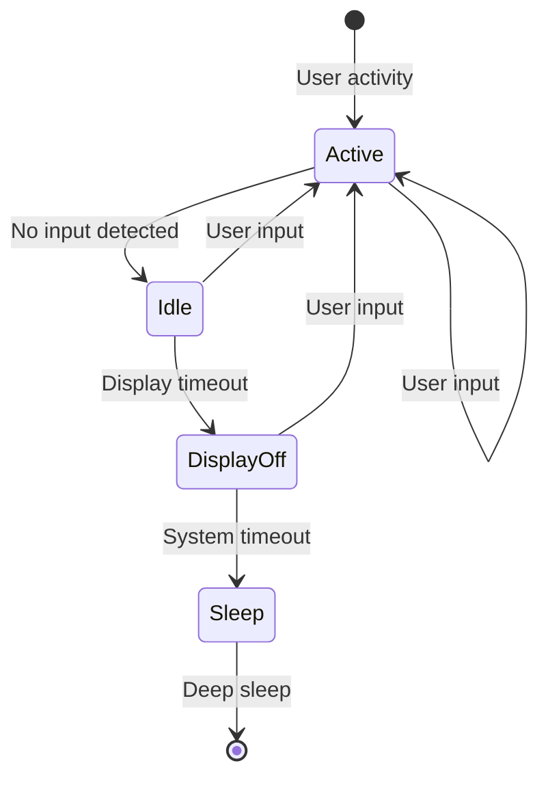
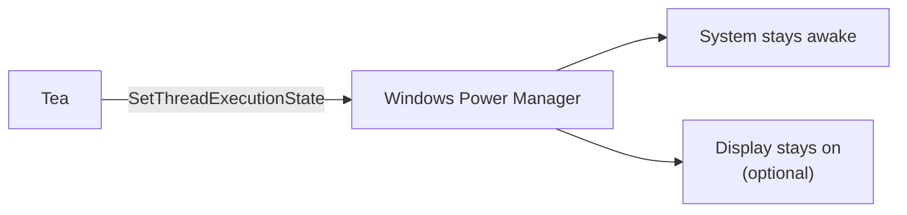
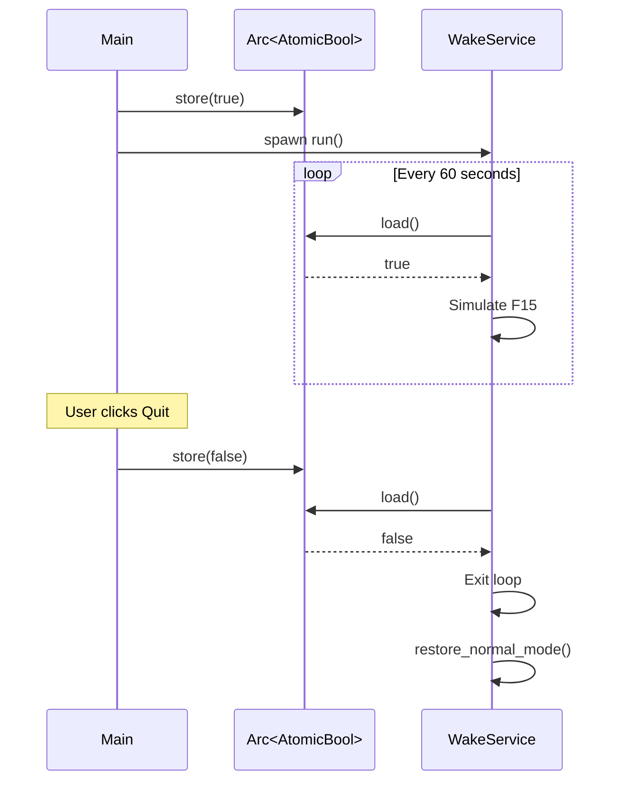
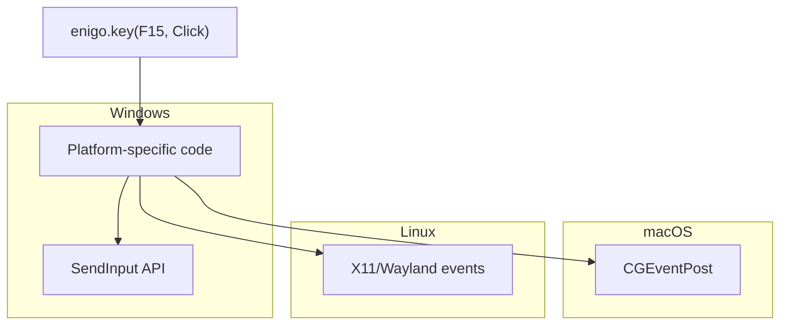
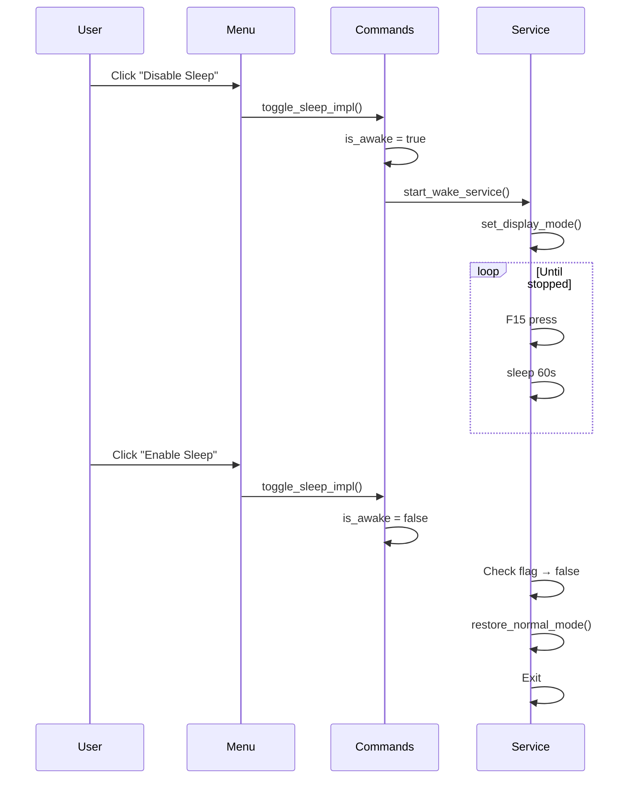

# Chapter 13: The Wake Service: Background Tasks

> *"A night watchman doesn't actively fight intruders every second—they patrol regularly, making their presence known. Tea's wake service works the same way: periodic signals that keep the system alert."*

In Chapter 12, you learned how Tea manages icons. Now we'll explore the **wake service**—the background task that actually prevents your computer from sleeping.

---

## The Problem: System Sleep

Operating systems are designed to conserve power:



Without intervention, your system will:
1. Detect no keyboard/mouse activity
2. Dim then turn off the display
3. Eventually enter sleep/hibernate

Tea interrupts this chain.

---

## Two Strategies for Staying Awake

Tea uses two complementary approaches:

### Strategy 1: Input Simulation (F15 Key)

Simulate a keypress to trick the OS into thinking someone's using the computer.


### Strategy 2: Platform API (Windows Only)

Tell Windows directly: "Don't sleep, I'm working."



### Why Both?

| Strategy | Platform | Reliability | Granularity |
|----------|----------|-------------|-------------|
| F15 simulation | All | High | Coarse (prevents all sleep) |
| Windows API | Windows | Very high | Fine (system vs display) |

Using both provides redundancy and platform-specific features.

---

## The `WakeService` Struct

Let's examine Tea's wake service implementation:

```rust
// src-tauri/src/wake_service.rs
pub struct WakeService {
    /// Flag controlling whether wake loop continues
    running: Arc<AtomicBool>,
    /// Platform-specific display controller
    display_controller: Box<dyn DisplayControl + Send>,
}
```

### Fields Explained

| Field | Type | Purpose |
|-------|------|---------|
| `running` | `Arc<AtomicBool>` | Shared flag to stop the service |
| `display_controller` | `Box<dyn DisplayControl + Send>` | Platform-specific implementation |

### The Stop Flag Pattern

The `running` flag is the service's "off switch":



This pattern allows **graceful shutdown**—the service checks the flag and exits cleanly.

---

## Why F15?

Tea simulates the F15 key. Why that specific key?

### The Key Selection Problem

| Key | Problem |
|-----|---------|
| Letters (A-Z) | Would type characters |
| Arrow keys | Would move cursors/selections |
| F1-F12 | Often bound to app shortcuts |
| Modifier keys | Would affect next key press |

### F15: The Perfect Ghost Key

| Property | Benefit |
|----------|---------|
| Rarely on physical keyboards | Users can't accidentally type it |
| No standard OS binding | Won't trigger system actions |
| No standard app binding | Won't trigger app shortcuts |
| Recognized as input | Resets idle timer |

F15 is a **ghost key**—the OS acknowledges it but nothing responds to it.

---

## The `run` Method

The heart of the service is the `run` method:

```rust
// src-tauri/src/wake_service.rs
pub async fn run(self, screen_mode: ScreenMode) -> Result<()> {
    log::info!("Starting wake service with screen mode: {:?}", screen_mode);

    // Apply platform display settings
    self.display_controller.set_display_mode(screen_mode);

    // Determine if F15 simulation is needed
    #[cfg(windows)]
    let use_f15 = screen_mode.should_keep_display_on();
    #[cfg(not(windows))]
    let use_f15 = true;

    log::info!("Wake strategy: F15 simulation={}, platform API=active", use_f15);

    // Initialize input simulator only if needed
    let mut enigo = if use_f15 {
        let settings = Settings::default();
        Some(Enigo::new(&settings).map_err(|e| AppError::InputSimulation { /* ... */ })?)
    } else {
        None
    };

    // Main wake loop
    while self.running.load(Ordering::SeqCst) {
        if let Some(ref mut enigo) = enigo {
            log::trace!("Simulating F15 key press");
            if let Err(e) = enigo.key(Key::F15, Direction::Click) {
                log::error!("F15 key press failed (continuing): {}", e);
            }
        }
        tokio::time::sleep(Duration::from_secs(60)).await;
    }

    // Restore normal display behavior
    self.display_controller.restore_normal_mode();
    log::info!("Wake service stopped");

    Ok(())
}
```

### Phase-by-Phase Breakdown

#### Phase 1: Platform Setup

```rust
self.display_controller.set_display_mode(screen_mode);
```

Tell the OS our display preferences before doing anything else.

#### Phase 2: Strategy Selection

```rust
#[cfg(windows)]
let use_f15 = screen_mode.should_keep_display_on();
#[cfg(not(windows))]
let use_f15 = true;
```

On Windows with "Allow Screen Off," the API alone is sufficient. Otherwise, use F15.

#### Phase 3: Simulator Initialization

```rust
let mut enigo = if use_f15 {
    Some(Enigo::new(&settings)?)
} else {
    None
};
```

Only create the input simulator if we'll actually use it. This avoids unnecessary permission requests.

#### Phase 4: Main Loop

```rust
while self.running.load(Ordering::SeqCst) {
    if let Some(ref mut enigo) = enigo {
        enigo.key(Key::F15, Direction::Click)?;
    }
    tokio::time::sleep(Duration::from_secs(60)).await;
}
```

Every 60 seconds, simulate F15 (if enabled) and wait.

#### Phase 5: Cleanup

```rust
self.display_controller.restore_normal_mode();
```

Restore normal power behavior when stopping.

---

## Async with Tokio

The service uses **async Rust** with the Tokio runtime:

```rust
pub async fn run(self, screen_mode: ScreenMode) -> Result<()>
```

### Why Async?

| Sync Sleep | Async Sleep |
|------------|-------------|
| Blocks the thread | Yields to other tasks |
| Wastes resources | Efficient waiting |
| Hard to cancel | Easy cooperative shutdown |

### The Sleep Call

```rust
tokio::time::sleep(Duration::from_secs(60)).await;
```

This:
1. Tells Tokio "wake me in 60 seconds"
2. Yields control to other tasks
3. Resumes when the timer fires

The thread can do other work while waiting.

### Spawning the Service

In [commands.rs](../src-tauri/src/commands.rs):

```rust
pub fn start_wake_service(is_awake: Arc<AtomicBool>, screen_mode: ScreenMode) {
    let display_controller = platform::get_display_controller();
    let service = WakeService::new(is_awake, display_controller);

    tokio::spawn(async move {
        if let Err(e) = service.run(screen_mode).await {
            log::error!("Wake service error: {}", e);
        }
    });
}
```

`tokio::spawn` creates a new task that runs concurrently with the main application.

---

## The Enigo Crate

Tea uses [enigo](https://crates.io/crates/enigo) for input simulation:

```toml
# Cargo.toml
[dependencies]
enigo = "0.3.0"
```

### Basic Usage

```rust
use enigo::{Direction, Enigo, Key, Keyboard, Settings};

let settings = Settings::default();
let mut enigo = Enigo::new(&settings)?;
enigo.key(Key::F15, Direction::Click)?;
```

### What Happens Under the Hood



Enigo abstracts platform differences—you write one call, it works everywhere.

### Error Handling

```rust
if let Err(e) = enigo.key(Key::F15, Direction::Click) {
    log::error!("F15 key press failed (continuing): {}", e);
}
```

Key press failures are logged but don't stop the service. The next iteration might succeed.

---

## Platform-Specific Display Control

### The `DisplayControl` Trait

```rust
// src-tauri/src/platform.rs
pub trait DisplayControl {
    fn set_display_mode(&self, screen_mode: ScreenMode);
    fn restore_normal_mode(&self);
}
```

This trait defines what any platform must implement.

### Windows Implementation

```rust
#[cfg(windows)]
pub struct WindowsDisplayControl;

#[cfg(windows)]
impl DisplayControl for WindowsDisplayControl {
    fn set_display_mode(&self, screen_mode: ScreenMode) {
        use windows::Win32::System::Power::{
            SetThreadExecutionState, ES_CONTINUOUS, ES_DISPLAY_REQUIRED, ES_SYSTEM_REQUIRED,
        };

        unsafe {
            if screen_mode.should_keep_display_on() {
                SetThreadExecutionState(ES_CONTINUOUS | ES_SYSTEM_REQUIRED | ES_DISPLAY_REQUIRED);
            } else {
                SetThreadExecutionState(ES_CONTINUOUS | ES_SYSTEM_REQUIRED);
            }
        }
    }

    fn restore_normal_mode(&self) {
        use windows::Win32::System::Power::{SetThreadExecutionState, ES_CONTINUOUS};
        unsafe {
            SetThreadExecutionState(ES_CONTINUOUS);
        }
    }
}
```

### Windows API Flags Explained

| Flag | Meaning |
|------|---------|
| `ES_CONTINUOUS` | Keep these settings until changed |
| `ES_SYSTEM_REQUIRED` | Prevent system sleep |
| `ES_DISPLAY_REQUIRED` | Prevent display sleep |

### Non-Windows Implementation

```rust
#[cfg(not(windows))]
pub struct NoOpDisplayControl;

#[cfg(not(windows))]
impl DisplayControl for NoOpDisplayControl {
    fn set_display_mode(&self, _screen_mode: ScreenMode) {
        // F15 handles everything
    }

    fn restore_normal_mode(&self) {
        // Nothing to restore
    }
}
```

On macOS and Linux, the F15 simulation alone prevents sleep.

### Factory Function

```rust
pub fn get_display_controller() -> Box<dyn DisplayControl + Send> {
    #[cfg(windows)]
    { Box::new(WindowsDisplayControl) }

    #[cfg(not(windows))]
    { Box::new(NoOpDisplayControl) }
}
```

Call sites don't need conditional compilation—they just call `get_display_controller()`.

---

## Service Lifecycle



### Starting

```rust
// In toggle_sleep_impl
if new_awake {
    start_wake_service(is_awake.clone(), current_mode);
}
```

### Stopping

The service stops itself when it sees `running == false`. No explicit stop call needed.

---

## Testing the Wake Service

Tea includes a test with mock display control:

```rust
struct MockDisplayControl {
    calls: Arc<std::sync::Mutex<Vec<String>>>,
}

impl DisplayControl for MockDisplayControl {
    fn set_display_mode(&self, screen_mode: ScreenMode) {
        self.calls.lock().unwrap()
            .push(format!("set_display_mode({:?})", screen_mode));
    }

    fn restore_normal_mode(&self) {
        self.calls.lock().unwrap()
            .push("restore_normal_mode".to_string());
    }
}
```

### What the Mock Does

1. Implements the trait without side effects
2. Records every call for verification
3. Allows testing lifecycle without touching platform APIs

### The Test

```rust
#[tokio::test]
#[ignore] // Requires input simulation
async fn test_wake_service_lifecycle() {
    let running = Arc::new(AtomicBool::new(true));
    let (mock_display, calls) = MockDisplayControl::new();
    let service = WakeService::new(running.clone(), Box::new(mock_display));

    // Start service
    let handle = tokio::spawn(async move {
        service.run(ScreenMode::KeepScreenOn).await
    });

    // Let it initialize
    tokio::time::sleep(Duration::from_millis(100)).await;

    // Stop service
    running.store(false, Ordering::SeqCst);

    // Wait for completion
    handle.await.unwrap();

    // Verify calls
    let call_log = calls.lock().unwrap();
    assert!(call_log.contains(&"set_display_mode(KeepScreenOn)".to_string()));
    assert!(call_log.contains(&"restore_normal_mode".to_string()));
}
```

---

## Screen Mode Impact

### `KeepScreenOn`

```rust
// Windows: ES_SYSTEM_REQUIRED | ES_DISPLAY_REQUIRED + F15
// Other: F15 only
```

- System won't sleep
- Display won't turn off
- Maximum "awake" behavior

### `AllowScreenOff`

```rust
// Windows: ES_SYSTEM_REQUIRED only (no F15)
// Other: F15 only (no difference)
```

- System won't sleep
- Display CAN turn off
- Energy saving while preventing sleep

This is why Windows users see the screen mode menu items but other platforms don't.

---

## Error Recovery

The service handles errors gracefully:

### Initialization Failure

```rust
Enigo::new(&settings).map_err(|e| AppError::InputSimulation {
    message: "Failed to initialize input simulator".to_string(),
    cause: e.to_string(),
    recovery_hint: "Ensure the application has necessary permissions.",
})?
```

If initialization fails, the service returns an error immediately.

### Runtime Failure

```rust
if let Err(e) = enigo.key(Key::F15, Direction::Click) {
    log::error!("F15 key press failed (continuing): {}", e);
}
```

If a single keypress fails, log it and continue. The next one might work.

---

## Key Takeaways

1. **Two strategies** — F15 simulation (universal) + platform API (Windows-specific)
2. **F15 is a ghost key** — Recognized as input but triggers nothing
3. **Arc<AtomicBool> for control** — Shared flag enables graceful shutdown
4. **Async for efficiency** — Tokio sleep yields instead of blocking
5. **Trait abstraction** — `DisplayControl` hides platform differences
6. **Graceful error handling** — Log failures, keep running

---

## What's Next?

In **Chapter 14**, we'll explore **platform-specific code** in depth—conditional compilation, the `windows` crate, and how Tea adapts to different operating systems.

---

## Exercises

1. **Change the interval**: Modify the sleep duration from 60 to 30 seconds. What's the tradeoff?

2. **Add a counter**: Track how many F15 presses have been simulated. Log it when the service stops.

3. **Mock testing**: Write a test that verifies `restore_normal_mode` is called even if the loop runs zero iterations.

4. **Different key**: Change F15 to F13. Research whether this is equally safe on all platforms.
