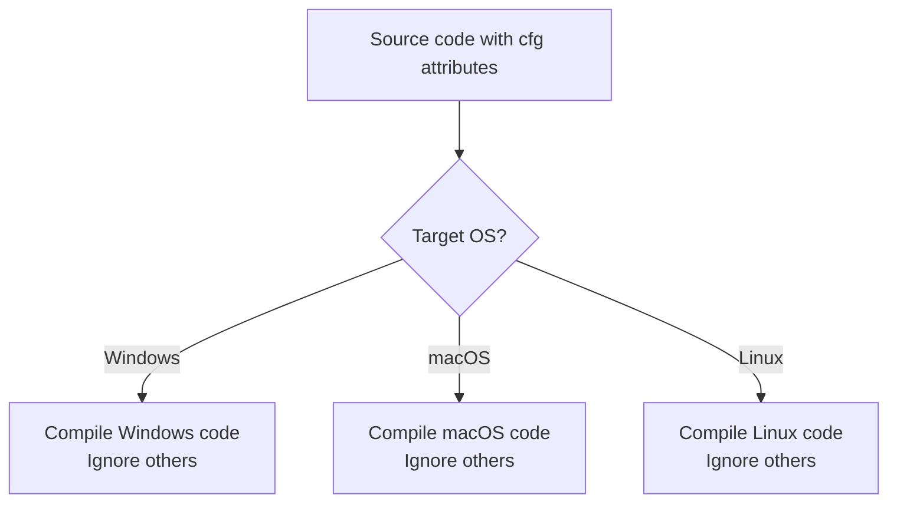
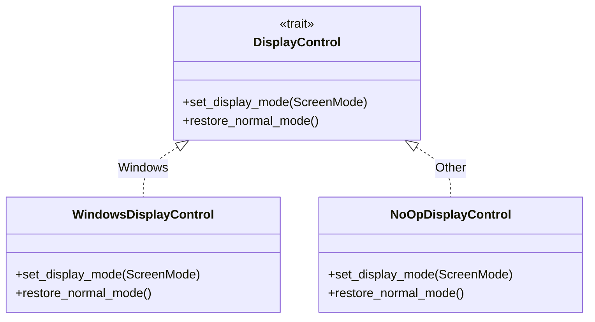
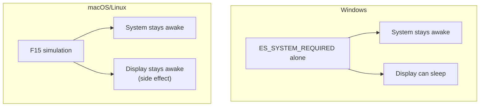

# Chapter 14: Platform-Specific Code

> *"A universal remote needs different codes for Sony vs Samsung vs LG. Similarly, 'prevent sleep' means different things to Windows, macOS, and Linux."*

In Chapter 13, you saw how the wake service uses platform-specific display control. Now we'll explore **conditional compilation**—the Rust mechanism that lets you write one codebase that adapts to different operating systems.

---

## The Cross-Platform Challenge

Tea runs on Windows, macOS, and Linux. Each has different APIs:

| Goal | Windows | macOS | Linux |
|------|---------|-------|-------|
| Prevent system sleep | `SetThreadExecutionState` | F15 simulation | F15 simulation |
| Prevent display sleep | `ES_DISPLAY_REQUIRED` | F15 simulation | F15 simulation |
| Autostart | Registry | LaunchAgent | .desktop file |

One app, three different implementations.

---

## Conditional Compilation with `cfg`

Rust's `cfg` attribute controls which code gets compiled:

```rust
#[cfg(windows)]
fn do_something_windows() {
    // Only compiled on Windows
}

#[cfg(not(windows))]
fn do_something_other() {
    // Compiled on macOS/Linux
}
```

### The Power of `cfg`



Code that doesn't match the target OS **doesn't exist** in the final binary—it's not even compiled.

### Common `cfg` Conditions

| Condition | Matches |
|-----------|---------|
| `#[cfg(windows)]` | Windows only |
| `#[cfg(unix)]` | macOS, Linux, BSD |
| `#[cfg(target_os = "macos")]` | macOS only |
| `#[cfg(target_os = "linux")]` | Linux only |
| `#[cfg(not(windows))]` | Everything except Windows |

---

## Tea's Platform Architecture

Tea uses a **trait-based** approach for platform abstraction:



### The Trait Definition

```rust
// src-tauri/src/platform.rs
pub trait DisplayControl {
    fn set_display_mode(&self, screen_mode: ScreenMode);
    fn restore_normal_mode(&self);
}
```

This defines **what** any platform must do, not **how**.

### Windows Implementation

```rust
#[cfg(windows)]
pub struct WindowsDisplayControl;

#[cfg(windows)]
impl DisplayControl for WindowsDisplayControl {
    fn set_display_mode(&self, screen_mode: ScreenMode) {
        use windows::Win32::System::Power::{
            SetThreadExecutionState, ES_CONTINUOUS, ES_DISPLAY_REQUIRED, ES_SYSTEM_REQUIRED,
        };

        unsafe {
            if screen_mode.should_keep_display_on() {
                SetThreadExecutionState(ES_CONTINUOUS | ES_SYSTEM_REQUIRED | ES_DISPLAY_REQUIRED);
            } else {
                SetThreadExecutionState(ES_CONTINUOUS | ES_SYSTEM_REQUIRED);
            }
        }
    }

    fn restore_normal_mode(&self) {
        use windows::Win32::System::Power::{SetThreadExecutionState, ES_CONTINUOUS};
        unsafe {
            SetThreadExecutionState(ES_CONTINUOUS);
        }
    }
}
```

**Note**: Both the struct and impl have `#[cfg(windows)]`. This means on macOS/Linux, `WindowsDisplayControl` doesn't exist at all.

### Non-Windows Implementation

```rust
#[cfg(not(windows))]
pub struct NoOpDisplayControl;

#[cfg(not(windows))]
impl DisplayControl for NoOpDisplayControl {
    fn set_display_mode(&self, _screen_mode: ScreenMode) {
        // F15 handles everything
    }

    fn restore_normal_mode(&self) {
        // Nothing to restore
    }
}
```

On non-Windows platforms, display control does nothing—F15 simulation handles both system and display sleep prevention.

---

## The Factory Pattern

How does the rest of the code get the right implementation? A factory function:

```rust
pub fn get_display_controller() -> Box<dyn DisplayControl + Send> {
    #[cfg(windows)]
    {
        Box::new(WindowsDisplayControl)
    }

    #[cfg(not(windows))]
    {
        Box::new(NoOpDisplayControl)
    }
}
```

### Why This Works

1. **Caller doesn't care about platform**: Just calls `get_display_controller()`
2. **Return type is abstract**: `Box<dyn DisplayControl + Send>`
3. **Platform logic is centralized**: One place to change

### The Appliance Store Analogy

Think of it like a store selling appliances:

| Customer Request | Store Action (Factory) |
|------------------|----------------------|
| "I need a display controller" | Check what country you're in |
| In USA (Windows) | Give you USA-voltage appliance |
| In Europe (macOS/Linux) | Give you EU-voltage appliance |

The customer gets "an appliance that works"—they don't care about voltages.

---

## Platform-Specific Dependencies

Some crates only exist on certain platforms:

```toml
# Cargo.toml
[target.'cfg(windows)'.dependencies]
windows = { version = "0.58", features = ["Win32_System_Power"] }
```

### Anatomy of Target Dependencies

```toml
[target.'cfg(windows)'.dependencies]
    │         │              │
    │         │              └── Standard dependencies section
    │         └── The condition (same as #[cfg()])
    └── Special section for conditional deps
```

This means:
- On Windows: `windows` crate is compiled
- On other platforms: `windows` crate is completely ignored

### Why This Matters

| Platform | `windows` crate |
|----------|-----------------|
| Windows | Compiled, linked |
| macOS | Not downloaded, not compiled |
| Linux | Not downloaded, not compiled |

Binaries stay small. Build times stay fast.

---

## The `windows` Crate

Tea uses Microsoft's official `windows` crate for Windows API access:

```rust
use windows::Win32::System::Power::{
    SetThreadExecutionState, ES_CONTINUOUS, ES_DISPLAY_REQUIRED, ES_SYSTEM_REQUIRED,
};
```

### Features

The crate is huge, so you specify only what you need:

```toml
windows = { version = "0.58", features = ["Win32_System_Power"] }
```

| Feature | Provides |
|---------|----------|
| `Win32_System_Power` | Power management APIs |
| `Win32_UI_Shell` | Shell APIs (notifications, etc.) |
| `Win32_Foundation` | Basic types |

### Unsafe Code

Windows API calls require `unsafe`:

```rust
unsafe {
    SetThreadExecutionState(ES_CONTINUOUS | ES_SYSTEM_REQUIRED);
}
```

**Why unsafe?** Rust can't verify what external C APIs do. You're promising the code is correct.

**Is it actually safe?** Yes—Microsoft documents these APIs as safe for application use.

---

## The `ScreenMode` and Platform Capability

Tea's `ScreenMode` enum knows about platform limitations:

```rust
// src-tauri/src/core/screen_mode.rs
impl ScreenMode {
    pub fn is_supported(self) -> bool {
        match self {
            ScreenMode::KeepScreenOn => true,         // All platforms
            ScreenMode::AllowScreenOff => cfg!(windows),  // Windows only
        }
    }
}
```

### Why `AllowScreenOff` is Windows-Only



On non-Windows platforms, there's no way to keep the system awake without also keeping the display awake.

### Using in UI

```rust
// src-tauri/src/main.rs
let screen_on_item = if ScreenMode::KeepScreenOn.is_supported() {
    Some(MenuItemBuilder::with_id(...).build(handle)?)
} else {
    None
};
```

Menu items for unsupported modes simply don't appear.

---

## Compile-Time vs Runtime Checks

### Compile-Time (`cfg!`)

```rust
let use_f15 = !cfg!(windows) || screen_mode.should_keep_display_on();
```

`cfg!()` (with exclamation mark) is a **macro** that returns `true` or `false` at compile time:

| Platform | `cfg!(windows)` returns |
|----------|------------------------|
| Windows | `true` |
| Other | `false` |

The compiler may optimize away unreachable branches.

### Runtime (never needed here)

You could check the OS at runtime:

```rust
// Don't do this for platform-specific code
if std::env::consts::OS == "windows" {
    // ...
}
```

But this:
1. Includes dead code in the binary
2. Prevents compiler optimizations
3. Adds runtime overhead

Use `cfg` whenever possible.

---

## Testing Platform-Specific Code

Tea tests platform-specific behavior with conditional tests:

```rust
#[test]
fn test_keep_screen_on_always_supported() {
    assert!(ScreenMode::KeepScreenOn.is_supported());
}

#[test]
#[cfg(windows)]
fn test_allow_screen_off_supported_on_windows() {
    assert!(ScreenMode::AllowScreenOff.is_supported());
}

#[test]
#[cfg(not(windows))]
fn test_allow_screen_off_not_supported_on_non_windows() {
    assert!(!ScreenMode::AllowScreenOff.is_supported());
}
```

### How This Works

| Test | Windows | macOS/Linux |
|------|---------|-------------|
| `test_keep_screen_on_always_supported` | Runs | Runs |
| `test_allow_screen_off_supported_on_windows` | Runs | Doesn't exist |
| `test_allow_screen_off_not_supported_on_non_windows` | Doesn't exist | Runs |

Each test only exists where it makes sense.

---

## Mock Implementations for Testing

The trait pattern enables easy testing:

```rust
struct MockDisplayControl {
    calls: Arc<std::sync::Mutex<Vec<String>>>,
}

impl DisplayControl for MockDisplayControl {
    fn set_display_mode(&self, screen_mode: ScreenMode) {
        self.calls.lock().unwrap()
            .push(format!("set_display_mode({:?})", screen_mode));
    }

    fn restore_normal_mode(&self) {
        self.calls.lock().unwrap()
            .push("restore_normal_mode".to_string());
    }
}
```

### Why This Works

The `WakeService` accepts `Box<dyn DisplayControl>`, not a concrete type:

```rust
pub struct WakeService {
    display_controller: Box<dyn DisplayControl + Send>,
}
```

In production: Real platform controller
In tests: Mock that records calls

---

## Common Patterns

### Pattern 1: Platform-Specific Structs

```rust
#[cfg(windows)]
struct WindowsThing;

#[cfg(not(windows))]
struct OtherThing;
```

### Pattern 2: Platform-Specific Impls

```rust
struct MyStruct;

#[cfg(windows)]
impl MyStruct {
    fn windows_only_method(&self) { ... }
}
```

### Pattern 3: Platform-Specific Function Bodies

```rust
fn do_something() {
    #[cfg(windows)]
    {
        // Windows code
    }

    #[cfg(not(windows))]
    {
        // Other code
    }
}
```

### Pattern 4: Factory Functions

```rust
fn get_thing() -> Box<dyn Trait> {
    #[cfg(windows)]
    { Box::new(WindowsThing) }
    
    #[cfg(not(windows))]
    { Box::new(OtherThing) }
}
```

---

## Best Practices

### 1. Minimize Platform-Specific Code

```rust
// Good: Trait abstracts platform
trait DisplayControl { ... }

// Bad: Platform checks scattered everywhere
if cfg!(windows) { ... } else { ... }
```

### 2. Test All Platforms

Run CI on all target platforms:
- Windows
- macOS
- Ubuntu Linux

### 3. Document Platform Limitations

```rust
/// Allow display to sleep while keeping system awake
///
/// **Windows only** - Not supported on macOS/Linux.
AllowScreenOff,
```

### 4. Use Features for Large Platform Code

If platform code is substantial, consider feature flags:

```toml
[features]
windows-native = ["dep:windows"]

[target.'cfg(windows)'.dependencies]
windows = { version = "0.58", optional = true }
```

---

## Key Takeaways

1. **`#[cfg()]` excludes code at compile time** — Non-matching code doesn't exist in the binary
2. **Traits abstract platform differences** — Define interface, implement per-platform
3. **Factory functions hide selection logic** — Callers get "the right one" automatically
4. **Target dependencies save resources** — Platform crates only compile where needed
5. **`cfg!()` macro for inline checks** — Returns bool at compile time
6. **Test with conditional attributes** — Tests exist only where relevant

---

## What's Next?

In **Chapter 15**, we'll explore **state persistence**—how Tea saves and loads user preferences using JSON files.

---

## Exercises

1. **Add Linux-specific code**: Create a `LinuxDisplayControl` struct that logs messages instead of doing nothing.

2. **Feature detection**: Research how to detect if the current Linux desktop supports system tray icons.

3. **Conditional tests**: Write a test that only runs on macOS using `target_os = "macos"`.

4. **Dependency exploration**: What happens if you remove the `Win32_System_Power` feature from the Windows crate?
