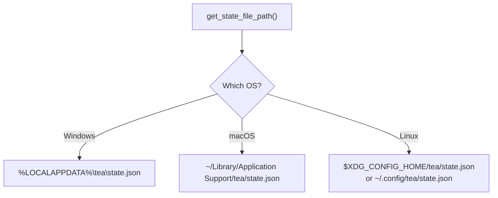
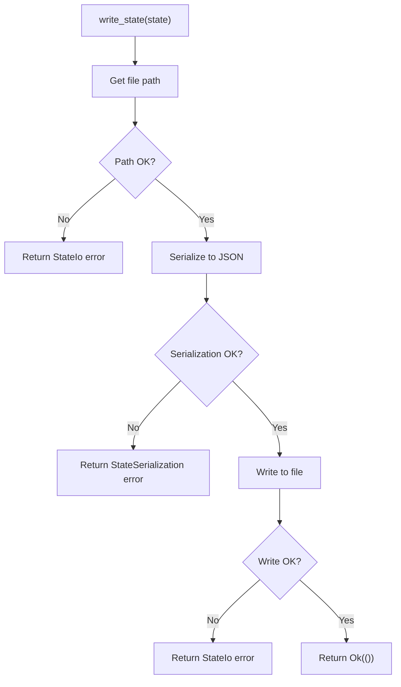
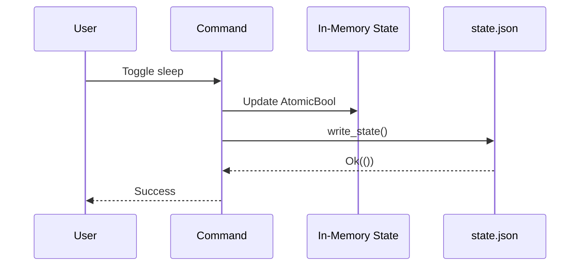

# Chapter 15: State Persistence

> *"A bookmark remembers where you stopped reading. Tea's persistence remembers your preferences—so you don't have to re-enable 'Disable Sleep' every time you restart."*

In Chapter 14, you learned how Rust handles platform-specific code. Now we'll explore **state persistence**—saving and loading user preferences using JSON files.

---

## Why Persist State?

Without persistence:
1. User enables "Disable Sleep"
2. User restarts their computer
3. Tea starts with default settings (sleep allowed)
4. User has to enable it again

With persistence:
1. User enables "Disable Sleep"
2. Setting saved to disk
3. Computer restarts
4. Tea reads saved setting
5. Sleep prevention active automatically

---

## Tea's State Model

### The `AppState` Struct

```rust
// src-tauri/src/persistence.rs
#[derive(Serialize, Deserialize, Default, Debug, Clone, PartialEq, Eq)]
pub struct AppState {
    /// Whether system wake is currently active
    pub sleep_disabled: bool,
    /// User's screen mode preference
    pub screen_mode: ScreenMode,
}
```

Two fields, two user preferences:

| Field | Type | Default | Meaning |
|-------|------|---------|---------|
| `sleep_disabled` | `bool` | `false` | Is wake prevention active? |
| `screen_mode` | `ScreenMode` | `AllowScreenOff` | Keep screen on or allow sleep? |

### Derive Macros

```rust
#[derive(Serialize, Deserialize, Default, Debug, Clone, PartialEq, Eq)]
```

| Derive | Provides |
|--------|----------|
| `Serialize` | Convert to JSON |
| `Deserialize` | Parse from JSON |
| `Default` | Create with default values |
| `Debug` | Pretty-print for logging |
| `Clone` | Create copies |
| `PartialEq, Eq` | Compare instances |

---

## JSON Serialization with Serde

Tea uses [serde](https://serde.rs/) and [serde_json](https://docs.serde.rs/serde_json/) for serialization:

```toml
# Cargo.toml
[dependencies]
serde = { version = "1.0", features = ["derive"] }
serde_json = "1.0"
```

### What the State Looks Like

```json
{
  "sleep_disabled": true,
  "screen_mode": "KeepScreenOn"
}
```

Serde automatically:
- Converts Rust field names to JSON keys
- Serializes enums as strings
- Handles nested types

### Custom Serialization

`ScreenMode` is an enum. Serde serializes it as:

```rust
pub enum ScreenMode {
    KeepScreenOn,      // → "KeepScreenOn"
    AllowScreenOff,    // → "AllowScreenOff"
}
```

No custom code needed—derive does the work.

---

## Platform-Specific Paths

Different operating systems have different conventions for config files:



### Windows Path

```rust
#[cfg(target_os = "windows")]
{
    let local_app_data = std::env::var("LOCALAPPDATA")
        .or_else(|_| std::env::var("APPDATA"))
        .unwrap_or_else(|_| ".".to_string());
    let mut path = PathBuf::from(local_app_data);
    path.push("tea");
    // Result: C:\Users\Name\AppData\Local\tea\state.json
}
```

### macOS Path

```rust
#[cfg(target_os = "macos")]
{
    let home = std::env::var("HOME").unwrap_or_else(|_| ".".to_string());
    let mut path = PathBuf::from(home);
    path.push("Library");
    path.push("Application Support");
    path.push("tea");
    // Result: /Users/name/Library/Application Support/tea/state.json
}
```

### Linux Path

```rust
#[cfg(target_os = "linux")]
{
    let home = std::env::var("HOME").unwrap_or_else(|_| ".".to_string());
    let xdg_config = std::env::var("XDG_CONFIG_HOME")
        .unwrap_or_else(|_| format!("{}/.config", home));
    let mut path = PathBuf::from(xdg_config);
    path.push("tea");
    // Result: ~/.config/tea/state.json (or XDG_CONFIG_HOME/tea/state.json)
}
```

### Why These Locations?

| Platform | Convention | Reason |
|----------|------------|--------|
| Windows | `%LOCALAPPDATA%` | Per-user, not synced across machines |
| macOS | `Application Support` | Apple's recommended location |
| Linux | XDG spec | Freedesktop.org standard |

Following conventions means:
- Users know where to find config files
- Backup tools know what to include
- Uninstallers know what to clean up

---

## Creating Directories

The path function also creates directories:

```rust
fs::create_dir_all(&path).map_err(|e| AppError::StateIo {
    message: format!("Failed to create config directory at {}", path.display()),
    cause: e.to_string(),
    recovery_hint: "Ensure you have write permissions to the AppData directory.",
})?;
```

### `create_dir_all`

Like `mkdir -p` in Unix:
- Creates the directory
- Creates all parent directories
- Does nothing if it already exists

### Error Handling

If directory creation fails:
1. Wrap in `AppError::StateIo`
2. Include the path that failed
3. Provide a recovery hint
4. Propagate with `?`

---

## Writing State

```rust
// src-tauri/src/persistence.rs
pub fn write_state(state: &AppState) -> Result<()> {
    let path = get_state_file_path()?;
    
    let json = serde_json::to_string_pretty(state).map_err(|e| AppError::StateSerialization {
        message: "Failed to serialize application state".to_string(),
        cause: e.to_string(),
        recovery_hint: "This is a bug. Please report it with your state configuration.",
    })?;

    fs::write(&path, json).map_err(|e| AppError::StateIo {
        message: format!("Failed to write state to {}", path.display()),
        cause: e.to_string(),
        recovery_hint: "Ensure you have write permissions and sufficient disk space.",
    })?;

    Ok(())
}
```

### Step-by-Step



### Pretty Printing

```rust
serde_json::to_string_pretty(state)
```

Produces:
```json
{
  "sleep_disabled": true,
  "screen_mode": "KeepScreenOn"
}
```

Instead of:
```json
{"sleep_disabled":true,"screen_mode":"KeepScreenOn"}
```

Users can read and edit the file if needed.

---

## Reading State

```rust
// src-tauri/src/persistence.rs
pub fn read_state() -> AppState {
    let path = match get_state_file_path() {
        Ok(p) => p,
        Err(e) => {
            log::error!("Failed to get state file path, using defaults: {}", e);
            return AppState::default();
        }
    };
    
    match fs::read_to_string(&path) {
        Ok(content) => {
            match serde_json::from_str(&content) {
                Ok(state) => state,
                Err(e) => {
                    log::warn!("State file corrupted ({}), using defaults: {}", path.display(), e);
                    AppState::default()
                }
            }
        }
        Err(e) => {
            if e.kind() != std::io::ErrorKind::NotFound {
                log::warn!("Failed to read state file, using defaults: {}", e);
            }
            AppState::default()
        }
    }
}
```

### The Defensive Design Pattern

Notice: `read_state` returns `AppState`, not `Result<AppState>`.

**Why?** This function **never fails**. If anything goes wrong, it returns defaults.

| Scenario | Response |
|----------|----------|
| Path determination fails | Log error, return default |
| File doesn't exist | Return default (normal first run) |
| File can't be read | Log warning, return default |
| JSON is corrupted | Log warning, return default |
| Everything works | Return loaded state |

### The Airbag Analogy

Think of `read_state` like a car's airbag system:

| Car | Tea |
|-----|-----|
| Sensor works → read speed | File exists → read content |
| Sensor broken → assume safe | File broken → assume defaults |
| Never "fail to check" | Never fail to return state |

The app should always start, even with corrupted config.

---

## When State Is Written

Tea writes state after every change:

```rust
// src-tauri/src/commands.rs
pub fn toggle_sleep_impl(/* ... */) -> Result<(bool, ScreenMode), String> {
    // ... toggle logic ...

    // Persist state
    let new_state = AppState {
        sleep_disabled: new_awake,
        screen_mode: current_mode,
    };
    write_state(&new_state).map_err(|e| format!("Failed to persist state: {}", e))?;

    Ok((new_awake, current_mode))
}
```

### Write-Through Pattern

Every state change immediately writes to disk:



**Pros**:
- State always matches disk
- Crash-safe (changes survive crashes)

**Cons**:
- Disk I/O on every change
- Slight performance overhead

For Tea, reliability trumps performance.

---

## Default Values

```rust
impl Default for AppState {
    fn default() -> Self {
        AppState {
            sleep_disabled: false,      // Don't prevent sleep by default
            screen_mode: ScreenMode::AllowScreenOff,  // Windows default
        }
    }
}
```

### Why These Defaults?

| Default | Reasoning |
|---------|-----------|
| `sleep_disabled: false` | Don't interfere until user asks |
| `screen_mode: AllowScreenOff` | Energy-efficient default |

**Principle**: Defaults should be the most conservative option.

---

## Testing Persistence

```rust
#[cfg(test)]
mod tests {
    use super::*;

    #[test]
    fn test_default_state_values() {
        let state = AppState::default();
        assert!(!state.sleep_disabled);
        assert_eq!(state.screen_mode, ScreenMode::AllowScreenOff);
    }

    #[test]
    fn test_state_serialization() {
        let state = AppState {
            sleep_disabled: true,
            screen_mode: ScreenMode::KeepScreenOn,
        };

        let json = serde_json::to_string(&state).unwrap();
        let deserialized: AppState = serde_json::from_str(&json).unwrap();

        assert_eq!(state, deserialized);
    }
}
```

### What These Tests Verify

| Test | Verifies |
|------|----------|
| `test_default_state_values` | Defaults are what we expect |
| `test_state_serialization` | Round-trip: serialize → deserialize → same |

### Testing File I/O

For actual file tests, use `tempfile`:

```rust
#[cfg(test)]
use tempfile::TempDir;

#[test]
fn test_write_and_read_state() {
    let temp = TempDir::new().unwrap();
    // Set environment variable to temp path
    // Write state, read state, verify match
}
```

---

## Error Types

Tea defines specific errors for persistence:

```rust
// src-tauri/src/error.rs
pub enum AppError {
    StateIo {
        message: String,
        cause: String,
        recovery_hint: String,
    },
    StateSerialization {
        message: String,
        cause: String,
        recovery_hint: String,
    },
    // ...
}
```

### When Each Is Used

| Error | Trigger |
|-------|---------|
| `StateIo` | Filesystem operations (read/write/mkdir) |
| `StateSerialization` | JSON encode/decode failures |

---

## Schema Evolution

What if you need to add a new field later?

### Adding Fields (Safe)

```rust
#[derive(Serialize, Deserialize, Default)]
pub struct AppState {
    pub sleep_disabled: bool,
    pub screen_mode: ScreenMode,
    #[serde(default)]  // Use default if missing
    pub new_field: String,
}
```

Old files without `new_field` still parse—`#[serde(default)]` fills in the default.

### Removing Fields (Safe)

Just remove the field. Serde ignores unknown fields by default.

### Renaming Fields (Careful)

```rust
#[serde(alias = "old_name")]
pub new_name: String,
```

Accepts both old and new names when reading.

---

## Key Takeaways

1. **Serde handles serialization** — `Serialize`/`Deserialize` derives do the work
2. **Platform-specific paths** — Follow OS conventions for config locations
3. **Defensive reading** — Return defaults on any failure
4. **Write-through** — Persist immediately after every change
5. **Pretty JSON** — Human-readable config files
6. **Conservative defaults** — Don't interfere until user asks

---

## What's Next?

In **Chapter 16**, we'll explore **autostart integration**—making Tea launch automatically when the system boots.

---

## Exercises

1. **Add a field**: Add an `interval_seconds: u64` field to `AppState`. Make it default to 60.

2. **Find your config**: After running Tea, navigate to the config directory and open `state.json`. What do you see?

3. **Corrupt the config**: Edit `state.json` to contain invalid JSON. Restart Tea. What happens?

4. **Migration**: How would you handle renaming `sleep_disabled` to `wake_enabled` while supporting old config files?
