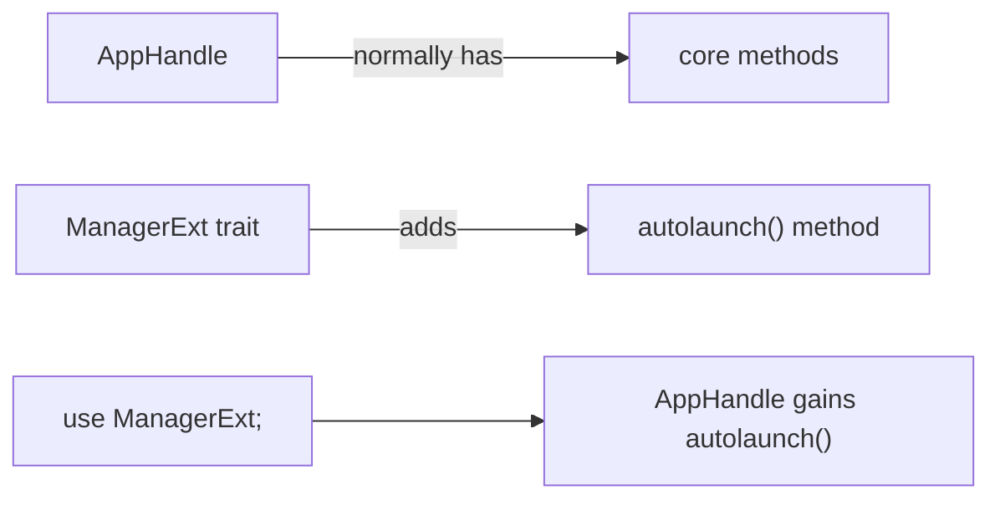
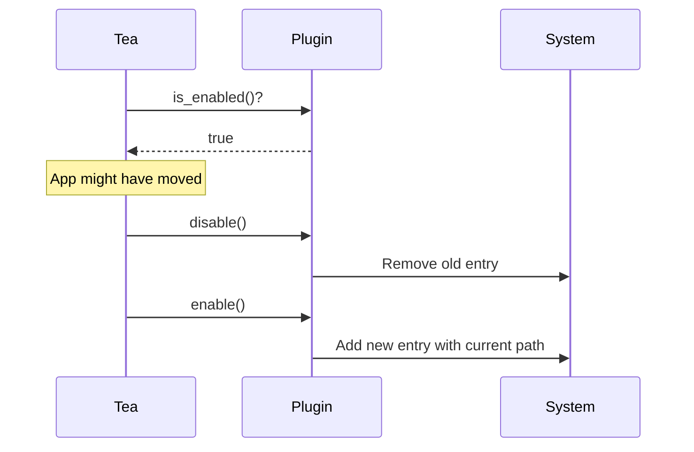

# Chapter 16: Autostart Integration

> *"A coffee maker with a timer starts brewing before you wake up. Tea's autostart feature launches when your computer boots—so sleep prevention is ready when you need it."*

In Chapter 15, you learned how Tea persists user preferences. Now we'll explore **autostart**—making Tea launch automatically at system startup using the `tauri-plugin-autostart` plugin.

---

## Why Autostart Matters

Without autostart:
1. Computer boots
2. User has to manually find and launch Tea
3. Until then, system can sleep unexpectedly

With autostart:
1. Computer boots
2. Tea launches automatically in the background
3. Previous settings restored immediately
4. Sleep prevention active without user action

For a utility app, autostart is essential.

---

## Platform Autostart Mechanisms

Each platform has a different way to launch apps at startup:

| Platform | Mechanism | Location |
|----------|-----------|----------|
| Windows | Registry | `HKCU\Software\Microsoft\Windows\CurrentVersion\Run` |
| macOS | LaunchAgent | `~/Library/LaunchAgents/*.plist` |
| Linux | Desktop Entry | `~/.config/autostart/*.desktop` |

### Windows Registry

```
HKEY_CURRENT_USER\Software\Microsoft\Windows\CurrentVersion\Run
    Tea = "C:\Users\Name\AppData\Local\Programs\Tea\Tea.exe"
```

Windows reads this key at login and runs each program.

### macOS LaunchAgent

```xml
<!-- ~/Library/LaunchAgents/com.tea.app.plist -->
<?xml version="1.0" encoding="UTF-8"?>
<plist version="1.0">
<dict>
    <key>Label</key>
    <string>com.tea.app</string>
    <key>ProgramArguments</key>
    <array>
        <string>/Applications/Tea.app/Contents/MacOS/Tea</string>
    </array>
    <key>RunAtLoad</key>
    <true/>
</dict>
</plist>
```

macOS `launchd` reads these files and starts the apps.

### Linux Desktop Entry

```ini
# ~/.config/autostart/tea.desktop
[Desktop Entry]
Type=Application
Name=Tea
Exec=/usr/bin/tea
Hidden=false
X-GNOME-Autostart-enabled=true
```

Desktop environments read these at login.

---

## The Autostart Plugin

Tea uses `tauri-plugin-autostart` instead of implementing this manually:

```toml
# Cargo.toml
[dependencies]
tauri-plugin-autostart = "2"
```

### Why Use a Plugin?

| Manual Implementation | Plugin |
|-----------------------|--------|
| Write platform-specific code | One API for all |
| Handle edge cases yourself | Battle-tested |
| Maintain three implementations | Maintained by Tauri team |

The plugin abstracts all platform differences behind a simple API.

---

## Plugin Setup

### 1. Add Dependency

```toml
# Cargo.toml
[dependencies]
tauri-plugin-autostart = "2"
```

### 2. Initialize Plugin

```rust
// src-tauri/src/main.rs
use tauri_plugin_autostart::{MacosLauncher, ManagerExt};

tauri::Builder::default()
    .plugin(tauri_plugin_autostart::init(
        MacosLauncher::LaunchAgent,
        None,
    ))
```

### 3. Grant Permissions

```json
// src-tauri/capabilities/default.json
{
  "permissions": [
    "autostart:allow-enable",
    "autostart:allow-disable",
    "autostart:allow-is-enabled"
  ]
}
```

---

## Plugin Configuration

The `init()` function takes two parameters:

```rust
tauri_plugin_autostart::init(
    MacosLauncher::LaunchAgent,  // macOS launch method
    None,                        // Extra arguments
)
```

### macOS Launcher Options

| Option | Description |
|--------|-------------|
| `MacosLauncher::LaunchAgent` | Uses launchd (modern, recommended) |
| `MacosLauncher::AppleScript` | Uses AppleScript (legacy) |

`LaunchAgent` is more reliable and the standard approach.

### Extra Arguments

The second parameter passes arguments to your app at startup:

```rust
// Launch with custom arguments
tauri_plugin_autostart::init(
    MacosLauncher::LaunchAgent,
    Some(vec!["--minimized", "--silent"]),
)
```

Tea uses `None`—no extra arguments needed.

---

## Using the Autostart Manager

The plugin adds methods to `AppHandle` via an extension trait:

```rust
use tauri_plugin_autostart::ManagerExt;

// Get the manager
let manager = app.autolaunch();

// Check status
let enabled: bool = manager.is_enabled()?;

// Enable autostart
manager.enable()?;

// Disable autostart
manager.disable()?;
```

### The Extension Trait Pattern



Without `use tauri_plugin_autostart::ManagerExt`, the `autolaunch()` method doesn't exist.

---

## Tea's Autostart Implementation

### Checking Status on Startup

```rust
// src-tauri/src/main.rs (in setup_tray)
let autostart_manager = handle.autolaunch();
let is_autostart = autostart_manager.is_enabled().unwrap_or_else(|e| {
    log::warn!("Failed to check autostart status: {}", e);
    false  // Defensive default
});
```

### Refreshing After Updates

Tea has a clever trick:

```rust
if is_autostart {
    // Update autostart path if already enabled
    // (ensures correct path after app updates)
    if autostart_manager.disable().is_ok() {
        if let Err(e) = autostart_manager.enable() {
            log::error!("Failed to update autostart path: {}", e);
        }
    }
}
```

**Why?** When the app updates, the executable path might change. This disable-then-enable dance ensures the system points to the new location.



### Menu Item Display

```rust
let autostart_text = if is_autostart {
    "\u{2713} Start at Login"  // ✓ Start at Login
} else {
    "Start at Login"
};
```

A checkmark indicates the current state.

---

## The Toggle Handler

When users click the autostart menu item:

```rust
// src-tauri/src/main.rs
fn handle_toggle_autostart(
    app: &tauri::AppHandle,
    toggle_item: &Arc<tauri::menu::MenuItem<tauri::Wry>>,
) {
    let autostart_manager = app.autolaunch();
    let is_enabled = autostart_manager.is_enabled().unwrap_or_else(|e| {
        log::warn!("Failed to check autostart status during toggle: {}", e);
        false
    });

    log::info!("Toggling autostart: {} -> {}", is_enabled, !is_enabled);

    if is_enabled {
        let _ = autostart_manager.disable();
        let _ = toggle_item.set_text("Start at Login");
    } else {
        let _ = autostart_manager.enable();
        let _ = toggle_item.set_text("✓ Start at Login");
    }
}
```

### Pattern Breakdown

1. Get current state
2. Toggle to opposite
3. Update menu text to match

### Error Handling

Note the `let _ = ...` pattern:

```rust
let _ = autostart_manager.disable();
```

This explicitly ignores the result. If disabling fails:
- The error is logged by the plugin
- The UI might be slightly out of sync
- But the app continues working

For a non-critical feature, this is acceptable.

---

## What the Plugin Does Internally

### On Windows

```rust
// Pseudo-code of what the plugin does
fn enable() {
    let exe_path = std::env::current_exe()?;
    let key = RegKey::open(HKEY_CURRENT_USER, "Software\\Microsoft\\Windows\\CurrentVersion\\Run")?;
    key.set_value("Tea", exe_path)?;
}

fn disable() {
    let key = RegKey::open(HKEY_CURRENT_USER, "Software\\Microsoft\\Windows\\CurrentVersion\\Run")?;
    key.delete_value("Tea")?;
}
```

### On macOS

```rust
// Pseudo-code
fn enable() {
    let plist = create_launch_agent_plist();
    fs::write("~/Library/LaunchAgents/com.tea.app.plist", plist)?;
    // launchd picks it up automatically
}

fn disable() {
    fs::remove_file("~/Library/LaunchAgents/com.tea.app.plist")?;
}
```

### On Linux

```rust
// Pseudo-code
fn enable() {
    let desktop_entry = create_desktop_entry();
    fs::write("~/.config/autostart/tea.desktop", desktop_entry)?;
}

fn disable() {
    fs::remove_file("~/.config/autostart/tea.desktop")?;
}
```

You don't need to know these details—the plugin handles everything.

---

## Capabilities and Permissions

The autostart plugin requires explicit permissions:

```json
{
  "permissions": [
    "autostart:allow-enable",
    "autostart:allow-disable",
    "autostart:allow-is-enabled"
  ]
}
```

### Why Three Separate Permissions?

Tauri's security model is fine-grained:

| Permission | Allows |
|------------|--------|
| `allow-enable` | Calling `manager.enable()` |
| `allow-disable` | Calling `manager.disable()` |
| `allow-is-enabled` | Calling `manager.is_enabled()` |

You could have an app that can check status but not change it—useful for some scenarios.

---

## Testing Autostart

### Manual Testing

1. Enable autostart in Tea
2. Close Tea completely
3. Restart your computer
4. Verify Tea starts automatically

### Checking the System

**Windows**:
```powershell
reg query "HKCU\Software\Microsoft\Windows\CurrentVersion\Run" /v Tea
```

**macOS**:
```bash
ls ~/Library/LaunchAgents/ | grep tea
cat ~/Library/LaunchAgents/com.tea.app.plist
```

**Linux**:
```bash
ls ~/.config/autostart/ | grep tea
cat ~/.config/autostart/tea.desktop
```

---

## Common Issues

### "Autostart not working"

| Platform | Check |
|----------|-------|
| Windows | Run `regedit` and look for the entry |
| macOS | Verify plist exists and is valid XML |
| Linux | Check desktop environment supports autostart |

### "App starts but doesn't work"

The autostart might be pointing to an old executable location. Fix:
1. Disable autostart
2. Enable autostart again

This updates the path.

### "Permission denied"

Some enterprise environments block autostart modifications. The plugin will fail silently or throw an error.

---

## Best Practices

### 1. Default to Off

```rust
let is_autostart = manager.is_enabled().unwrap_or(false);
```

Don't enable autostart by default—let users opt in.

### 2. Refresh on Update

```rust
if is_autostart {
    manager.disable();
    manager.enable();  // Re-registers with current path
}
```

### 3. Handle Failures Gracefully

```rust
if let Err(e) = manager.enable() {
    log::error!("Could not enable autostart: {}", e);
    // App continues to work, just without autostart
}
```

### 4. Provide Visual Feedback

Show a checkmark or toggle state so users know the current setting.

---

## Autostart vs. Service

Autostart launches an app when a user logs in. This is different from a **system service**:

| Autostart | System Service |
|-----------|----------------|
| Runs when user logs in | Runs when system boots |
| User-level permissions | System-level permissions |
| Visible in tray | Often invisible |
| Easy to configure | Requires admin |

Tea uses autostart because:
- It's a user utility, not a system service
- No admin privileges needed
- Users expect to see it in the tray

---

## Key Takeaways

1. **Plugin abstracts platform differences** — One API for Windows/macOS/Linux
2. **Extension trait adds methods** — `use ManagerExt` to get `autolaunch()`
3. **Refresh after updates** — Disable + enable to update paths
4. **Capabilities required** — Each operation needs explicit permission
5. **Default to off** — Let users opt into autostart
6. **Graceful degradation** — If autostart fails, app still works

---

## What's Next?

In **Chapter 17**, we'll explore **testing**—unit tests, integration tests, and how to test Tauri applications effectively.

---

## Exercises

1. **Check your autostart**: After enabling autostart, find the registry entry (Windows), plist file (macOS), or desktop file (Linux).

2. **Remove the permission**: Remove `autostart:allow-enable` from capabilities. What happens when you try to enable autostart?

3. **Custom arguments**: Modify the plugin initialization to pass `--silent` as a startup argument. How would you detect this in your app?

4. **UI experiment**: Instead of a checkmark in text, how might you indicate autostart status differently?
