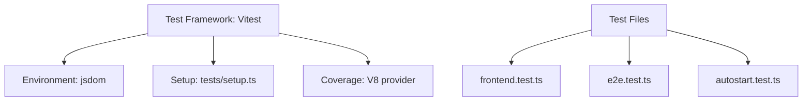
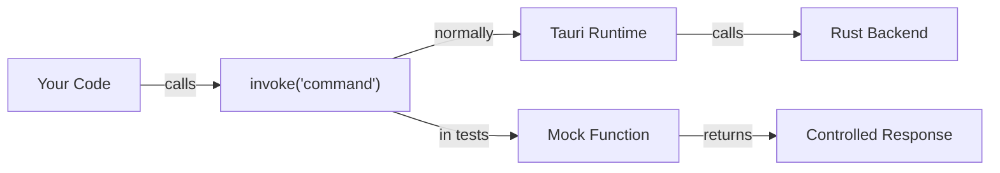
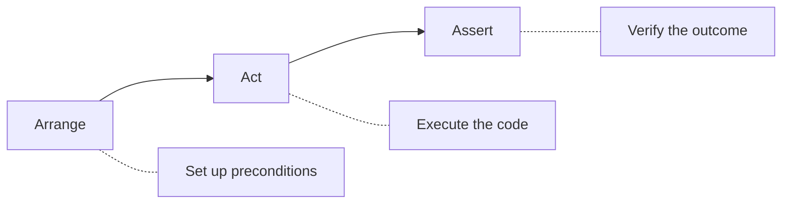
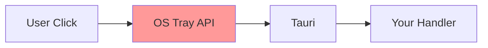

# Chapter 17: Testing

> *"A chef tastes their dish before serving. A developer runs tests before shipping. Both practices catch problems early—before they reach the customer."*

In Chapter 16, you learned about autostart integration. Now we'll explore **testing**—how Tea validates its code works correctly using Vitest, mocks, and different testing strategies.

---

## Why Test a Tray Application?

Testing a system tray app presents unique challenges:

| Challenge | Why It's Hard |
|-----------|--------------|
| No visible UI | Can't click buttons or check text fields |
| OS integration | Platform-specific behaviors vary |
| Background processes | Wake service runs asynchronously |
| Tray menu | Native menus aren't in the DOM |

Yet testing remains valuable:
- Catch regressions early
- Document expected behavior
- Enable confident refactoring
- Validate business logic

---

## Tea's Testing Stack



### Configuration

```typescript
// vitest.config.ts
import { defineConfig } from "vitest/config";

export default defineConfig({
  test: {
    globals: true,
    environment: "jsdom",
    setupFiles: ["./tests/setup.ts"],
    coverage: {
      provider: "v8",
      reporter: ["text", "json", "html"],
      exclude: [
        "node_modules/",
        "tests/",
        "src-tauri/",
        "*.config.ts",
        "*.config.js",
      ],
    },
    include: ["tests/**/*.test.ts"],
    exclude: ["node_modules", "src-tauri"],
  },
});
```

### Key Configuration Options

| Option | Value | Purpose |
|--------|-------|---------|
| `globals: true` | Enables global `describe`, `it`, `expect` | Less import boilerplate |
| `environment: "jsdom"` | Browser-like DOM | Test HTML/DOM code |
| `setupFiles` | `["./tests/setup.ts"]` | Runs before each test file |
| `coverage.provider: "v8"` | V8 engine coverage | Fast, built-in |

---

## Test Setup and Mocking

### The Setup File

```typescript
// tests/setup.ts
import { vi } from 'vitest';

// Mock Tauri API
global.window = global.window || ({} as any);

// Mock the Tauri invoke function
vi.mock('@tauri-apps/api/core', () => ({
  invoke: vi.fn(),
}));

// Mock Tauri plugin shell
vi.mock('@tauri-apps/plugin-shell', () => ({
  open: vi.fn(),
}));
```

### Why Mock Tauri?



During tests:
- No Tauri runtime is running
- `invoke()` calls would fail
- Mocks let tests run in pure JavaScript

---

## Test Categories

Tea uses three types of tests:

### 1. Frontend Tests

Test the HTML structure that exists in the hidden window:

```typescript
// tests/frontend.test.ts
describe("DOM Structure Tests", () => {
  it("should have main container element", () => {
    const container = document.querySelector(".container");
    expect(container).toBeTruthy();
    expect(container?.tagName).toBe("MAIN");
  });

  it("should have Tea heading", () => {
    const heading = document.querySelector("h1");
    expect(heading).toBeTruthy();
    expect(heading?.textContent).toBe("Tea");
  });
});
```

### 2. E2E Tests

Validate the complete application structure:

```typescript
// tests/e2e.test.ts
describe("Application Initialization", () => {
  it("should initialize with correct default state", () => {
    const heading = document.querySelector("h1");
    const container = document.querySelector(".container");

    expect(heading).toBeTruthy();
    expect(container).toBeTruthy();
    expect(heading?.textContent).toBe("Tea");
  });

  it("should have no interactive form elements", () => {
    // System tray app - no forms in the hidden window
    expect(document.querySelector("form")).toBeNull();
    expect(document.querySelector("input")).toBeNull();
    expect(document.querySelector("button")).toBeNull();
  });
});
```

### 3. Documentation Tests

Capture expected behavior as tests:

```typescript
// tests/autostart.test.ts
describe("Platform-Specific Behavior", () => {
  it("should document Windows autostart location", () => {
    const windowsLocation = "HKCU\\Software\\Microsoft\\Windows\\CurrentVersion\\Run";
    expect(windowsLocation).toContain("CurrentVersion\\Run");
  });

  it("should document macOS autostart location", () => {
    const macosLocation = "~/Library/LaunchAgents";
    expect(macosLocation).toContain("LaunchAgents");
  });
});
```

---

## Test Anatomy

### Structure of a Test File

```typescript
import { describe, it, expect, beforeEach, afterEach } from "vitest";

// Setup helper
function setupDOM() {
  document.body.innerHTML = `
    <main class="container">
      <h1>Tea</h1>
    </main>
  `;
}

function cleanupDOM() {
  document.body.innerHTML = "";
}

describe("Feature Name", () => {
  // Runs before each test in this describe block
  beforeEach(() => {
    setupDOM();
  });

  // Runs after each test
  afterEach(() => {
    cleanupDOM();
  });

  it("should do something specific", () => {
    // Arrange - set up test data
    const expected = "Tea";
    
    // Act - perform the action
    const heading = document.querySelector("h1");
    
    // Assert - verify the result
    expect(heading?.textContent).toBe(expected);
  });
});
```

### The AAA Pattern



### Lifecycle Hooks

| Hook | When It Runs |
|------|--------------|
| `beforeAll` | Once before all tests in describe |
| `beforeEach` | Before each test |
| `afterEach` | After each test |
| `afterAll` | Once after all tests |

---

## Vitest Assertions

### Common Matchers

```typescript
// Truthiness
expect(value).toBeTruthy();
expect(value).toBeFalsy();
expect(value).toBeNull();

// Equality
expect(value).toBe(42);              // Strict equality (===)
expect(value).toEqual({ a: 1 });     // Deep equality
expect(value).not.toBe(0);           // Negation

// Strings
expect(text).toContain("substring");
expect(text).toMatch(/pattern/);

// Numbers
expect(num).toBeGreaterThan(5);
expect(num).toBeLessThanOrEqual(10);

// Arrays
expect(array).toHaveLength(3);
expect(array).toContain("item");

// Objects
expect(obj).toHaveProperty("key");
expect(obj).toMatchObject({ partial: "match" });
```

### DOM-Specific Assertions

```typescript
// Element exists
expect(document.querySelector(".class")).toBeTruthy();

// Element doesn't exist
expect(document.querySelector(".missing")).toBeNull();

// Element content
expect(element?.textContent).toBe("Expected text");

// Element attributes
expect(element?.getAttribute("id")).toBe("my-id");

// Element classes
expect(element?.classList.contains("active")).toBe(true);
```

---

## Testing Accessibility

Tea includes basic accessibility tests:

```typescript
// tests/frontend.test.ts
describe("Accessibility Tests", () => {
  it("should have a main landmark", () => {
    const main = document.querySelector("main");
    expect(main).toBeTruthy();
  });

  it("should have a heading for screen readers", () => {
    const heading = document.querySelector("h1");
    expect(heading).toBeTruthy();
    expect(heading?.textContent).not.toBe("");
  });

  it("should have text content for screen readers", () => {
    const paragraphs = document.querySelectorAll("p");
    paragraphs.forEach((p) => {
      expect(p.textContent).not.toBe("");
    });
  });
});
```

### Why This Matters

Even though Tea's window is hidden, good structure:
- Helps future development
- Passes automated accessibility audits
- Documents intentions

---

## Documentation as Tests

Tea uses an interesting pattern: documenting expected behavior through tests:

```typescript
// tests/autostart.test.ts
it("should document manual testing procedure", () => {
  // Manual testing steps:
  // 1. Launch Tea application
  // 2. Click "Start at Login" in tray menu
  // 3. Verify checkmark appears
  // 4. Restart computer/log out and log in
  // 5. Verify Tea starts automatically
  
  const manualSteps = 5;
  expect(manualSteps).toBeGreaterThan(0);
});
```

### Why Document in Tests?

| Benefit | Explanation |
|---------|-------------|
| Single source of truth | Documentation lives with code |
| Won't go stale | Tests are run regularly |
| Searchable | Find behavior by running test grep |
| Enforced format | Must be executable |

---

## Running Tests

### Basic Commands

```bash
# Run all tests
npm test

# Run with watch mode
npm test -- --watch

# Run specific file
npm test -- tests/frontend.test.ts

# Run tests matching pattern
npm test -- -t "should have heading"
```

### Coverage Report

```bash
# Generate coverage report
npm test -- --coverage
```

This produces:
- Console summary
- `coverage/` directory with HTML report
- JSON data for CI tools

---

## Mocking Strategies

### Simple Function Mock

```typescript
import { vi } from 'vitest';

const mockFn = vi.fn();
mockFn("arg");

expect(mockFn).toHaveBeenCalled();
expect(mockFn).toHaveBeenCalledWith("arg");
```

### Module Mock

```typescript
vi.mock('@tauri-apps/api/core', () => ({
  invoke: vi.fn().mockResolvedValue({ success: true }),
}));
```

### Mock Implementation

```typescript
const mockInvoke = vi.fn().mockImplementation((cmd) => {
  if (cmd === 'get_state') {
    return Promise.resolve({ sleep_disabled: true });
  }
  return Promise.resolve(null);
});
```

### Spy on Existing Function

```typescript
const spy = vi.spyOn(console, 'log');
someFunction();
expect(spy).toHaveBeenCalledWith('expected message');
spy.mockRestore();
```

---

## Testing Rust Code

Tea's Rust backend can also be tested. Rust has built-in test support:

```rust
// In any Rust file
#[cfg(test)]
mod tests {
    use super::*;

    #[test]
    fn test_screen_mode_support() {
        let mode = ScreenMode::KeepDisplay;
        assert!(mode.is_supported());
    }

    #[test]
    fn test_default_state() {
        let state = AppState::default();
        assert_eq!(state.sleep_disabled, false);
        assert_eq!(state.screen_mode, ScreenMode::KeepDisplay);
    }
}
```

### Running Rust Tests

```bash
cd src-tauri
cargo test
```

### Integration Tests

```rust
// tests/integration_test.rs
use tea::persistence::{read_state, write_state};

#[test]
fn test_state_roundtrip() {
    let state = AppState {
        sleep_disabled: true,
        screen_mode: ScreenMode::AllowScreenOff,
    };
    
    // Write and read back
    write_state(&state).unwrap();
    let loaded = read_state();
    
    assert_eq!(loaded.sleep_disabled, state.sleep_disabled);
}
```

---

## What's Hard to Test

Some aspects of Tea are genuinely hard to test automatically:

### 1. System Tray Interaction



The OS tray API is outside your control.

### 2. Sleep Prevention

Does `SetThreadExecutionState` actually prevent sleep? You'd need to:
1. Set the state
2. Wait for system idle timeout
3. Verify no sleep occurred

That's not practical in automated tests.

### 3. Autostart Registration

Testing requires:
- Writing to registry/LaunchAgent/desktop file
- Logging out and back in
- Verifying the app started

Manual testing is more practical.

### Manual Testing Checklist

```markdown
## Sleep Prevention
- [ ] Enable sleep prevention
- [ ] Verify icon changes
- [ ] Wait for system idle time
- [ ] Confirm no sleep occurs

## Autostart
- [ ] Enable "Start at Login"
- [ ] Restart computer
- [ ] Verify Tea is running
- [ ] Disable "Start at Login"
- [ ] Restart computer
- [ ] Verify Tea is NOT running

## Screen Modes
- [ ] Test each screen mode
- [ ] Verify display behavior matches mode
```

---

## Test Organization Best Practices

### Group by Feature

```
tests/
  autostart.test.ts     # Autostart feature
  frontend.test.ts      # DOM/HTML tests
  e2e.test.ts           # Full app structure
  setup.ts              # Shared setup
```

### Descriptive Test Names

```typescript
// ❌ Bad
it("test1", () => { ... });

// ✅ Good
it("should display checkmark when autostart is enabled", () => { ... });
```

### One Assertion Per Concept

```typescript
// ❌ Testing too many things
it("should work", () => {
  expect(heading).toBeTruthy();
  expect(button).toBeFalsy();
  expect(count).toBe(5);
  expect(text).toContain("hello");
});

// ✅ Focused tests
it("should have heading", () => {
  expect(heading).toBeTruthy();
});

it("should not have button", () => {
  expect(button).toBeFalsy();
});
```

---

## Continuous Integration

Tests should run automatically:

```yaml
# .github/workflows/test.yml
name: Test
on: [push, pull_request]

jobs:
  test:
    runs-on: ubuntu-latest
    steps:
      - uses: actions/checkout@v4
      - uses: actions/setup-node@v4
        with:
          node-version: '20'
      - run: npm ci
      - run: npm test -- --coverage
```

This ensures:
- Tests run on every push
- PRs can't be merged if tests fail
- Coverage tracked over time

---

## Key Takeaways

1. **Mock external dependencies** — Tauri APIs don't exist in test environment
2. **jsdom for DOM testing** — Simulate browser environment
3. **Documentation tests** — Capture expected behavior as executable specs
4. **Manual testing still needed** — OS integration can't be fully automated
5. **AAA pattern** — Arrange, Act, Assert for clear tests
6. **Focused tests** — One concept per test case

---

## What's Next?

In **Chapter 18**, we'll explore **building and bundling**—how to create distributable packages for Windows, macOS, and Linux.

---

## Exercises

1. **Add a test**: Write a test that verifies the container has exactly two paragraph elements.

2. **Mock exploration**: Modify the mock for `invoke` to return a custom value. Write a test that uses it.

3. **Rust test**: Add a unit test to `screen_mode.rs` that tests `ScreenMode::default()`.

4. **Coverage goal**: Run coverage and identify any uncovered branches. Can you write tests to cover them?

5. **Negative test**: Write a test that verifies something does NOT exist (like `expect(x).toBeNull()`).
