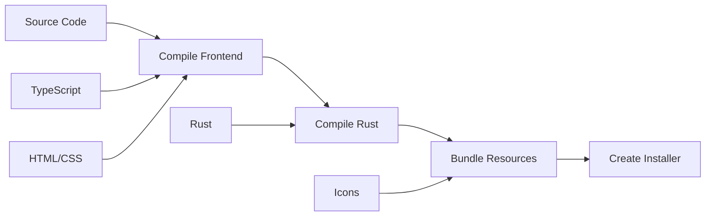
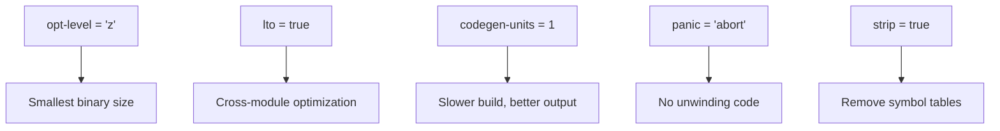

# Chapter 18: Building and Bundling

> *"A furniture maker crafts individual pieces in the workshop, but customers receive a finished, assembled product in a box. Building software follows the same journey—from raw source code to polished installer."*

In Chapter 17, you learned how to test Tea. Now we'll explore **building and bundling**—transforming source code into distributable applications for Windows, macOS, and Linux.

---

## The Build Pipeline



The Tauri build process:
1. **Compile frontend** — Vite bundles TypeScript/CSS/HTML
2. **Compile Rust** — Cargo builds the Rust binary
3. **Bundle resources** — Embed frontend, icons, metadata
4. **Create installer** — Platform-specific packages

---

## Prerequisites

### All Platforms

```bash
# Rust (via rustup)
curl --proto '=https' --tlsv1.2 -sSf https://sh.rustup.rs | sh

# Node.js (LTS version)
# Download from https://nodejs.org/
```

### Windows

- **Visual Studio Build Tools** — C++ compiler
- **WebView2 Runtime** — Usually pre-installed on Windows 10/11

### macOS

```bash
# Xcode Command Line Tools
xcode-select --install
```

### Linux

```bash
# Ubuntu/Debian
sudo apt-get install build-essential \
  libwebkit2gtk-4.0-dev \
  libgtk-3-dev \
  libayatana-appindicator3-dev \
  librsvg2-dev \
  xdotool

# Fedora
sudo dnf install webkit2gtk4.0-devel \
  gtk3-devel \
  libappindicator-gtk3-devel \
  librsvg2-devel \
  xdotool
```

---

## Development vs Production

### Development Mode

```bash
cargo tauri dev
```

Features:
- Hot reload for frontend changes
- Debug symbols included
- Unoptimized for faster builds
- Console window visible (Windows)

### Production Build

```bash
cargo tauri build
```

Features:
- Optimized for size and speed
- No debug symbols
- Creates installers
- No console window (Windows)

---

## Package Scripts

Tea's `package.json` defines build scripts:

```json
{
  "scripts": {
    "dev": "vite",
    "build": "tsc && vite build",
    "preview": "vite preview",
    "tauri": "tauri"
  }
}
```

| Script | Purpose |
|--------|---------|
| `npm run dev` | Start Vite dev server only |
| `npm run build` | Build frontend only |
| `cargo tauri dev` | Full development mode |
| `cargo tauri build` | Full production build |

---

## Vite Configuration

```typescript
// vite.config.ts
import { defineConfig } from "vite";

const host = process.env.TAURI_DEV_HOST;

export default defineConfig(async () => ({
  // Prevent vite from obscuring rust errors
  clearScreen: false,
  
  // Tauri expects a fixed port
  server: {
    port: 1420,
    strictPort: true,
    host: host || false,
    hmr: host
      ? {
          protocol: "ws",
          host,
          port: 1421,
        }
      : undefined,
    watch: {
      // Don't watch Rust files (Cargo handles that)
      ignored: ["**/src-tauri/**"],
    },
  },
}));
```

### Key Settings

| Setting | Purpose |
|---------|---------|
| `clearScreen: false` | Keep Rust errors visible |
| `port: 1420` | Tauri expects this specific port |
| `strictPort: true` | Fail if port is busy |
| `ignored: ["**/src-tauri/**"]` | Let Cargo watch Rust files |

---

## Cargo Configuration

### Build Dependencies

```toml
# src-tauri/Cargo.toml
[build-dependencies]
tauri-build = { version = "2", features = [] }
```

### Release Profile

```toml
[profile.release]
opt-level = "z"      # Optimize for size
lto = true           # Link Time Optimization
codegen-units = 1    # Better optimization
panic = "abort"      # Smaller binary
strip = true         # Remove debug symbols
```

### What Each Setting Does



| Setting | Tradeoff |
|---------|----------|
| `opt-level = "z"` | Size vs speed (prefer size) |
| `lto = true` | Build time vs binary size |
| `codegen-units = 1` | Build time vs optimization |
| `panic = "abort"` | No stack traces on panic |
| `strip = true` | Can't debug release builds |

---

## Build Outputs

After `cargo tauri build`, find outputs in:

```
src-tauri/target/release/
├── tea.exe              # Windows executable
├── tea                  # macOS/Linux executable
└── bundle/
    ├── msi/             # Windows MSI installer
    ├── nsis/            # Windows NSIS installer
    ├── deb/             # Debian package
    ├── rpm/             # RPM package
    ├── appimage/        # Linux AppImage
    └── macos/           # macOS app bundle
```

### Platform-Specific Outputs

| Platform | Formats |
|----------|---------|
| Windows | `.exe`, `.msi`, NSIS installer |
| macOS | `.app`, `.dmg` |
| Linux | `.deb`, `.rpm`, `.AppImage` |

---

## Bundle Configuration

The `tauri.conf.json` controls bundling:

```json
{
  "bundle": {
    "active": true,
    "targets": "all",
    "identifier": "com.tea.app",
    "icon": [
      "icons/32x32.png",
      "icons/128x128.png",
      "icons/128x128@2x.png",
      "icons/icon.icns",
      "icons/icon.ico"
    ]
  }
}
```

### Bundle Settings

| Setting | Purpose |
|---------|---------|
| `active` | Enable/disable bundling |
| `targets` | Which formats to build |
| `identifier` | Unique app ID (reverse domain) |
| `icon` | Icons for different platforms |

### Target Options

```json
// Build all formats
"targets": "all"

// Build specific formats
"targets": ["msi", "nsis"]

// Build default format only
"targets": "default"
```

---

## Icons and Resources

### Icon Requirements

| Platform | Format | Sizes |
|----------|--------|-------|
| Windows | `.ico` | 16, 32, 48, 256 |
| macOS | `.icns` | 16, 32, 128, 256, 512 |
| Linux | `.png` | Various sizes |

### Generating Icons

```bash
# Use Tauri's icon generator
cargo tauri icon path/to/your-icon.png
```

This generates all required sizes and formats.

---

## Windows-Specific Build

### NSIS Installer

NSIS (Nullsoft Scriptable Install System) creates the familiar Windows installer:

```
src-tauri/target/release/bundle/nsis/
└── Tea_2.0.0_x64-setup.exe
```

Features:
- Custom installation path
- Start menu shortcuts
- Desktop shortcut (optional)
- Uninstaller

### MSI Installer

MSI is preferred for enterprise deployments:

```
src-tauri/target/release/bundle/msi/
└── Tea_2.0.0_x64_en-US.msi
```

Features:
- Windows Installer technology
- Group Policy deployment
- Silent install support

### Signing (Code Signing)

For production, sign your Windows executables:

```json
// tauri.conf.json
{
  "bundle": {
    "windows": {
      "certificateThumbprint": "YOUR_CERT_THUMBPRINT",
      "timestampUrl": "http://timestamp.digicert.com"
    }
  }
}
```

Without signing, users see "Unknown publisher" warnings.

---

## macOS-Specific Build

### App Bundle Structure

```
Tea.app/
└── Contents/
    ├── Info.plist
    ├── MacOS/
    │   └── Tea            # Executable
    ├── Resources/
    │   └── icon.icns      # App icon
    └── _CodeSignature/    # Code signature
```

### DMG Creation

```
src-tauri/target/release/bundle/macos/
└── Tea_2.0.0_x64.dmg
```

The DMG provides a drag-to-Applications experience.

### Signing and Notarization

For distribution outside the App Store:

```bash
# Sign the app
codesign --sign "Developer ID Application: Your Name" Tea.app

# Notarize with Apple
xcrun notarytool submit Tea.dmg --apple-id YOUR_ID --password APP_PASSWORD --team-id TEAM_ID
```

Without notarization, Gatekeeper blocks the app.

---

## Linux-Specific Build

### Debian Package (.deb)

```
src-tauri/target/release/bundle/deb/
└── tea_2.0.0_amd64.deb
```

Install with:
```bash
sudo dpkg -i tea_2.0.0_amd64.deb
```

### AppImage

```
src-tauri/target/release/bundle/appimage/
└── tea_2.0.0_amd64.AppImage
```

AppImage is self-contained:
```bash
chmod +x tea_2.0.0_amd64.AppImage
./tea_2.0.0_amd64.AppImage
```

### RPM Package

```
src-tauri/target/release/bundle/rpm/
└── tea-2.0.0-1.x86_64.rpm
```

Install with:
```bash
sudo rpm -i tea-2.0.0-1.x86_64.rpm
```

---

## Build Troubleshooting

### Common Errors

#### "WebView2 not found" (Windows)

```
Error: WebView2 runtime not found
```

**Solution**: Install WebView2 from Microsoft or use embedded installer mode.

#### "Missing libraries" (Linux)

```
Error: cannot find -lwebkit2gtk-4.0
```

**Solution**: Install the development packages listed in prerequisites.

#### "Code signing failed" (macOS)

```
Error: codesign exited with error code 1
```

**Solution**: Ensure valid Developer ID certificate is in Keychain.

### Debug Build Issues

```bash
# Verbose Cargo output
RUST_BACKTRACE=1 cargo tauri build --verbose

# Check frontend build
npm run build
```

---

## Optimizing Build Size

Tea's release profile is optimized for size:

```toml
[profile.release]
opt-level = "z"
lto = true
codegen-units = 1
panic = "abort"
strip = true
```

### Additional Techniques

| Technique | Impact |
|-----------|--------|
| Remove unused features | Medium |
| Use `--release` flag | High |
| Enable LTO | High |
| Strip symbols | Medium |
| Compress resources | Low |

### Checking Binary Size

```bash
# Windows
dir src-tauri\target\release\tea.exe

# macOS/Linux
ls -lh src-tauri/target/release/tea
```

Typical Tauri app: 5-15 MB (vs Electron: 80-150 MB)

---

## Continuous Integration Build

Automate builds with GitHub Actions:

```yaml
# .github/workflows/build.yml
name: Build
on: [push, pull_request]

jobs:
  build:
    strategy:
      matrix:
        platform: [windows-latest, macos-latest, ubuntu-latest]
    runs-on: ${{ matrix.platform }}
    
    steps:
      - uses: actions/checkout@v4
      
      - name: Setup Node
        uses: actions/setup-node@v4
        with:
          node-version: '20'
          
      - name: Setup Rust
        uses: dtolnay/rust-toolchain@stable
        
      - name: Install dependencies (Linux)
        if: matrix.platform == 'ubuntu-latest'
        run: |
          sudo apt-get update
          sudo apt-get install -y libwebkit2gtk-4.0-dev...
          
      - name: Install frontend dependencies
        run: npm ci
        
      - name: Build
        run: cargo tauri build
        
      - name: Upload artifacts
        uses: actions/upload-artifact@v4
        with:
          name: tea-${{ matrix.platform }}
          path: src-tauri/target/release/bundle/*
```

---

## Key Takeaways

1. **Two-stage build** — Frontend (Vite) then backend (Cargo)
2. **Release profile matters** — Size optimization for production
3. **Platform-specific installers** — NSIS/MSI, DMG, deb/AppImage
4. **Code signing required** — For trusted distribution
5. **CI/CD automates** — Build for all platforms automatically
6. **Tauri is efficient** — Much smaller than Electron

---

## What's Next?

In **Chapter 19**, we'll explore **distribution**—how to publish Tea so users can download and install it.

---

## Exercises

1. **Build locally**: Run `cargo tauri build` and find the generated installer for your platform.

2. **Check binary size**: Compare the debug build size (`cargo tauri build --debug`) vs release build.

3. **Modify bundle config**: Change the bundle identifier and rebuild. What changes?

4. **Generate icons**: Create a custom icon and use `cargo tauri icon` to generate all sizes.

5. **Profile optimization**: Try removing `lto = true` from the release profile. How does it affect build time and binary size?
