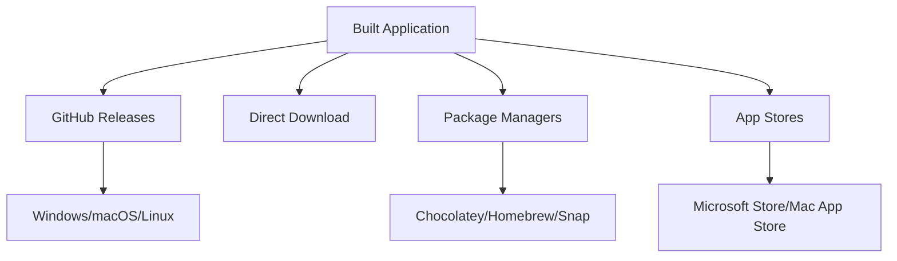

# Chapter 19: Distribution

> *"A great meal isn't truly complete until it reaches the diner's table. Similarly, your application isn't finished until users can easily download and install it."*

In Chapter 18, you learned how to build Tea into platform-specific installers. Now we'll explore **distribution**—getting those installers into users' hands.

---

## Distribution Channels



Tea uses **GitHub Releases** as the primary distribution channel—free, reliable, and familiar to developers.

---

## GitHub Releases

### Creating a Release

1. **Tag the version**:
```bash
git tag v2.0.0
git push origin v2.0.0
```

2. **Create Release on GitHub**:
   - Go to Releases → New Release
   - Select tag
   - Write release notes
   - Upload installers

### Release Structure

```
Tea v2.0.0

## What's New
- Feature X
- Bug fix Y

## Downloads
| Platform | File | Size |
|----------|------|------|
| Windows (64-bit) | Tea_2.0.0_x64-setup.exe | 8.2 MB |
| macOS (Intel) | Tea_2.0.0_x64.dmg | 6.1 MB |
| macOS (Apple Silicon) | Tea_2.0.0_aarch64.dmg | 5.9 MB |
| Linux (Debian) | tea_2.0.0_amd64.deb | 7.3 MB |
| Linux (AppImage) | tea_2.0.0_amd64.AppImage | 9.1 MB |

## Checksums
SHA256:
- Tea_2.0.0_x64-setup.exe: abc123...
```

### Automated Releases with GitHub Actions

```yaml
# .github/workflows/release.yml
name: Release
on:
  push:
    tags:
      - 'v*'

jobs:
  release:
    permissions:
      contents: write
    strategy:
      matrix:
        include:
          - platform: windows-latest
            target: x86_64-pc-windows-msvc
          - platform: macos-latest
            target: x86_64-apple-darwin
          - platform: macos-latest
            target: aarch64-apple-darwin
          - platform: ubuntu-latest
            target: x86_64-unknown-linux-gnu

    runs-on: ${{ matrix.platform }}
    steps:
      - uses: actions/checkout@v4
      
      - name: Setup Node
        uses: actions/setup-node@v4
        with:
          node-version: '20'
          
      - name: Setup Rust
        uses: dtolnay/rust-toolchain@stable
        with:
          targets: ${{ matrix.target }}
          
      - name: Install dependencies (Linux)
        if: matrix.platform == 'ubuntu-latest'
        run: |
          sudo apt-get update
          sudo apt-get install -y libwebkit2gtk-4.0-dev...
          
      - name: Install frontend dependencies
        run: npm ci
        
      - name: Build
        run: cargo tauri build --target ${{ matrix.target }}
        
      - name: Upload to Release
        uses: softprops/action-gh-release@v1
        with:
          files: src-tauri/target/${{ matrix.target }}/release/bundle/**/*
```

This automatically:
- Triggers on version tags
- Builds for all platforms
- Uploads artifacts to GitHub Release

---

## Version Numbering

### Semantic Versioning

```
MAJOR.MINOR.PATCH
2.0.0
│ │ │
│ │ └─ Bug fixes, no new features
│ └─── New features, backward compatible
└───── Breaking changes
```

### Keeping Versions in Sync

Tea has versions in multiple places:

```json
// package.json
{
  "version": "2.0.0"
}
```

```toml
# Cargo.toml
[package]
version = "2.0.0"
```

```json
// tauri.conf.json
{
  "version": "2.0.0"
}
```

Keep these synchronized!

---

## Changelogs

A changelog helps users understand what's new:

```markdown
# Changelog

## [2.0.0] - 2024-01-15

### Added
- Screen mode selection (Keep Display vs Allow Screen Off)
- macOS support
- Linux support

### Changed
- Migrated to Tauri 2.0
- State file location now follows platform conventions

### Fixed
- Autostart not persisting after app updates

## [1.0.0] - 2023-06-01

### Added
- Initial release
- Windows support
- System tray interface
- Sleep prevention
```

### Changelog Best Practices

| Category | Use For |
|----------|---------|
| Added | New features |
| Changed | Changes in existing functionality |
| Deprecated | Soon-to-be removed features |
| Removed | Removed features |
| Fixed | Bug fixes |
| Security | Security vulnerabilities |

---

## Auto-Updates

Tauri supports automatic updates:

### 1. Add Plugin

```toml
# Cargo.toml
[dependencies]
tauri-plugin-updater = "2"
```

### 2. Configure Update Server

```json
// tauri.conf.json
{
  "plugins": {
    "updater": {
      "endpoints": [
        "https://releases.myapp.com/{{current_version}}"
      ],
      "pubkey": "YOUR_PUBLIC_KEY"
    }
  }
}
```

### 3. Check for Updates

```rust
use tauri_plugin_updater::UpdaterExt;

// In your app
if let Ok(update) = app.updater().check().await {
    if update.is_available() {
        update.download_and_install().await?;
    }
}
```

### Update Response Format

```json
{
  "version": "2.1.0",
  "notes": "Bug fixes and improvements",
  "pub_date": "2024-01-20T00:00:00Z",
  "platforms": {
    "windows-x86_64": {
      "url": "https://releases.myapp.com/tea_2.1.0_x64-setup.nsis.zip",
      "signature": "SIGNATURE_HERE"
    }
  }
}
```

---

## Code Signing

### Why Sign Your Code?

| Without Signing | With Signing |
|-----------------|--------------|
| "Unknown publisher" warning | Publisher name shown |
| SmartScreen blocks download | Trusted by Windows |
| Gatekeeper blocks on macOS | Runs without warnings |
| Users may not trust it | Professional appearance |

### Windows Code Signing

1. **Obtain a certificate** from a Certificate Authority (DigiCert, Sectigo, etc.)

2. **Configure Tauri**:
```json
{
  "bundle": {
    "windows": {
      "certificateThumbprint": "YOUR_THUMBPRINT",
      "timestampUrl": "http://timestamp.digicert.com"
    }
  }
}
```

3. **In CI, use secrets**:
```yaml
- name: Build and Sign
  env:
    TAURI_SIGNING_PRIVATE_KEY: ${{ secrets.TAURI_PRIVATE_KEY }}
  run: cargo tauri build
```

### macOS Signing and Notarization

1. **Enroll in Apple Developer Program** ($99/year)

2. **Create certificates** in Apple Developer Portal

3. **Sign the app**:
```bash
codesign --sign "Developer ID Application: Your Name" \
  --options runtime \
  Tea.app
```

4. **Notarize**:
```bash
xcrun notarytool submit Tea.dmg \
  --apple-id your@email.com \
  --password app-specific-password \
  --team-id YOUR_TEAM_ID \
  --wait
```

5. **Staple the ticket**:
```bash
xcrun stapler staple Tea.dmg
```

---

## Package Managers

### Windows: Winget

Create a manifest for Windows Package Manager:

```yaml
# manifests/t/Tea/Tea/2.0.0/Tea.Tea.yaml
PackageIdentifier: Tea.Tea
PackageVersion: 2.0.0
PackageName: Tea
Publisher: Your Name
License: MIT
ShortDescription: Prevent your system from sleeping
InstallerType: exe
Installers:
  - Architecture: x64
    InstallerUrl: https://github.com/.../Tea_2.0.0_x64-setup.exe
    InstallerSha256: ABC123...
```

Submit to [winget-pkgs](https://github.com/microsoft/winget-pkgs).

### macOS: Homebrew

Create a cask:

```ruby
# Casks/tea.rb
cask "tea" do
  version "2.0.0"
  sha256 "abc123..."

  url "https://github.com/.../Tea_#{version}_x64.dmg"
  name "Tea"
  desc "System tray sleep prevention utility"
  homepage "https://github.com/..."

  app "Tea.app"
end
```

Submit to [homebrew-cask](https://github.com/Homebrew/homebrew-cask).

### Linux: Snap Store

```yaml
# snapcraft.yaml
name: tea
version: '2.0.0'
summary: Prevent your system from sleeping
description: |
  Tea is a system tray utility that prevents your computer
  from going to sleep during important tasks.
grade: stable
confinement: strict

apps:
  tea:
    command: tea
    extensions: [gnome]
    
parts:
  tea:
    plugin: nil
    source: .
    build-packages:
      - cargo
      - libwebkit2gtk-4.0-dev
```

---

## Documentation for Users

### README Essentials

```markdown
# Tea

> Prevent your system from sleeping

## Download

| Platform | Download |
|----------|----------|
| Windows | [Tea_2.0.0_x64-setup.exe](link) |
| macOS | [Tea_2.0.0.dmg](link) |
| Linux | [tea_2.0.0.AppImage](link) |

## Installation

### Windows
1. Download the installer
2. Run the .exe file
3. Follow the installation wizard

### macOS
1. Download the .dmg file
2. Open it and drag Tea to Applications
3. Right-click and "Open" for first launch (Gatekeeper)

### Linux
1. Download the AppImage
2. Make it executable: `chmod +x tea*.AppImage`
3. Run: `./tea*.AppImage`
```

### Troubleshooting Section

```markdown
## Troubleshooting

### "Windows protected your PC"
This appears because the app isn't code-signed. Click
"More info" then "Run anyway".

### "Tea is damaged and can't be opened" (macOS)
Clear the quarantine flag:
```
xattr -cr /Applications/Tea.app
```

### App doesn't start (Linux)
Ensure required libraries are installed:
```
sudo apt install libwebkit2gtk-4.0-37 libgtk-3-0
```
```

---

## Analytics and Crash Reporting

### Download Analytics

GitHub provides basic download counts. For more detail, use:
- **Download trackers** in release URLs
- **Sentry** for crash reporting
- **Custom analytics endpoint**

### Privacy Considerations

| Data | Consideration |
|------|---------------|
| Download counts | Public, no user data |
| Crash reports | Requires user consent |
| Usage analytics | Requires clear privacy policy |

Tea doesn't include analytics—respecting user privacy is part of the value proposition.

---

## Distribution Checklist

Before each release:

```markdown
## Pre-Release
- [ ] All tests passing
- [ ] Version bumped in all locations
- [ ] Changelog updated
- [ ] README updated if needed

## Build
- [ ] Windows x64 built
- [ ] macOS x64 built
- [ ] macOS ARM64 built
- [ ] Linux x64 built

## Signing
- [ ] Windows installer signed
- [ ] macOS app signed and notarized

## Release
- [ ] Create GitHub release
- [ ] Upload all installers
- [ ] Add checksums
- [ ] Write release notes

## Post-Release
- [ ] Test download links
- [ ] Verify installation on each platform
- [ ] Update package manager manifests
- [ ] Announce release
```

---

## Key Takeaways

1. **GitHub Releases** — Free, reliable hosting for installers
2. **Automate with CI** — Build and upload on tag push
3. **Code signing matters** — Avoids security warnings
4. **Multiple formats** — NSIS, MSI, DMG, deb, AppImage
5. **Keep versions synced** — package.json, Cargo.toml, tauri.conf.json
6. **Document installation** — Users need clear instructions

---

## What's Next?

Congratulations! You've reached the end of **Part 4: Production**.

In the **Appendices**, you'll find reference material:
- **Appendix A**: Command Reference
- **Appendix B**: Data Models and Types
- **Appendix C**: Glossary

---

## Exercises

1. **Create a release**: Tag your local Tea build with `v2.0.0-mytest` and push to GitHub. Create a release with the built installer.

2. **Write a changelog**: Document all the changes you'd want users to know about for a hypothetical v2.1.0.

3. **Checksum generation**: Generate SHA256 checksums for your built installers. On Windows: `Get-FileHash file.exe`. On macOS/Linux: `sha256sum file`.

4. **Package manager research**: Find a package manager manifest for a Tauri app you use. Study its structure.

5. **Auto-update exploration**: Read the [Tauri Updater documentation](https://tauri.app/plugin/updater/) and plan how you'd implement auto-updates for Tea.
